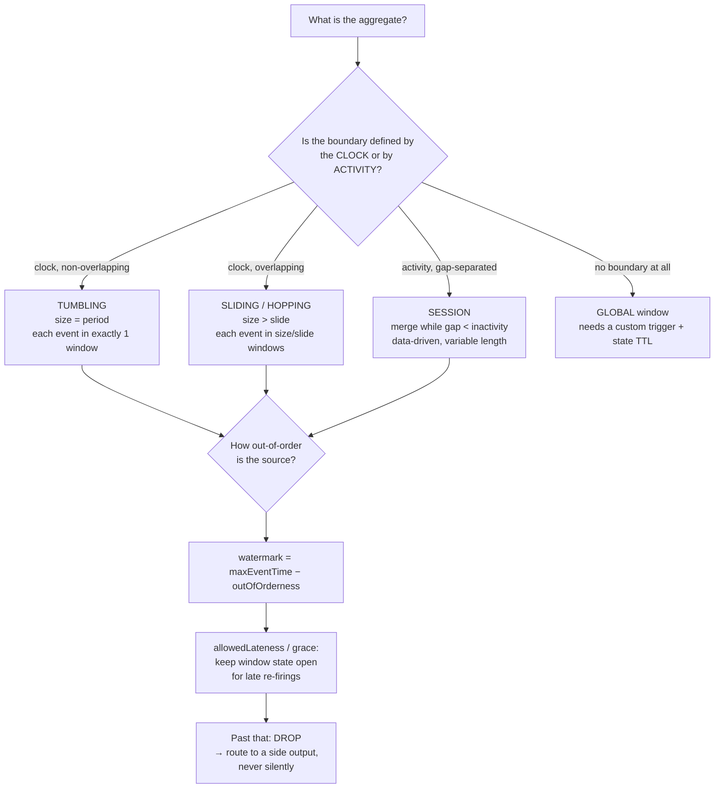

# Stream Windowing Coach

Unbounded data has no "end", so every streaming aggregate needs an explicit answer to *where* results are
grouped and *when* they are emitted. This skill derives both from the Dataflow model instead of copying a
snippet — first principles as required by [`AGENTS.md`](../../../AGENTS.md).

## When to use

- Choosing between tumbling, hopping/sliding and session windows for a metric, alert, or feature.
- A window "never fires", fires twice, or silently drops records that arrived a little late.
- You must trade result **latency** against result **completeness** and want to state the trade explicitly.
- **Don't use it for** running the code — that's [flink-local-lab](../flink-local-lab/SKILL.md) and
  [kafka-streams-lab](../kafka-streams-lab/SKILL.md); or for topology/broker design — that's
  [streaming-pipeline-designer](../streaming-pipeline-designer/SKILL.md).

## First principles: what · where · when · how

Akidau et al., *"The Dataflow Model"* (VLDB 2015) — the paper behind Beam, and the vocabulary Flink,
Kafka Streams and Spark Structured Streaming all adopted — decomposes any streaming aggregate into four
independent questions: **What** results are computed (the aggregation), **Where** in event time they are
grouped (the *window*), **When** they are emitted in processing time (the *trigger*, driven by
*watermarks*), and **How** refinements relate to earlier emissions (discarding vs accumulating).

A **watermark** is the runtime's claim that no further event with timestamp ≤ *W* is expected. It is a
heuristic; the only way to make it perfect is to make it infinitely late. That single sentence explains
every late-data policy that follows.



| Window | Boundaries | Each event lands in | Cost | Use for |
| --- | --- | --- | --- | --- |
| Tumbling (fixed) | aligned, non-overlapping `[start, start+size)` | exactly 1 | cheapest | billing periods, per-minute counts, SLA buckets |
| Sliding / hopping | overlapping, `size` every `slide` | `size / slide` windows | **duplication factor** — 1 h/1 min = 60× state and output | moving averages, rolling alerts |
| Session | data-driven; merge while gap < inactivity | 1 (windows merge) | merge bookkeeping; unbounded length | user visits, device bursts, "activity" analytics |
| Global | none | 1 (forever) | requires custom trigger **and** state TTL or it leaks | custom triggers, ML feature stores |

| Concept | Apache Flink | Kafka Streams | Apache Beam | Spark Structured Streaming |
| --- | --- | --- | --- | --- |
| Fixed window | `TumblingEventTimeWindows.of(Duration.ofSeconds(10))` | `TimeWindows.ofSizeAndGrace(size, grace)` | `FixedWindows.of(...)` | `window(col("ts"), "10 minutes")` |
| Sliding | `SlidingEventTimeWindows.of(size, slide)` | `SlidingWindows.ofTimeDifferenceAndGrace(...)` | `SlidingWindows.of(size).every(slide)` | `window(col("ts"), "10 minutes", "5 minutes")` |
| Session | `EventTimeSessionWindows.withGap(gap)` | `SessionWindows.ofInactivityGapAndGrace(...)` | `Sessions.withGapDuration(gap)` | `session_window(col("ts"), "30 seconds")` |
| Lateness budget | `.allowedLateness(d)` | grace period argument | `.withAllowedLateness(d)` | `.withWatermark("ts", "5 minutes")` |
| Late records | `.sideOutputLateData(tag)` | dropped (metered) | late pane / dropped | dropped in append mode |
| Refinements | per-element late firings | `suppress(untilWindowCloses(...))` to emit once | `discardingFiredPanes()` / `accumulatingFiredPanes()` | output mode `append`/`update`/`complete` |

**Check the exact signatures against your engine's version docs** — window APIs have churned (Flink moved
from `Time` to `Duration`; Kafka Streams replaced `TimeWindows.of` with `ofSizeAndGrace`).

## Procedure

1. **Write the metric as a sentence** with its time basis: "unique users per 5-minute *event-time* bucket".
2. **Choose the window** from the flowchart; name the runner-up and why it lost (usually cost).
3. **Measure real out-of-orderness** before you guess it: sample `processingTime − eventTime` and take a
   high percentile (p99), not the max, or one stuck producer sets your latency forever.
4. **Set the watermark strategy** to that p99, plus idleness handling for quiet partitions. In Flink:
   `WatermarkStrategy.forBoundedOutOfOrderness(Duration.ofSeconds(2)).withIdleness(Duration.ofSeconds(30))`.
   Remember the operator watermark is the **minimum** across all input channels — one idle partition stalls
   every downstream window.
5. **Decide the lateness budget** by business value: `allowedLateness` keeps window state alive for
   corrections and costs memory proportional to `lateness / size` extra open windows.
6. **Route dropped data somewhere visible** — a side output, a dead-letter topic, a counter with an alert.
   "Silently dropped" is the failure mode that survives code review and destroys trust in the numbers.
7. **Pick the emission contract**: exactly one final result (`suppress(untilWindowCloses)` / append mode) or
   early speculative results plus corrections (early firings + accumulating panes). Downstream sinks must
   be idempotent or upsert-capable if you choose the latter —
   [idempotency-coach](../idempotency-coach/SKILL.md).
8. **Trace the timeline by hand**, then run it and diff prediction vs observation
   ([flink-local-lab](../flink-local-lab/SKILL.md)). Close with the **Learning Footer**.

## Output shape

```
Metric: <aggregate> per <window> on <event-time field>
Window: <tumbling|sliding|session|global> size=<> slide=<> gap=<>   Runner-up: <...> rejected because <...>
Time basis: event time — because <replay/correctness> | processing time — because <latency only>
Out-of-orderness: measured p99 = <ms> → watermark = maxEventTime − <ms>  (+ idleness <ms>)
Allowed lateness / grace: <duration>   Extra open windows ≈ lateness/size = <n>
Late data policy: <side output <name> | DLQ topic | counter + alert>   NOT silently dropped
Emission: <single final result | early firings + corrections>   Accumulation: <discarding|accumulating>
Sink requirement: <idempotent upsert | append-only>
Cost: state ≈ <keys × open windows × per-key bytes>   Sliding duplication factor = <size/slide>
Predicted timeline: <event ts → watermark → which window fires when>
Next: <flink-local-lab | kafka-streams-lab | streaming-pipeline-designer>
Learning Footer
```

## Worked example — a tumbling window that fires twice, then drops

Tumbling 10 s event-time windows, out-of-orderness 2 s, `allowedLateness = 5 s`, one key. Window start is
`ts − (ts mod size)`, so window `[0,10000)` covers `ts ∈ [0, 9999]`. Flink emits a watermark of
`maxEventTime − outOfOrderness − 1 ms`, and a window fires when `watermark ≥ windowEnd − 1`.

| # | event ts (ms) | value | max ts so far | watermark | what happens |
| --- | --- | --- | --- | --- | --- |
| 1 | 1 000 | 1 | 1 000 | −1 001 | buffered in `[0,10000)` |
| 2 | 4 000 | 2 | 4 000 | 1 999 | buffered — 1 999 < 9 999, no firing |
| 3 | 13 000 | 3 | 13 000 | **10 999** | 10 999 ≥ 9 999 → **`[0,10000)` FIRES with sum = 3** |
| 4 | 7 000 | 4 | 13 000 | 10 999 | **late**, but 10 999 ≤ 9 999 + 5 000 → window still open → **RE-FIRES, sum = 7** |
| 5 | 18 000 | 5 | 18 000 | **15 999** | 15 999 > 14 999 → `[0,10000)` state **purged**; `[10000,20000)` holds 3 + 5 |
| 6 | 6 000 | 6 | 18 000 | 15 999 | window gone → **dropped → side output**, never merged |

Three lessons fall out of one table. The window fired **twice** — a downstream sink that appends would now
double-count 3 and 7; it must upsert on `(key, windowStart)`. Event #4 was *late yet correct*, saved purely
by `allowedLateness`. Event #6 was equally valid data, lost to a budget the team chose; that is a business
decision, so it belongs in the design doc and in a monitored counter, not in a code comment.

**Session windows merge instead of firing.** With a 30 s inactivity gap, each event provisionally opens
`[ts, ts+gap)` and overlapping windows merge:

| Event ts (s) | Provisional window | After merge |
| --- | --- | --- |
| 0 | [0, 30) | session A = [0, 30) |
| 20 | [20, 50) | overlaps A → A = [0, 50) |
| 45 | [45, 75) | overlaps A → A = [0, 75) |
| 100 | [100, 130) | 100 − 45 = 55 s of inactivity > 30 s gap → **new** session B |

Result: two sessions, A = [0, 75) with three events and B = [100, 130) with one. Note that a *late* event
at ts = 72 would open [72, 102), overlapping both A = [0, 75) and B = [100, 130) and merging them into one
session [0, 130) — session windows can retroactively delete results, so their sinks must be upsert-based by
construction.

## Tips

- "My window never fires" is almost always a watermark problem, not a window problem: an idle partition, a
  wrong timestamp field (millis vs seconds), or processing-time semantics on a replayed backlog.
- Sliding windows multiply everything by `size / slide` — a 24 h window sliding every minute keeps 1 440
  copies of every key's state. Prefer an incremental/decremental aggregate if the function allows it.
- Event time makes replays reproducible; processing time does not. If a backfill must reproduce yesterday's
  numbers exactly, event time is not optional.
- `allowedLateness` is memory you rent: extra open windows ≈ `lateness / size` per key. Bound it, and set a
  state TTL on global windows or the job leaks until it OOMs.
- Never let late records vanish quietly — a side output plus an alert turns a silent correctness bug into a
  visible, tunable number.
- Continue with [flink-local-lab](../flink-local-lab/SKILL.md),
  [kafka-streams-lab](../kafka-streams-lab/SKILL.md), [flink-sql-lab](../flink-sql-lab/SKILL.md),
  [spark-streaming-lab](../spark-streaming-lab/SKILL.md),
  [streaming-pipeline-designer](../streaming-pipeline-designer/SKILL.md),
  [idempotency-coach](../idempotency-coach/SKILL.md) and
  [schema-evolution-coach](../schema-evolution-coach/SKILL.md). Close with the **Learning Footer**
  (`AGENTS.md`).
