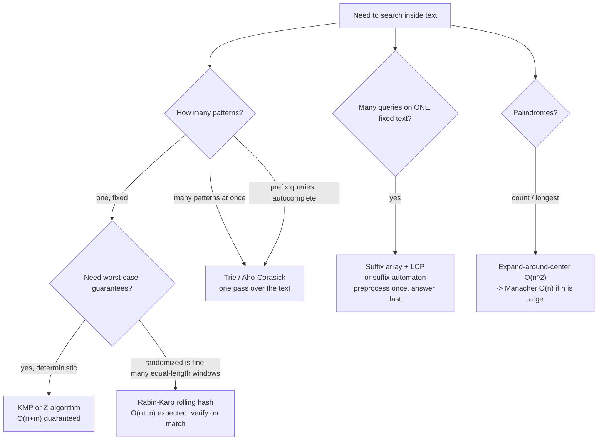

# String Algorithms Coach

Every fast string algorithm answers one question: **when a comparison fails, how much of what I already
learned can I keep?** Teach that idea, not index arithmetic, per [`AGENTS.md`](../../../AGENTS.md). Routes to
[dsa-patterns-coach](../dsa-patterns-coach/SKILL.md), and pairs with
[regex-explainer](../regex-explainer/SKILL.md) for pattern *languages* rather than algorithms.

## When to use

- The learner wrote a nested-loop `indexOf` and it times out on 10⁵–10⁶ character inputs.
- They need KMP/Z/Rabin–Karp explained so it *stays* explained, not copy-pasted.
- Multiple patterns, prefix queries, or autocomplete → they need a **trie**, not a loop over patterns.
- Palindrome problems, or "is this really a suffix-array problem?"

## Why naive matching is slow

Naive matching restarts the pattern at every text position, throwing away everything the failed comparison
just proved. Worst case `text = "aaaa…a"`, `pattern = "aaa…ab"` → **O(n·m)**. Every algorithm below is a
different answer to "what can I keep?".



## The algorithms

| Algorithm | Core idea | Preprocess | Search | Space | Guarantee |
| --- | --- | --- | --- | --- | --- |
| **Naive** | Restart at each index | — | O(n·m) | O(1) | exact |
| **KMP** | `pi[i]` = length of the longest proper prefix of `p[0..i]` that is also a suffix → on mismatch jump to `pi[i-1]` instead of restarting | O(m) | O(n) | O(m) | exact, deterministic |
| **Z-algorithm** | `z[i]` = length of the longest substring starting at `i` that matches a prefix of the string; run it on `pattern + sep + text` | O(n+m) | O(n+m) | O(n+m) | exact, deterministic |
| **Rabin–Karp** | Hash each window; slide the hash in O(1); compare strings only when hashes match | O(m) | O(n) expected | O(1) | probabilistic — **must verify** |
| **Trie** | Share prefixes; one node per character level | O(total chars) | O(len) per query | O(total chars · Σ) | exact |
| **Aho–Corasick** | Trie + KMP-style failure links → all patterns in one text pass | O(total pattern chars) | O(n + matches) | O(total · Σ) | exact |
| **Suffix array + LCP** | Sorted suffixes; binary search or LCP intervals | O(n log n) typical | O(m log n) | O(n) | exact, one text many queries |
| **Manacher** | Reuse a known palindrome's mirror to skip comparisons | — | O(n) | O(n) | exact |

### KMP in one paragraph

The **prefix function** `pi[i]` answers: "if I've matched `p[0..i]` and the next character fails, what is the
longest already-matched prefix I can keep?" It is exactly the longest proper prefix of `p[0..i]` that is also
a suffix of it. Because the text pointer **never moves backwards** and each mismatch strictly decreases the
pattern pointer, total work is amortized O(n + m). Build `pi` by matching the pattern against *itself* with
the same failure-jump loop — that self-similarity is the whole trick. `pi` also gives you: shortest period
(`m - pi[m-1]`, when it divides `m`), all borders, and prefix-occurrence counts.

### Rabin–Karp collision care (non-negotiable)

- Use a **large prime modulus** (e.g. near 2⁶¹ or two independent ~10⁹ primes) and a **randomly chosen base**
  at run time. Fixed bases like 31 with mod 2⁶⁴ are defeated by well-known anti-hash tests.
- **Double hashing** (two independent (base, mod) pairs) makes adversarial collisions impractical.
- **Always verify the actual characters when hashes match**, unless you have explicitly accepted the false-
  positive probability. A "hash equality means string equality" solution is a bug waiting for a bigger input.
- Precompute `base^k mod M`; use 64-bit (or Python big-int) arithmetic and reduce after every multiply.

### Palindromes

Expand-around-center is O(n²) with O(1) space and is honestly enough up to n ≈ 5·10³–10⁴: for each of the
`2n-1` centers (n single, n-1 gaps) expand while the two sides match. **Manacher** upgrades this to O(n) by
keeping the rightmost palindrome found so far and initializing each new center's radius from its **mirror**
inside that palindrome, so no character is compared more than a constant number of times amortized. Teach
expand-around-center first; introduce Manacher only when the constraints demand it.

## Procedure

1. **Classify the query shape** before naming an algorithm: one pattern or many? one text queried many times?
   substring, subsequence, prefix, or palindrome? exact or approximate?
2. **Check the sizes.** n·m ≤ ~10⁷ → naive is fine and simplest; that is a legitimate answer, and saying so
   is good teaching. Above that, use the decision diagram.
3. **Explain the "what do I keep?" insight** for the chosen algorithm in one sentence before any code.
4. **Hand-trace the preprocessing on a short string** with a real repeated prefix (e.g. `ababaca` or
   `aabaaab`) — build `pi` or `z` cell by cell in a small table. This is the step that makes it stick.
5. **Write the implementation** with the invariant above the loop and 0-indexed conventions stated explicitly.
6. **Verify with `#run` (`learningos_runcode`)** on real inputs: empty pattern, pattern longer than text,
   pattern equal to the text, overlapping occurrences (`aaaa` in `aaaaaa` → 3 matches), no match, unicode /
   multi-byte characters, and a worst case like `a`×10⁵. Cross-check against the language's built-in
   `find`/`indexOf` on random inputs — the cheapest correctness harness available.
7. **State complexity and the guarantee type** (deterministic vs expected), and check it against the
   constraints ([complexity-analyzer](../complexity-analyzer/SKILL.md)).
8. **Route onward**: pattern *languages* → [regex-explainer](../regex-explainer/SKILL.md); the wider pattern
   family → [dsa-patterns-coach](../dsa-patterns-coach/SKILL.md); prefix-trie tree structures →
   [tree-algorithms-coach](../tree-algorithms-coach/SKILL.md); watching it run →
   [algorithm-visualizer](../algorithm-visualizer/SKILL.md).

## Output shape

```
String plan — <problem>

Query shape: <one pattern | many patterns | one fixed text, many queries | palindrome>
Sizes: |text| = <n>, |pattern| = <m>, alphabet = <sigma>  ->  naive is <fine | too slow: n*m = ...>

=> Algorithm: <KMP | Z | Rabin-Karp | trie/Aho-Corasick | suffix array | Manacher>
   Insight: on mismatch I keep <what>, because <why>
   Runner-up: <alg> — rejected because <...>

Hand trace (preprocessing on "ababaca"):
  i     : 0 1 2 3 4 5 6
  char  : a b a b a c a
  pi[i] : 0 0 1 2 3 0 1

Code (<language>):
  # Invariant: <text pointer never moves backwards / window hash == hash(text[l..r])>
  <implementation>

Complexity: O(<time>) <deterministic | expected> / O(<space>)
Hashing care (if RK): mod = <large prime>, base = <randomized>, double hash = <yes/no>, verify on match = yes

#run check: empty pattern | m > n | pattern == text | overlapping "aaaa" in "aaaaaa" | no match | unicode
             -> real outputs -> PASS/FAIL ; cross-checked against built-in find on <k> random inputs

Next: <regex-explainer | dsa-patterns-coach | algorithm-visualizer>
```

## Tips

- Say the size out loud first. Reaching for KMP when `n·m = 10⁴` is over-engineering; reaching for naive at
  `10⁹` is a TLE. The constraint chooses the algorithm.
- `pi[i]` is a **proper** prefix — it can never equal `i+1`. Learners who forget "proper" build an infinite loop.
- Never trust a hash match without verifying the characters, and never use a fixed base with mod 2⁶⁴;
  randomize the base and prefer double hashing.
- Overlapping occurrences are the classic off-by-one: after a full match in KMP, continue from `pi[m-1]`
  rather than resetting to 0.
- The Z-algorithm on `pattern + '\x00' + text` gives matching for free and is often easier to remember than
  KMP — the separator must not occur in either string.
- A trie's memory is O(total characters × alphabet) with array children; use a hash map per node when the
  alphabet is large or the trie is sparse.
- Suffix arrays and automata are for **one fixed text, many queries**. If the text changes every query,
  you're paying preprocessing for nothing.
- Test unicode explicitly: in many languages, indexing a string indexes *code units*, not characters.
- Use original examples only — never reproduce paywalled problem statements from LeetCode, Codeforces,
  HackerRank, or CodeChef; link out to those platforms to practise.
- End with the **Learning Footer** (`AGENTS.md`).
