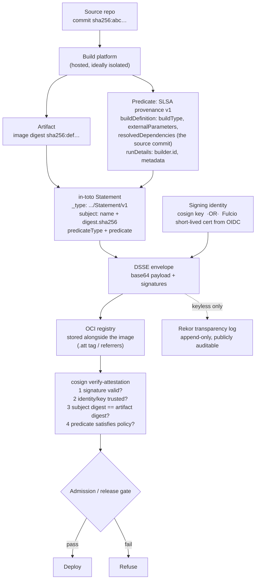

# Supply Chain Attestation Lab

A signature says *someone vouched for these bytes*. An **attestation** says *this specific claim is true
about these bytes, and here is who says so*. This lab builds the whole chain on your own machine — local
registry, local keys, real cosign — so you can verify a provenance and then watch verification fail on a
tampered artifact, in the verify-before-you-teach spirit of [`AGENTS.md`](../../../AGENTS.md).

## When to use

- You publish images or binaries and consumers currently trust them because of the URL they came from.
- A policy requires "SLSA Level 3" and nobody in the room can say what the provenance would contain, let
  alone verify one.
- You already produce an SBOM, and it sits in a build artifact bucket where nobody can tell whether it
  matches the image they are running.
- **Don't use it for** vulnerability scanning (provenance says *where an artifact came from*, never that it
  is safe — see [trivy-scan-lab](../trivy-scan-lab/SKILL.md)), for license compliance, or for offensive
  work. Signature-only signing without claims is covered in
  [cosign-signing-lab](../cosign-signing-lab/SKILL.md); this skill is about the *statements*.

## First principles: a signed statement about a named subject

**in-toto attestation** is the envelope format. A signed attestation is a **DSSE envelope** wrapping an
**in-toto Statement** with three parts (in-toto Attestation Specification, in-toto.io / GitHub
`in-toto/attestation`):

- **`subject`** — *what* the claim is about: a name plus a cryptographic digest. The digest is the binding;
  the name is a convenience.
- **`predicateType`** — a URI naming the *kind* of claim (`https://slsa.dev/provenance/v1`,
  SPDX, CycloneDX, VEX, test results, review approvals…).
- **`predicate`** — the claim itself, in the shape that `predicateType` defines.

**SLSA** (Supply-chain Levels for Software Artifacts, slsa.dev — a specification hosted by the OpenSSF;
**v1.0 was released in April 2023** and the **v1.1 Build track** followed, per the SLSA site's release
history) defines a *Build track* of levels describing how trustworthy the provenance is:

| SLSA Build level | Requirement, in one line | What an attacker must do to forge it | Typical implementation |
| --- | --- | --- | --- |
| **Build L1** | Provenance **exists** and is available to consumers | write a plausible JSON file | any build that emits provenance, even locally |
| **Build L2** | Provenance is **signed** and generated by a **hosted** build platform | steal the build platform's signing key | hosted CI signing with a managed identity |
| **Build L3** | The build platform is **hardened**: builds are isolated and the provenance-signing material is unforgeable by the build itself | compromise the build platform's control plane | a reusable, isolated builder workflow the job cannot tamper with |

⚠ Verify on the current page: SLSA has re-organised its levels between versions (the older v0.1 four-level
model is not the v1.x Build track), predicate versions move (`provenance/v0.2` → `provenance/v1`), and
cosign's `--type` shorthands change between releases. Check slsa.dev and `cosign attest --help` rather than
trusting a memory.



*Figure: the attestation chain. Step 3 in verification is the one people forget — a perfectly valid
signature over a statement whose `subject.digest` is **not** the artifact you are about to run proves
nothing at all.*

| Concept | It **does** prove | It does **not** prove |
| --- | --- | --- |
| Signature | these exact bytes were signed by that key/identity | the bytes are safe, current, or licensed |
| Provenance | which builder, from which source, with which parameters | the source was reviewed or the build was correct |
| SBOM attestation | this component list was asserted for **this digest** | the list is complete or the components are patched |
| Rekor entry | the signature existed at a point in time, publicly | the signer was authorised |
| VEX | this CVE is/is not exploitable in this artifact | anything about other CVEs |

| Signing mode | Key material | Best for | Trade-off |
| --- | --- | --- | --- |
| **Key-based** (`--key cosign.key`) | long-lived local key pair | air-gapped labs, offline verification | you now own a key rotation and storage problem |
| **Keyless** (default) | short-lived Fulcio cert from an OIDC identity, logged in Rekor | CI with a workload identity | requires network + a public transparency log |

## Procedure

1. **Install the tools** (all free): `cosign` (sigstore), `syft` (Anchore, for SBOMs), `jq`, Docker.
   Confirm versions — flags differ between cosign 1.x and 2.x:
   `cosign version` (this lab assumes **cosign 2.x**, where `COSIGN_EXPERIMENTAL` is no longer needed).
2. **Run a local registry so nothing leaves your machine**:
   `docker run -d -p 5000:5000 --name registry registry:2`.
3. **Build and push a demo image**, then **pin it by digest** — every attestation binds to a digest, never
   a tag:
   ```bash
   docker build -t localhost:5000/demo:v1 .
   docker push localhost:5000/demo:v1
   IMG=$(docker inspect --format='{{index .RepoDigests 0}}' localhost:5000/demo:v1)
   echo "$IMG"     # localhost:5000/demo@sha256:...
   ```
4. **Generate a key pair** for offline work: `COSIGN_PASSWORD="" cosign generate-key-pair` →
   `cosign.key` (never commit it) and `cosign.pub` (distribute freely).
5. **Sign the image** offline, then verify — and read what verification actually checked:
   ```bash
   cosign sign --key cosign.key --tlog-upload=false --allow-insecure-registry "$IMG"
   cosign verify --key cosign.pub --insecure-ignore-tlog=true --allow-insecure-registry "$IMG" | jq
   ```
   `--tlog-upload=false` / `--insecure-ignore-tlog=true` are what make this work with no network; in real
   pipelines you *want* the transparency log.
6. **Write a SLSA provenance predicate** (see the worked example) describing builder, build type and the
   resolved source commit. Hand-writing it once is the fastest way to understand what CI generates for you.
7. **Attach it as an attestation** and verify it, checking the predicate type explicitly:
   ```bash
   cosign attest --key cosign.key --type slsaprovenance1 --predicate provenance.json \
     --tlog-upload=false --allow-insecure-registry "$IMG"
   cosign verify-attestation --key cosign.pub --type slsaprovenance1 \
     --insecure-ignore-tlog=true --allow-insecure-registry "$IMG" \
     | jq -r '.payload' | base64 -d | jq
   ```
8. **Assert the subject digest matches** — the check the tooling does *not* do for you if you extract the
   predicate by hand. Compare `.subject[0].digest.sha256` against the digest you are about to deploy.
9. **Generate and attach an SBOM attestation** so the component list is bound to the digest:
   ```bash
   syft "$IMG" -o spdx-json > sbom.spdx.json
   cosign attest --key cosign.key --type spdxjson --predicate sbom.spdx.json \
     --tlog-upload=false --allow-insecure-registry "$IMG"
   ```
10. **Break it on purpose** (the lesson): rebuild the image with any change, push it under the same tag,
    and re-run `cosign verify-attestation` against the **new** digest. It fails — no attestation exists for
    those bytes. That is exactly the class of substitution attack the whole mechanism exists to stop.
11. **Move to keyless in CI** (network required): in GitHub Actions, `permissions: id-token: write` plus
    `cosign sign --yes ` obtains a short-lived Fulcio certificate from the workflow's OIDC identity and
    records it in Rekor. Verify by **identity**, not by key:
    `cosign verify --certificate-identity-regexp '^https://github.com/<org>/<repo>/' --certificate-oidc-issuer https://token.actions.githubusercontent.com `.
    GitHub's `actions/attest-build-provenance` action produces SLSA provenance directly and
    `gh attestation verify` checks it — verify current usage in the GitHub Actions documentation.
12. **Turn verification into a gate**, not a report: enforce it at admission
    ([k8s-admission-policy-lab](../k8s-admission-policy-lab/SKILL.md)) or in the release job. An attestation
    nothing verifies is decoration.
13. **Clean up**: `docker rm -f registry`, delete `cosign.key`. Close with the **Learning Footer**.

## Output shape

```
Artifact: <name>@sha256:<digest>        Registry: <local:5000 | ghcr.io/...>
Signing mode: <key-based (offline) | keyless (Fulcio + Rekor)>   cosign: <2.x.y>

Attestations attached:
  predicateType=https://slsa.dev/provenance/v1   type=slsaprovenance1  → <attached ✔>
  predicateType=<SPDX>                           type=spdxjson         → <attached ✔>

Provenance content (what it actually claims):
  builder.id            : <https://... — the identity a consumer must trust>
  buildType             : <URI describing how to interpret externalParameters>
  externalParameters    : <repo, ref, workflow>
  resolvedDependencies  : <source commit sha256/gitCommit>
  metadata              : invocationId=<..> startedOn=<..> finishedOn=<..>

Verification performed:
  signature valid                                   ✔
  signer identity trusted (<key fingerprint | cert identity + OIDC issuer>)   ✔
  subject.digest == deployed digest                 ✔   ← the step most people skip
  predicateType is the one policy requires          ✔
  transparency log entry (Rekor)                    <✔ | n/a offline>

Negative test: rebuilt image, same tag, new digest → verify-attestation FAILED as expected  ✔
SLSA Build level claimed: <L1 | L2 | L3>   Justification: <builder is hosted/isolated because ...>
Gap to next level: <e.g. "builder is not isolated from the job → cannot claim L3">
Enforcement point: <admission controller | release gate | none — decoration>
Next: <cosign-signing-lab | trivy-scan-lab | k8s-admission-policy-lab>
Learning Footer
```

## Worked example — attest a locally built image, then defeat a tag swap

**Setup (free, offline).**

```bash
docker run -d -p 5000:5000 --name registry registry:2

cat > Dockerfile <<'EOF'
FROM alpine:3.20
RUN adduser -D -u 10001 app
USER 10001
ENTRYPOINT ["/bin/sh", "-c", "echo v1 && sleep 3600"]
EOF

docker build -t localhost:5000/demo:v1 .
docker push localhost:5000/demo:v1
IMG=$(docker inspect --format='{{index .RepoDigests 0}}' localhost:5000/demo:v1)

COSIGN_PASSWORD="" cosign generate-key-pair       # cosign.key + cosign.pub
```

**A hand-written SLSA provenance v1 predicate.** Note carefully: this file is the **predicate only** —
cosign wraps it in the in-toto Statement and fills in `subject` from the image digest, which is why you
must never hand-write `subject` here and hope.

```json
{
  "buildDefinition": {
    "buildType": "https://example.com/local-docker-build/v1",
    "externalParameters": {
      "source": "git+https://github.com/acme/demo@refs/heads/main",
      "dockerfile": "Dockerfile"
    },
    "internalParameters": {
      "buildHost": "laptop-local"
    },
    "resolvedDependencies": [
      {
        "uri": "git+https://github.com/acme/demo@refs/heads/main",
        "digest": { "gitCommit": "0f7c1a3d9b2e4f5a6c8d0e1f2a3b4c5d6e7f8a9b" }
      },
      {
        "uri": "pkg:docker/alpine@3.20",
        "digest": { "sha256": "0a4eaa0eecf5f8c050e5bba433f58c052be7587ee8af3e8b3910ef9ab5fbe9f5" }
      }
    ]
  },
  "runDetails": {
    "builder": { "id": "https://example.com/builders/local-docker" },
    "metadata": {
      "invocationId": "local-2026-08-09T10:15:00Z",
      "startedOn": "2026-08-09T10:15:00Z",
      "finishedOn": "2026-08-09T10:15:42Z"
    }
  }
}
```

**Honesty check on the level claim.** This provenance is real and available, so it is **Build L1**. It is
signed, but the builder is a laptop, not a hosted platform, and the same laptop holds the signing key — so
it is *not* L2, and claiming otherwise is exactly the kind of paper compliance the framework exists to
prevent. Moving to L2 means the build runs on hosted CI whose managed identity signs; L3 additionally
requires the job to be unable to reach the signing material (a reusable, isolated builder workflow).

**Attach and verify:**

```bash
cosign attest --key cosign.key --type slsaprovenance1 --predicate provenance.json \
  --tlog-upload=false --allow-insecure-registry "$IMG"

cosign verify-attestation --key cosign.pub --type slsaprovenance1 \
  --insecure-ignore-tlog=true --allow-insecure-registry "$IMG" \
  | jq -r '.payload' | base64 -d | jq '{_type, predicateType, subject}'
```

Expected shape of the decoded statement — this is the thing consumers actually reason about:

```json
{
  "_type": "https://in-toto.io/Statement/v1",
  "predicateType": "https://slsa.dev/provenance/v1",
  "subject": [
    { "name": "localhost:5000/demo",
      "digest": { "sha256": "def0123456789abcdef..." } }
  ]
}
```

**The check the tooling will not do for you.** Wire the digest comparison into your gate, because a valid
attestation for a *different* image is the whole attack:

```bash
DEPLOY_DIGEST="${IMG##*@}"                                  # sha256:...
ATT_DIGEST=$(cosign verify-attestation --key cosign.pub --type slsaprovenance1 \
  --insecure-ignore-tlog=true --allow-insecure-registry "$IMG" \
  | jq -r '.payload' | base64 -d | jq -r '"sha256:" + .subject[0].digest.sha256')

[ "$DEPLOY_DIGEST" = "$ATT_DIGEST" ] \
  && echo "OK: attestation binds to the artifact being deployed" \
  || { echo "REFUSE: provenance subject != deployed digest"; exit 1; }
```

**Now the negative test — a tag swap.** Tags are mutable; digests are not:

```bash
sed -i 's/echo v1/echo v2-EVIL/' Dockerfile
docker build -t localhost:5000/demo:v1 . && docker push localhost:5000/demo:v1
NEWIMG=$(docker inspect --format='{{index .RepoDigests 0}}' localhost:5000/demo:v1)

cosign verify-attestation --key cosign.pub --type slsaprovenance1 \
  --insecure-ignore-tlog=true --allow-insecure-registry "$NEWIMG"
# → error: no matching attestations   ✔ the substitution is rejected
```

Reasoning through it: `localhost:5000/demo:v1` now resolves to a *new* digest. The attestation was bound to
the old digest, so nothing verifies for the new bytes. Everything downstream must therefore **deploy by
digest**, never by tag — a pipeline that verifies `:v1` and then deploys `:v1` has verified one artifact
and shipped another.

**Bind the SBOM to the same digest** so a consumer can answer "what is *in* the thing I verified":

```bash
syft "$IMG" -o spdx-json > sbom.spdx.json
cosign attest --key cosign.key --type spdxjson --predicate sbom.spdx.json \
  --tlog-upload=false --allow-insecure-registry "$IMG"
cosign verify-attestation --key cosign.pub --type spdxjson \
  --insecure-ignore-tlog=true --allow-insecure-registry "$IMG" >/dev/null && echo "SBOM attestation OK"
```

## Tips

- **Digests, not tags, everywhere.** Tags are mutable pointers; every attestation binds to a digest, so any
  pipeline step that re-resolves a tag after verification silently voids the guarantee.
- Always verify **three** things: the signature is valid, the *identity* is one you trust, and the
  `subject.digest` is the artifact you are about to run. Tools check the first easily, the second if you
  pass the right flags, and the third almost never.
- Keyless signing replaces "protect this key forever" with "trust this identity at this moment" — usually
  the better trade in CI, at the cost of needing Fulcio/Rekor reachable and a public log entry.
- Provenance is about **origin**, not safety. Pair it with scanning
  ([trivy-scan-lab](../trivy-scan-lab/SKILL.md)) and dependency hygiene
  ([dependency-audit](../dependency-audit/SKILL.md)); an attested, reproducible, thoroughly vulnerable
  image is entirely possible.
- Be honest about your SLSA level. Self-hosted, non-isolated builders that can reach their own signing key
  are L1–L2 at best, and an inflated claim is worse than no claim because downstream trusts it.
- An attestation nobody verifies is a build artifact. Put the verification in an enforcement point —
  admission control ([k8s-admission-policy-lab](../k8s-admission-policy-lab/SKILL.md),
  [opa-policy-lab](../opa-policy-lab/SKILL.md)) or the release gate.
- Predicate types are extensible: test results, code-review approval, and VEX are all legitimate
  attestations. Standardise which ones your gate requires, and version that list.
- Related: [cosign-signing-lab](../cosign-signing-lab/SKILL.md) for signature mechanics,
  [supply-chain-security-coach](../supply-chain-security-coach/SKILL.md) for the wider threat model,
  [github-actions-oidc-lab](../github-actions-oidc-lab/SKILL.md) for the workload identity that makes
  keyless possible, [ci-pipeline-builder](../ci-pipeline-builder/SKILL.md),
  [docker-registry-local-lab](../docker-registry-local-lab/SKILL.md), and
  [threat-model](../threat-model/SKILL.md).
  End with the **Learning Footer** (`AGENTS.md`).
