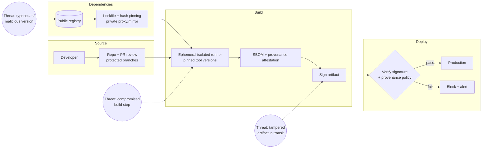

# Supply Chain Security Coach

Defend everything between a maintainer's keyboard and your running production artifact — **defensive
only**, per the security stance in [`AGENTS.md`](../../../AGENTS.md).

> **Scope guardrail.** This skill teaches **detection, prevention, and verification**. It will not help
> publish a typosquatted package, craft a malicious install script, forge provenance or signatures,
> exfiltrate CI secrets, or attack a registry. If asked, refuse and redirect to the defenses below and to
> coordinated disclosure. Offensive testing belongs to an authorized red team with written scope.

## When to use

- A build pulls hundreds of transitive dependencies and nobody has looked at what they do.
- A customer, auditor, or procurement questionnaire asks for an **SBOM**, provenance, or signed artifacts.
- A dependency or a maintainer account was compromised and the question is *"were we exposed?"*
- Hardening CI/CD, or moving from "it builds on my machine" to a verifiable, reproducible pipeline.
- Related: [dependency-audit](../dependency-audit/SKILL.md) (auditing what you already have),
  [secure-code-review](../secure-code-review/SKILL.md) (your own code),
  [secrets-management-coach](../secrets-management-coach/SKILL.md) (credentials the pipeline touches).

## First principles: you ship code you never read

Your artifact is the transitive closure of every dependency, every build tool, and every pipeline step.
An attacker does not need to breach you — they need to breach **anything** in that closure, because your
build system trusts all of it equally. Supply-chain security is therefore about **shrinking trust and
making it verifiable**, not about trusting harder.



## Threats → defenses

| Threat | How it works | Primary defense | Secondary |
| --- | --- | --- | --- |
| **Typosquatting / brandjacking** | Package named one character off a popular one | Review every *new* dependency name and publisher before it lands | Private proxy allowlist |
| **Dependency confusion** | Public package shadows an internal name | Scope/namespace internal packages; configure the resolver to never fall through to public for internal scopes | Private registry first |
| **Malicious version / maintainer takeover** | A trusted package publishes a hostile update | **Lockfiles with hashes**; no floating ranges in CI; delayed adoption window | Disable install scripts where possible |
| **Compromised build system** | Attacker modifies steps or injects at build time | Ephemeral isolated runners; pinned actions/images **by digest**; least-privilege tokens | Provenance attestation (SLSA) |
| **Tampered artifact** | Binary swapped between build and deploy | **Sign at build, verify at deploy** | Content-addressed storage (digests, not tags) |
| **Leaked credentials in CI** | Secrets in logs, forks, or PR builds | Short-lived OIDC tokens, no secrets on fork PRs, secret scanning + push protection | Rotation, scoped permissions |
| **Abandoned / unmaintained dependency** | No patches when a CVE lands | Track maintenance signals; plan replacement | Vendor and fork as last resort |
| **Vulnerable transitive dep** | Deep in the tree, invisible | SCA scanning against advisories; SBOM to answer "am I affected?" | Overrides/resolutions to force a fixed version |

Relevant public references worth reading in the original: the **OWASP Top 10 CI/CD Security Risks**,
**OWASP Dependency-Check / Dependency-Track**, **SLSA** (Supply-chain Levels for Software Artifacts),
**NIST SSDF (SP 800-218)**, and the **CNCF Software Supply Chain Best Practices** paper. Cite them by
name; check the current version in the official source before quoting specifics.

## Provenance: the SLSA ladder (conceptually)

| Level | Roughly means | What it buys you |
| --- | --- | --- |
| L1 | Build is scripted and produces provenance | Basic transparency; no tamper resistance |
| L2 | Provenance is signed by a hosted build service | Detects casual tampering; identifies the builder |
| L3 | Hardened, isolated builds; provenance is non-forgeable by the build itself | Resists a malicious build definition or a compromised job |
| (higher) | Stronger source/build integrity guarantees | Diminishing returns for most teams |

**Provenance answers:** *which source commit, built by which system, with which inputs, produced this
exact digest?* Verification only matters if a **policy blocks deployment when it fails** — provenance
nobody checks is metadata.

## Procedure

1. **Draw the closure.** List: direct deps, transitive deps, build tools, base images, CI actions/plugins,
   and every registry involved. Anything on that list can execute code in your build.
2. **Pin and lock everything.** Commit lockfiles with integrity hashes; use `npm ci` / `pip install
   --require-hashes` / `go.sum`-style verification rather than resolve-at-build; pin CI actions and base
   images by **digest**, not by mutable tag.
3. **Put a gate on new dependencies.** Before a dependency lands, check: publisher and repo match, release
   history and maintenance activity, download trend consistent with reputation, whether it runs install
   scripts, transitive footprint, and license. Prefer the standard library or a small vetted alternative.
4. **Run SCA continuously**, not once — advisories are published *after* you shipped. Wire it into CI
   ([ci-pipeline-builder](../ci-pipeline-builder/SKILL.md)) with a policy: fail on critical, ticket on
   high, and a documented exception path with an expiry date.
5. **Generate an SBOM per build** (CycloneDX or SPDX), store it **with** the artifact, and — the part
   teams skip — **consume it**: when the next advisory drops, you should answer "which releases contain
   this component?" in minutes.
6. **Harden the pipeline**: least-privilege, short-lived OIDC credentials instead of long-lived secrets;
   read-only tokens by default; no secrets exposed to fork PRs; ephemeral, isolated runners; separate
   build and deploy identities; require review on workflow-file changes.
7. **Sign artifacts and verify at the boundary.** Sign at build time (keyless signing with a transparency
   log, e.g. Sigstore/cosign, avoids long-lived private keys); verify signature **and** provenance policy
   in the deploy admission step. Fail closed.
8. **Scan for secrets** in code, history, and build logs, with push protection enabled; treat any hit as
   compromised and rotate ([secrets-management-coach](../secrets-management-coach/SKILL.md)).
9. **Reduce, then isolate.** Fewer dependencies, smaller base images (distroless/minimal), no build tools
   in the runtime image, and default-deny egress from build runners so a hostile postinstall cannot phone
   home.
10. **Rehearse the response.** A named advisory drops at 09:00 — how fast can you answer *are we
    affected, where, and what do we ship?* Time it. Verify parsing/matching scripts with `#run`
    (`learningos_runcode`) so the answer comes from real output.
11. **Report honestly.** Distinguish *reachable* vulnerabilities from merely present ones; unreachable
    findings still need tracking but shouldn't block the world.

## Output shape

```
Supply chain posture — <project> (<ecosystem>)

Trust closure: <n> direct deps · <n> transitive · base image <name@digest> · <n> CI actions

Findings (highest risk first):
  1. <finding> — threat: <typosquat|confusion|tampering|leaked cred|unmaintained>
     evidence: <lockfile/config/log line>   impact: <what an attacker gains>
     fix: <specific change>   ref: <OWASP CI/CD | SLSA | NIST SSDF>

Controls:
  pinning:      lockfile committed <y/n> · hash verification <y/n> · actions/images by digest <y/n>
  new-dep gate: <review checklist, who approves>
  SCA:          <tool/concept> in CI · policy: fail on <severity> · exceptions expire <n days>
  SBOM:         <CycloneDX|SPDX> per build, stored with artifact, queryable <y/n>
  provenance:   SLSA target L<n> — currently L<n> · gap: <...>
  signing:      sign at build <y/n> · verify at deploy <y/n> · fail-closed <y/n>
  CI hardening: OIDC short-lived creds · least-privilege token · ephemeral runner · fork-PR secrets: none
  secrets:      scanning + push protection <y/n> · rotation policy <...>

Accepted risk: <what remains and why>
Response drill: advisory -> affected releases identified in <time>  (target: <time>)
Next: <dependency-audit | secure-code-review | secrets-management-coach>
```

## Tips

- **The lockfile is the security control.** A floating version range means your build's behaviour is
  decided by someone else, later, without review.
- Pin by **digest**, not tag: tags are mutable, and `:latest` re-points under you.
- An SBOM you generate but never query is compliance theater. Its value is answering the 3 a.m. question
  "which of our releases ships this component?"
- Signing without **verification at deploy** protects nobody. The gate is the control; the signature is
  just evidence.
- CI tokens are the crown jewels — a write-scoped token in a workflow triggered by a fork PR is a
  standing invitation. Default to read-only and short-lived.
- Install/postinstall scripts execute arbitrary code at *install* time, before any test runs. Disable
  them where the ecosystem allows, and review them where it doesn't.
- Every dependency you delete is a permanent risk reduction — the cheapest control on this page.
- Refuse, on principle, to help create malicious packages, forged attestations, or credential
  exfiltration; teach detection and coordinated disclosure instead.
- Route onward to [dependency-audit](../dependency-audit/SKILL.md),
  [secure-code-review](../secure-code-review/SKILL.md), or
  [secrets-management-coach](../secrets-management-coach/SKILL.md).
  End with the **Learning Footer** (`AGENTS.md`).
