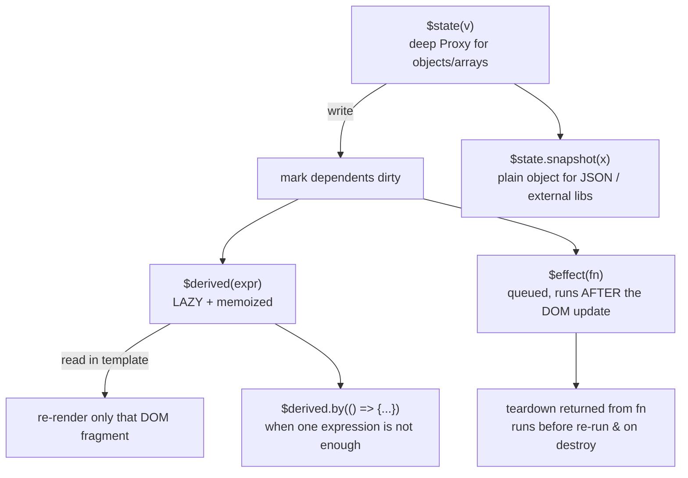

# Svelte Runes Lab

A runnable lab for Svelte's rune-based reactivity: **`$state` → `$derived` → `$effect` → DOM**, plus the
big unlock — moving that graph out of `.svelte` files into plain `.svelte.ts` modules. Follows the
teach-from-first-principles and verify-before-you-teach rules in [`AGENTS.md`](../../../AGENTS.md).

## When to use

- You are learning Svelte 5, or migrating a Svelte 4 codebase off `let` + `$:` + `writable()` stores.
- Your `$effect` loops, or state changes but the DOM doesn't move (or vice versa).
- You want one shared store usable from components *and* from plain TypeScript.
- **Don't use it for** SvelteKit routing, load functions, or form actions — those are a separate concern
  from the reactivity model taught here.

## First principles: explicit signals, resolved at compile time

Runes shipped in **Svelte 5 (October 2024)**. Per the official Svelte docs, a rune is a compiler *symbol*,
not a function you import — `$state`, `$derived`, `$effect`, `$props` are recognised by the compiler and
turned into signal-graph calls. That is why they are only legal in `.svelte` files and in modules whose name
ends `.svelte.js` / `.svelte.ts`, and why the old "assignment triggers reactivity" heuristic is gone: the
compiler now knows exactly which variables are reactive because you said so.



| Rune | Reactive? | Writable | Runs / evaluates | Gotcha |
| --- | --- | --- | --- | --- |
| `$state(v)` | yes (deep proxy for plain objects & arrays) | yes | on assignment | proxies are not `structuredClone`-able — use `$state.snapshot()` |
| `$state.raw(v)` | reference only | reassign only | on reassignment | mutating a field does **nothing**; use for large immutable blobs |
| `$derived(expr)` | yes | (see docs for your version) | lazily, on read, memoized | must be a single expression — otherwise `$derived.by` |
| `$derived.by(fn)` | yes | — | lazily, on read | same tracking rules; still no side effects inside |
| `$effect(fn)` | reads tracked | discouraged to write | **after** the DOM update, batched | only *synchronously* read deps are tracked; return a teardown |
| `$effect.pre(fn)` | reads tracked | discouraged | **before** the DOM update | for scroll-position reads / autoscroll |
| `$props()` | yes | via `$bindable()` | on parent update | destructure once; defaults live in the destructuring |
| `$inspect(x)` | yes | — | dev builds only | stripped in production — never load-bearing |

**Trade-off to say out loud:** Svelte 4's `$:` labelled statements were implicit and re-ran on a heuristic
dependency guess; runes are explicit and therefore verbose, but the dependency set is exact and the same
code works outside a component. The cost is a rule you must internalise: **`$derived` for values,
`$effect` only for the outside world.** Most "my effect loops" bugs are a `$derived` written as an `$effect`.

## Procedure

1. **Scaffold** with the Svelte CLI and check the version you are teaching against:

   ```bash
   npx sv create runes-lab      # choose: SvelteKit minimal (or Svelte library) + TypeScript
   cd runes-lab && npm i && npx svelte --version && npm run dev
   ```

2. **Declare state explicitly.** Replace every reactive `let x = 0` with `let x = $state(0)`. Objects and
   arrays become deep proxies, so `todos.push(t)` and `user.name = 'x'` are both reactive.
3. **Replace `$:` with `$derived`.** Anything computed from state is `$derived(...)` — never an `$effect`
   that assigns. Multi-statement logic goes in `$derived.by(() => { … return v })`.
4. **Reserve `$effect` for the boundary**: `document.title`, `localStorage`, canvas/chart libraries,
   subscriptions. Return a teardown function; it runs before every re-run and on destroy.
5. **Type your props** with `$props()`: `let { title, count = 0, ...rest }: Props = $props();`. Two-way
   binding requires the child to declare `let { value = $bindable('') } = $props()`.
6. **Move shared state into `.svelte.ts`.** Runes work in any module with that suffix. You cannot
   `export let` a reassigned `$state` variable — export a **class instance** (or an object with getters), so
   consumers read through a property access that the compiler can track.
7. **Break it on purpose:** read a dependency inside an `await` in an `$effect` and watch it stop tracking;
   then `JSON.stringify` a `$state` object and see the proxy leak. Fix with `$state.snapshot()`.
8. **Verify** with `npm run check` (svelte-check) and `npm run dev`.
9. Close with the **Learning Footer**.

## Output shape

```
Goal: <what the UI must do>              Svelte: <version>     File(s): <*.svelte, *.svelte.ts>
Graph: state -> <$state(...)>   derived -> <$derived / $derived.by>   boundary -> <$effect>
Props: <let { a, b = d, ...rest } = $props()>     Bindable: <$bindable(...) | none>
Shared store: <.svelte.ts class | object with getters>   Exported as: <instance | factory>
Migration from Svelte 4: let -> $state · $: -> $derived · writable() -> class in .svelte.ts
Pitfall reproduced: <effect loop | lost tracking after await | proxy in JSON> -> Fix: <...>
Code: <runnable component + module>
Verify: npm run check  ·  npm run dev
Next: <state-management-coach | component-designer | angular-signals-lab>
Learning Footer
```

## Worked example — a shared cart store in `.svelte.ts`, consumed by a component

`src/lib/cart.svelte.ts` — universal reactivity, no component required:

```ts
export class Cart {
  // Deep proxy: pushing into this array, or mutating a line, is reactive.
  lines = $state<{ name: string; price: number; qty: number }[]>([]);
  vatRate = $state(0.2);

  // Lazy + memoized. Nothing recomputes until something READS subtotal/total.
  subtotal = $derived(this.lines.reduce((s, l) => s + l.price * l.qty, 0));
  total = $derived(this.subtotal * (1 + this.vatRate));

  add(name: string, price: number) {
    const hit = this.lines.find(l => l.name === name);
    if (hit) hit.qty += 1; else this.lines.push({ name, price, qty: 1 });
  }
  remove(name: string) { this.lines = this.lines.filter(l => l.name !== name); }

  // $state.snapshot strips the proxy so JSON/structuredClone/fetch see a plain object.
  toJSON() { return $state.snapshot(this.lines); }
}

export const cart = new Cart();   // export the INSTANCE, not a reassigned $state variable
```

`src/routes/+page.svelte` (or `App.svelte`):

```svelte
<script lang="ts">
  import { cart } from '$lib/cart.svelte.ts';

  type Props = { currency?: string };
  let { currency = 'EUR' }: Props = $props();

  let query = $state('');
  const visible = $derived.by(() => {
    const q = query.trim().toLowerCase();
    return q ? cart.lines.filter(l => l.name.toLowerCase().includes(q)) : cart.lines;
  });

  // Boundary work only. Runs AFTER the DOM updates, and re-runs when total changes.
  $effect(() => {
    document.title = `Cart — ${cart.total.toFixed(2)} ${currency}`;
    localStorage.setItem('cart', JSON.stringify(cart.toJSON()));
    return () => { document.title = 'Shop'; };     // teardown before re-run and on destroy
  });
</script>

<input bind:value={query} placeholder="filter…" />
<button onclick={() => cart.add('Keyboard', 89)}>Add keyboard</button>

<ul>
  {#each visible as line (line.name)}
    <li>{line.name} × {line.qty} — {(line.price * line.qty).toFixed(2)}
      <button onclick={() => cart.remove(line.name)}>remove</button></li>
  {/each}
</ul>
<p>Subtotal {cart.subtotal.toFixed(2)} · Total {cart.total.toFixed(2)} {currency}</p>
```

Reason it through: clicking *Add keyboard* mutates the proxied array, which dirties `subtotal`, then `total`.
`visible` is only recomputed when the `{#each}` block reads it, and the `$effect` runs once, *after* the list
has been patched — so `document.title` is never one frame stale. `toJSON()` calls `$state.snapshot()` because
`JSON.stringify` on a raw `$state` proxy can serialise proxy internals; that single call is the difference
between a clean `localStorage` payload and a subtle corruption bug.

## Tips

- **`$derived` for values, `$effect` for effects.** If an `$effect` assigns to `$state`, you have written a
  derivation with extra steps — and probably an infinite loop.
- `$effect` tracks only what it reads **synchronously**. Anything read after an `await` is untracked; hoist
  the reads above the `await`, or use `untrack()` deliberately.
- `$state` proxies objects and arrays *deeply*, but a `Map`, `Set`, `Date` or class instance from elsewhere
  is not proxied — reassign it, or use the reactive built-ins from `svelte/reactivity`.
- Runes are compiler symbols: they only work in `.svelte`, `.svelte.js`, `.svelte.ts`. A rune in a plain
  `.ts` file is a runtime `ReferenceError`, not a silent no-op.
- You cannot `export let count = $state(0)` and have consumers see updates on reassignment — export a class
  instance or an object with getters so reads go through a tracked property access.
- Svelte 5 event syntax is a plain attribute (`onclick={fn}`), not `on:click` — mixing the two in one
  codebase is the most common migration error.
- `$inspect` is dev-only and stripped from production builds; never rely on its side effects.
- Compare graphs with [angular-signals-lab](../angular-signals-lab/SKILL.md) and
  [react-hooks-lab](../react-hooks-lab/SKILL.md); design the store boundary with
  [state-management-coach](../state-management-coach/SKILL.md) and the API with
  [component-designer](../component-designer/SKILL.md); keep handlers short per
  [inp-optimization-lab](../inp-optimization-lab/SKILL.md). Verify every rune against the Svelte docs for
  *your* version (`AGENTS.md` §2), then end with the **Learning Footer** (`AGENTS.md`).
