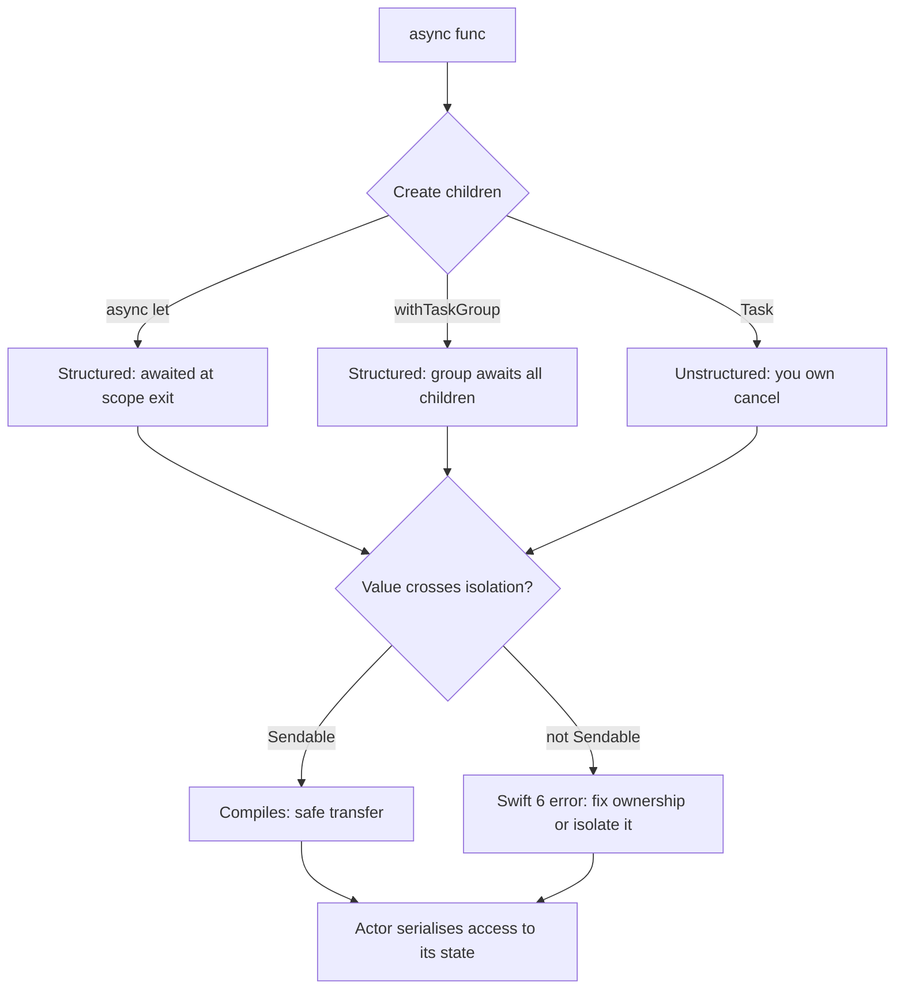

# Swift Concurrency Lab

Write the concurrent code, then let the **compiler** prove it is race-free — a lab that turns Swift 6's
errors from obstacles into a checking tool, per the first-principles and **Learning Footer** rules in
[`AGENTS.md`](../../../AGENTS.md). Pairs with [swiftui-lab](../swiftui-lab/SKILL.md) and
[ios-lifecycle-coach](../ios-lifecycle-coach/SKILL.md).

## When to use

- The learner is porting completion handlers / DispatchQueue code to `async/await`.
- "Publishing changes from background threads" or purple runtime warnings appear in a SwiftUI app.
- The Swift 6 language mode floods the project with `Sendable` errors and they want a staged plan.
- Parallel work does not actually run in parallel, or does not stop when the user navigates away.

## First principles

Swift concurrency replaces *threads you manage* with **tasks the runtime schedules on a cooperative thread
pool**. Three foundations:

1. **Structured concurrency** — child tasks created with `async let` or a task group cannot outlive their
   parent scope. The scope waits for them, propagates cancellation down, and rethrows errors up. `Task { }`
   is *un*structured: it escapes the scope and you must hold and cancel it yourself.
2. **Isolation** — an `actor` protects its mutable state by serialising access; anything crossing an
   isolation boundary must be `await`ed. `@MainActor` is the actor for UI work.
3. **Sendable** — the compiler's proof that a value may safely cross isolation boundaries. Swift 6 turns the
   old runtime coin-flip into a **compile-time** error (Swift.org, *Swift 6* / *Concurrency* documentation;
   SE-0302 Sendable, SE-0306 actors).



## Picking the right construct

| Need | Construct | Trade-off |
| --- | --- | --- |
| Two known parallel results | `async let a = …; async let b = …; await (a, b)` | Simplest parallelism; fixed, compile-time count |
| N parallel results, N known at runtime | `withTaskGroup` / `withThrowingTaskGroup` | Dynamic fan-out; you must bound concurrency yourself |
| Kick work off from sync code (a button tap) | `Task { }` | Unstructured — store it and `cancel()` on disappear |
| Detach from surrounding isolation/priority | `Task.detached` | Rarely correct; loses actor context and priority inheritance |
| Protect shared mutable state | `actor` | Serialised, reentrant across `await` — invariants can change mid-method |
| UI / view-model state | `@MainActor` | Guaranteed main thread; do not put heavy CPU work there |
| Global mutable value | `let` constant, actor, or `@MainActor` | Swift 6 rejects unprotected `var` globals |
| Bridge a callback API | `withCheckedContinuation` / `…ThrowingContinuation` | Must resume **exactly once**, or you leak / crash |
| Turn events into an async sequence | `AsyncStream` | Choose the buffering policy deliberately |

Cancellation is **cooperative** here too: `Task.isCancelled` / `try Task.checkCancellation()` must be checked
in long loops, and cancellation does not tear down work that never checks.

## Procedure

1. **Set up.** A Swift package or Xcode command-line target (`swift package init --type executable`) so you
   can iterate without a simulator. Record `swift --version` and the language mode in use.
2. **Exercise 1 — sequential vs parallel.** Write `func fetch(_ i: Int) async throws -> Int` with a
   `Task.sleep`. Await three calls in a row and time it; then use `async let` for all three and time it
   again. Print both elapsed times and explain the difference in one sentence.
3. **Exercise 2 — task group.** Fan out N items with `withThrowingTaskGroup(of:)`, collecting results as they
   complete. Then bound concurrency to 4 by adding tasks only while `inFlight < 4` and draining with
   `group.next()`. Compare wall time and peak memory for N = 1 000.
4. **Exercise 3 — cancellation.** Cancel the group after the first result and verify a child with no
   `Task.checkCancellation()` keeps working, while one that checks it stops. Add a `defer` cleanup and
   confirm it runs. Then create an unstructured `Task { }` from a SwiftUI `.task { }` vs `onAppear` and
   observe which one auto-cancels when the view disappears.
5. **Exercise 4 — actors.** Convert a `class Counter` with a lock into `actor Counter`. Hammer it from 1 000
   concurrent tasks and assert the final count. Now add an `await` in the middle of a mutating method and
   demonstrate **actor reentrancy**: state can change across that suspension, so re-read your invariants
   after every `await` rather than caching them.
6. **Exercise 5 — @MainActor.** Mark a view model `@MainActor` and call it from a background task; observe
   the required `await` hop. Move a CPU-heavy loop off the main actor into a `nonisolated` function or an
   actor and measure the UI hitch before and after.
7. **Exercise 6 — Sendable.** Try to capture a non-`Sendable` reference type in a `Task` and read the exact
   compiler diagnostic. Fix it three ways and compare: (a) make the type a `struct` of `Sendable` values,
   (b) make it an `actor`, (c) mark it `@unchecked Sendable` *with* a documented lock — and explain why (c)
   is a promise the compiler can no longer verify for you.
8. **Exercise 7 — incremental Swift 6 adoption.** Do not flip the whole project at once. Turn on
   `SWIFT_STRICT_CONCURRENCY = targeted`, fix the diagnostics, then `complete`, then finally switch the
   language mode to 6 — module by module. Keep a table of the error counts at each step: it is a progress
   bar and it makes the migration finite.
9. **Verify.** Run the counter test under **Thread Sanitizer** and the Main Thread Checker; assert the final
   value is exactly 1 000, that cancellation stops work within one check interval, and that the strict-mode
   error count strictly decreases at each stage.
10. **Run it with `#run`** (`learningos_runcode`): the pure async logic is executable Swift. Exercise real
    inputs *and* edge cases — zero items, one item, a child that throws immediately, cancel before the first
    suspension, a continuation resumed twice (observe the crash), and N = 10 000 — and teach from the real
    output.

## Output shape

```
Swift concurrency lab — <scenario> (Swift <version>, language mode <5|6>)

1 async let     : sequential <a> ms vs parallel <b> ms
2 task group    : unbounded N=1000 -> <ms>, peak mem <x>; bounded to 4 -> <ms>, <y>
3 cancellation  : unchecked child kept running <n> more items; checked child stopped at <ms>
                  SwiftUI .task auto-cancelled on disappear: <y/n>
4 actor         : 1000 concurrent increments -> final <1000>; reentrancy across await changed <invariant>
5 @MainActor    : hop required from background; heavy loop moved off main -> hitch <before>→<after>
6 Sendable      : diagnostic "<exact message>"; fixes struct / actor / @unchecked (chose <x> because …)
7 strict mode   : off <0> -> targeted <n> errors -> complete <m> -> Swift 6 mode <0>

Verification: TSan clean <y/n> | Main Thread Checker clean <y/n> | final count == 1000 <y/n>

#run edge cases: 0 items -> <output> | 1 -> <output> | child throws -> <output>
                 cancel before first await -> <output> | 10k items -> <output>

Takeaway: <structured vs unstructured, in one sentence>
Next: <linked skill>
```

## Tips

- Prefer structured concurrency (`async let`, task groups): the scope guarantees you cannot leak a child.
  Reach for `Task { }` only at the boundary with synchronous code, and cancel it yourself.
- `Task.detached` is almost never the right answer — it throws away actor context and priority inheritance;
  most uses of it are actually "I want to leave the main actor", which `nonisolated` handles better.
- Actors are **reentrant**: any `await` inside an actor method is a suspension where other calls can
  interleave. Re-check state after each `await`; do not cache invariants across one.
- An actor is not a performance tool — it serialises. For read-heavy immutable data, plain `Sendable` value
  types are faster and simpler.
- `@unchecked Sendable` silences the compiler, not the race. Use it only with a documented lock and treat it
  as technical debt with an owner.
- Migrate to strict concurrency **module by module** (`minimal` → `targeted` → `complete` → language mode 6);
  a big-bang flip produces an unreadable error wall.
- Every `withCheckedContinuation` must resume exactly once on every path — including the error path.
- Close with the **Learning Footer** (`AGENTS.md`): recap, pitfalls, next topic, one exercise, level, time.
