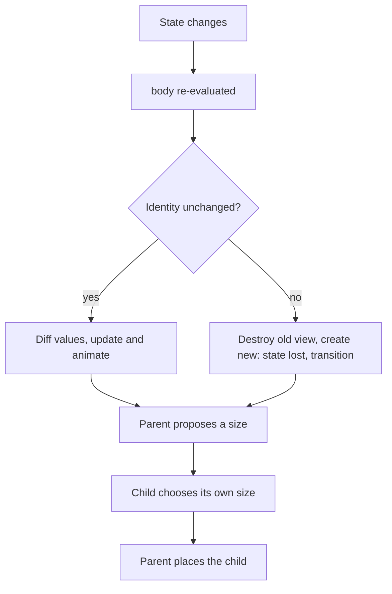

# SwiftUI Lab

A build-it-now lab: one screen, five commits, each one exposing a rule of SwiftUI's declarative model —
taught from first principles with trade-offs and the **Learning Footer**, per
[`AGENTS.md`](../../../AGENTS.md). Pairs with [ios-lifecycle-coach](../ios-lifecycle-coach/SKILL.md) and
[mobile-state-management-coach](../mobile-state-management-coach/SKILL.md).

## When to use

- The learner knows Swift but has never internalised *why* a SwiftUI view redraws (or refuses to).
- A view "doesn't update", or updates far too often, and they are guessing at property wrappers.
- A `List`/`ForEach` scrolls badly, animates the wrong row, or loses per-row state on delete.
- They want a repeatable hands-on rep before touching a production screen.

## First principles

A SwiftUI `View` is **not** an object you mutate — it is a lightweight, disposable *description*. SwiftUI
diffs the new description against the old one using **identity** (structural position, or an explicit `id`),
then updates only the underlying render nodes. Three consequences fall out of that single idea:

1. State cannot live in the value (the value is thrown away) — it lives *outside*, referenced by a property
   wrapper.
2. Same identity + different value = **update/animate**. Different identity = **destroy and recreate**
   (state is lost, transitions fire instead of animations).
3. Layout is a **negotiation**, not absolute positioning: a parent proposes a size, the child chooses its
   own size, the parent places it (Apple, *SwiftUI · Layout fundamentals* documentation).



## Choosing the right state tool

| Tool | Who owns the value | Semantics | Reach for it when | Pitfall |
| --- | --- | --- | --- | --- |
| `@State` | this view | value, private | small local view-owned truth (toggle, draft text) | making it non-private and passing it down |
| `@Binding` | a parent | two-way reference | a child must *write* a value it does not own | using a binding where read-only would do |
| `@Observable` class | a model object | reference, per-property tracking | shared/model state, iOS 17+ | keeping `ObservableObject` habits that invalidate too broadly |
| `@StateObject` / `@ObservedObject` | model object (pre-Observation) | reference | back-deploying below iOS 17 | `@ObservedObject` for an object the view *creates* — it gets re-created |
| `@Environment` | ancestor / system | injected | cross-cutting values (color scheme, dismiss, dependencies) | using it for screen-specific business state |
| plain `let` | the caller | value | anything the view only reads | wrapping read-only data in `@State` |

Rule of thumb: **the value belongs at the lowest node that contains every reader and writer.** With the
Observation framework (`@Observable`, Swift 5.9 / iOS 17), SwiftUI records *which properties a body actually
read* and invalidates only those readers — strictly finer-grained than `ObservableObject`, whose
`objectWillChange` notifies every observer.

## Procedure

1. **Set up the loop.** New iOS App (SwiftUI) target in Xcode. Add `#Preview { ContentView() }` and keep the
   canvas open — previews are the fastest edit→see cycle available; the simulator is the slow path.
2. **Commit 1 — local state.** Build a `Text` + `Button` counter with `@State private var count = 0`. Mutate
   it and watch `body` re-run. Add a `print` inside `body` and observe *how often* it runs: bodies are cheap
   and are called many times — so never put side effects there.
3. **Commit 2 — lift the state.** Extract a `CounterRow` child taking `@Binding var count: Int`; prove the
   child can write upward. Then rewrite it as read-only `let count: Int` plus an `onIncrement: () -> Void`
   closure, and argue which API is easier to test and reuse.
4. **Commit 3 — a model.** Introduce `@Observable final class TaskStore { var items: [Task] = [] }`, own it
   at the root with `@State private var store = TaskStore()`, and read it below via
   `@Environment(TaskStore.self)`. Add/remove items and confirm only views that *read* `items` re-render.
5. **Commit 4 — identity in lists.** Render `List { ForEach(store.items) { … } }` where `Task: Identifiable`
   with a **stable stored** `id` (never `UUID()` computed in `body`, never the array index). Now break it on
   purpose — `ForEach(items.indices, id: \.self)` — delete a middle row and watch the wrong row animate and
   per-row `@State` jump between rows. Restore the stable id and re-observe.
6. **Commit 5 — navigation as data.** Replace ad-hoc links with
   `NavigationStack(path: $path) { … .navigationDestination(for: Task.self) { … } }` and
   `@State private var path: [Task] = []`. Push and pop by mutating the array; add a "go home" button that
   sets `path = []`. Navigation is now **state you can test, restore and deep-link**.
7. **Verify — run this acceptance checklist and record the observed result**, not the expected one:
   - preview variants `.environment(\.colorScheme, .dark)` and
     `.environment(\.dynamicTypeSize, .accessibility3)` — does anything clip or truncate?
   - narrow width / rotation: does layout survive without hard-coded frames?
   - delete a middle row: does the *correct* row animate out?
   - push three details, then `path = []`: does it pop all the way home?
   - VoiceOver on in the simulator: is every control labelled?
8. **Run the logic with `#run`.** UI needs a simulator, but the pure parts do not: extract filtering,
   sorting and formatting into free functions and execute them with `#run` (`learningos_runcode`) on real
   inputs **including edge cases** — empty array, single item, duplicate titles, an emoji or RTL string, a
   very long title. Teach from the printed output, never from an assumed result.
9. **Reflect and route.** State in one sentence each: which state tool you chose and why, and which identity
   change caused the wrong animation. Then continue to
   [mobile-state-management-coach](../mobile-state-management-coach/SKILL.md) or
   [accessibility-audit](../accessibility-audit/SKILL.md).

## Output shape

```
SwiftUI lab — <screen> (target: iOS <version>)

Loop: Xcode #Preview canvas + simulator for gestures/VoiceOver

Commit 1 @State      -> counter updates; body ran <n> times (side effects moved out)
Commit 2 @Binding    -> child writes parent; alt API let + closure (chose <x> because …)
Commit 3 @Observable -> only <view> re-rendered on items change (per-property tracking)
Commit 4 identity    -> broken: indices + id:\.self => wrong row animated, state jumped
                        fixed : Identifiable with stored UUID => correct row
Commit 5 NavigationStack(path:) -> push/pop by array mutation; path = [] pops to root

Verification (observed):
  Dynamic Type AX3 : <PASS/FAIL — what clipped>
  Dark Mode        : <PASS/FAIL>
  Delete middle row: <PASS/FAIL>
  Pop-to-root      : <PASS/FAIL>
  VoiceOver labels : <PASS/FAIL>

#run (pure logic): filter("") -> <real output> | [] -> <output> | 1 item -> <output>
                   duplicates -> <output> | long/emoji title -> <output>

Takeaway: <identity vs value, in one sentence>
Next: <linked skill>
```

## Tips

- `body` is a pure function of state and may run many times per frame — no networking, no analytics, no
  mutation inside it.
- Prefer `@State` + `@Observable` (iOS 17+) over `ObservableObject` for new code: property-level tracking
  means fewer invalidations for free. Keep `@StateObject` only where you must back-deploy.
- `@State`/`@StateObject` **create and own**; `@Binding`/`@ObservedObject` **borrow**. Creating a model
  inside an `@ObservedObject` property re-creates it on every update — the classic "my state resets" bug.
- Never use array indices or a freshly computed `UUID()` as a `ForEach` id: identity must be stable across
  updates or SwiftUI animates and reuses the wrong rows.
- Work *with* the layout negotiation — `layoutPriority`, `fixedSize`, `Spacer` and flexible frames — instead
  of hard-coded pixel sizes that shatter at accessibility text sizes.
- Test Dynamic Type at `.accessibility3` before shipping; it catches more layout bugs than any other single
  check.
- Keep pure logic outside views so it can be executed and asserted — verify it with `#run` on edge cases.
- Close with the **Learning Footer** (`AGENTS.md`): recap, pitfalls, next topic, one exercise, level, time.
