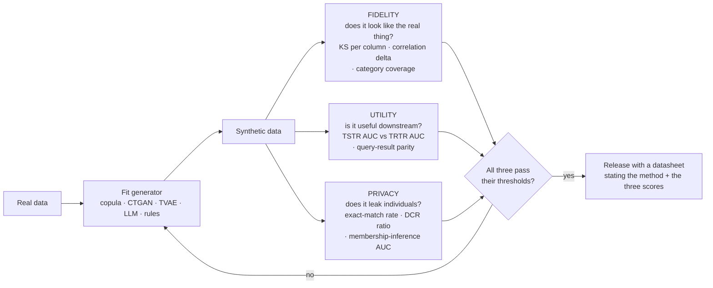

# Synthetic Data Lab

Anyone can generate rows that *look* right. The engineering is in the evaluation: synthetic data that
matches every marginal distribution can still be useless for training and can still leak the people in the
training set. This lab generates data **and** measures the three quantities that actually decide whether you
may use it — following the honesty and verification rules in [`AGENTS.md`](../../../AGENTS.md).

## When to use

- **Privacy / sharing**: you need a dataset a vendor, a demo, or a CI pipeline can touch, and the real one is
  regulated.
- **Volume or rare classes**: the minority class has 40 rows and every model overfits it.
- **Test fixtures**: you need realistic, schema-valid, referentially-intact data for integration tests.
- **Cold start**: the product does not exist yet, so you are simulating rather than sampling.
- **LLM training/eval sets**: you need instruction pairs, edge-case prompts, or labelled text you don't have.
- **Don't use it for** discovering *new* facts about the world — synthetic data cannot contain information
  the generator never saw, so measuring population statistics on it is circular. **Don't use it** as a
  privacy control on its own: synthesis is not anonymisation and confers no formal guarantee unless the
  generator itself is trained under differential privacy. And **don't** ship it into training without a
  train-on-synthetic-test-on-real number — see the worked example below for why.

## First principles: three axes that trade against each other

**Primary sources.** The dominant tabular deep generator is **CTGAN** — Xu, Skoularidou,
Cuesta-Infante & Veeramachaneni, *"Modeling Tabular Data using Conditional GAN"*, **NeurIPS 2019
(arXiv:1907.00503, 1 July 2019)** — which introduced mode-specific normalisation and training-by-sampling to
survive multi-modal continuous columns and severe categorical imbalance. It ships in the **Synthetic Data
Vault (SDV)** (`docs.sdv.dev`, MIT-licensed core; originally Patki, Wedge & Veeramachaneni, *"The Synthetic
Data Vault"*, **IEEE DSAA 2016**), whose `SDMetrics` package provides the diagnostic and quality reports.
For a formal privacy guarantee you need differential privacy (Dwork & Roth, *"The Algorithmic Foundations of
Differential Privacy"*, **2014**) applied *during* generator training — not applied to the output.

Every synthetic dataset sits somewhere on three axes, and you cannot maximise all three:

$$\textbf{Fidelity} \;\uparrow\; \Longrightarrow \textbf{Privacy} \;\downarrow \qquad\text{(perfect fidelity = a copy of the real data)}$$

$$\textbf{Utility} \;\ne\; \textbf{Fidelity} \qquad\text{(matching marginals does not preserve } P(y \mid X)\text{)}$$



*Figure — a synthetic dataset is only "done" when fidelity, utility, and privacy all clear a threshold you
wrote down in advance. Optimising any one alone reliably breaks another.*

| Axis | Ask | Cheap metric | Reads badly when |
| --- | --- | --- | --- |
| Fidelity | "does each column and pair look right?" | two-sample KS statistic per numeric column; category coverage; max abs correlation delta | KS > ~0.1, missing categories, sign-flipped correlations |
| Utility | "does a model trained on it still work?" | **TSTR** — train on synthetic, test on *real* holdout — versus **TRTR** (train real, test real) | TSTR/TRTR ratio below ~0.9; TSTR ≈ chance |
| Privacy | "can I find a real person in here?" | exact-duplicate rate; **DCR** = distance to closest real record, compared against a real holdout's DCR | any exact copies; DCR ratio well below 1.0 |

| Method | Good at | Fails at | Cost |
| --- | --- | --- | --- |
| Rules / faker | schema-valid test fixtures, referential integrity | any statistical realism | free, instant |
| Gaussian copula | marginals + rank correlation, small data, tabular | complex conditionals, multi-modal interactions | seconds, CPU |
| CTGAN / TVAE (SDV) | multi-modal continuous, imbalanced categoricals | small datasets, tight privacy claims | minutes–hours, GPU helps |
| LLM generation | text, instructions, edge cases, labels | statistical calibration; silently copies training data | API or local GPU |
| Augmentation (crop/paraphrase/SMOTE) | more of what you have | genuinely new modes | cheap |

⚠ SDV's Python API has moved between versions (`SingleTableMetadata` → `sdv.metadata.Metadata`; evaluation
helpers have relocated between `sdv.evaluation` and `sdv.evaluation.single_table`). **Verify the import path
on the current `docs.sdv.dev` page**, and check the licence terms for any non-core synthesizer before
commercial use.

## Procedure

1. **Write the acceptance thresholds *before* generating.** "TSTR/TRTR ≥ 0.90, max KS ≤ 0.05, zero exact
   copies, DCR ratio ≥ 0.95." Without this you will rationalise whatever you get.
2. **Describe the schema honestly.** Types, ranges, categories, keys, and — critically — *which columns are
   identifiers or quasi-identifiers*. Anything you mislabel as numeric (postcodes, IDs) will be synthesised
   on a sliding number scale and become nonsense.
3. **Split first.** Hold out a real test set that the generator **never sees**. Every utility and privacy
   number below is meaningless if the generator was fit on your evaluation data.
4. **Start with the simplest generator that could work** — rules for fixtures, a Gaussian copula for tabular
   statistics — and only escalate to CTGAN when a metric proves you need it.
   ```powershell
   pip install "sdv"                 # brings CTGAN, TVAE, GaussianCopula and SDMetrics
   ```
   ```python
   from sdv.metadata import Metadata
   from sdv.single_table import CTGANSynthesizer
   metadata = Metadata.detect_from_dataframe(real_df)   # ALWAYS inspect and correct this
   metadata.validate()
   synth = CTGANSynthesizer(metadata, epochs=300, verbose=True)
   synth.fit(real_df)
   fake_df = synth.sample(num_rows=len(real_df))
   ```
5. **Run the diagnostic before the quality report.** SDV's `run_diagnostic` checks validity and structure and
   **should score 100%** — anything less means broken data, not merely low fidelity:
   ```python
   from sdv.evaluation import run_diagnostic, evaluate_quality   # verify path on docs.sdv.dev
   run_diagnostic(real_data=real_df, synthetic_data=fake_df, metadata=metadata)
   evaluate_quality(real_data=real_df, synthetic_data=fake_df, metadata=metadata)
   ```
6. **Measure fidelity yourself** — per-column KS, category coverage, and the correlation-matrix delta. An
   aggregate "quality score" hides the one column that broke.
7. **Measure utility with TSTR.** Train the *same* model on synthetic and on real; evaluate both on the real
   holdout. Report the ratio, not just the synthetic number.
8. **Measure privacy.** Exact-duplicate count must be zero. Then compare the synthetic set's
   distance-to-closest-real-record against a *real holdout's* DCR: if synthetic records sit systematically
   closer to training rows than genuine unseen rows do, the generator memorised.
9. **Check the failure modes explicitly** (see Tips): mode collapse, category dropout, leakage of the target,
   and — for LLM-generated text — near-duplicate prompts and label skew.
10. **Ship a datasheet, not a CSV.** Method, seed, generator version, the three scores, known gaps, and the
    permitted uses. Then close with the **Learning Footer**.

## Output shape

```
Goal: <privacy | volume | rare class | fixtures | cold start>   Downstream use: <training | testing | demo>
Real data: <n rows, k cols, sensitive cols=<...>>   Holdout: <n rows, never seen by the generator>
Generator: <rules | GaussianCopula | CTGAN(epochs=..) | TVAE | LLM(model, prompt) >  seed=<...>
FIDELITY  KS per column: <col=stat, ...> (max <...>)  · corr delta max=<...> · category coverage=<...%>
UTILITY   TRTR <metric>=<...>   TSTR <metric>=<...>   ratio=<...>   [pass|FAIL vs threshold <...>]
PRIVACY   exact copies=<n>  · median DCR synth=<...> vs holdout=<...>  ratio=<...>  · MIA AUC=<...>
Failure-mode checks: mode collapse=<...> · dropped categories=<...> · target leakage=<...> · dup rate=<...>
Verdict: <release | regenerate | do not use for <purpose>>
Permitted use: <...>        NOT permitted: <e.g. any claim about the real population>
Datasheet: <path>           Regeneration command: <exact command + seed>
Next: <data-quality-checker | fine-tuning-data-curator | privacy-by-design-coach>
Learning Footer
```

## Worked example — fidelity looked perfect, so we checked utility and privacy anyway

Free, local, no GPU, no API key. We build a Gaussian-copula synthesizer from first principles (rank →
normal scores → correlated Gaussians → empirical inverse-CDF), then score all three axes. This is the same
algorithm family as SDV's `GaussianCopulaSynthesizer`, written out so you can see every step.

```python
# pip install numpy pandas scipy scikit-learn
import numpy as np, pandas as pd
from scipy import stats
from sklearn.ensemble import GradientBoostingClassifier
from sklearn.model_selection import train_test_split
from sklearn.metrics import roc_auc_score
from sklearn.neighbors import NearestNeighbors

rng = np.random.default_rng(7)
n = 4000
age    = rng.normal(42, 12, n).clip(18, 90)
income = np.exp(rng.normal(10.5, 0.5, n)) + age * 300      # income correlates with age
tenure = rng.gamma(2.0, 2.0, n)
logit  = -2.5 + 0.05 * age + 1.2e-5 * income - 0.35 * tenure
churn  = (rng.random(n) < 1 / (1 + np.exp(-logit))).astype(int)
real = pd.DataFrame({"age": age, "income": income, "tenure": tenure, "churn": churn})

def gaussian_copula_sample(df, m, rng):
    """Fit rank correlation in Gaussian space, sample, map back through the empirical inverse-CDF."""
    cols = list(df.columns)
    U = np.column_stack([stats.rankdata(df[c]) / (len(df) + 1) for c in cols])  # to (0,1)
    Z = stats.norm.ppf(U)                                                       # to normal scores
    L = np.linalg.cholesky(np.corrcoef(Z, rowvar=False) + 1e-6 * np.eye(len(cols)))
    Us = stats.norm.cdf(rng.normal(size=(m, len(cols))) @ L.T)                  # correlated uniforms
    return pd.DataFrame({c: np.quantile(df[c].to_numpy(), Us[:, j]) for j, c in enumerate(cols)})

synth = gaussian_copula_sample(real, n, rng)
synth["churn"] = (synth["churn"] > 0.5).astype(int)          # the copula treated the label as numeric

# ---- FIDELITY ----------------------------------------------------------------
ks = {c: round(stats.ks_2samp(real[c], synth[c]).statistic, 3) for c in ["age", "income", "tenure"]}
print("KS per column:", ks)
print("max |corr delta|:", round(np.abs(real.corr().to_numpy() - synth.corr().to_numpy()).max(), 3))
print("churn rate real/synth:", round(real.churn.mean(), 3), round(synth.churn.mean(), 3))

# ---- UTILITY: train on synthetic, test on REAL holdout -----------------------
X, y = real.drop(columns="churn"), real.churn
Xtr, Xte, ytr, yte = train_test_split(X, y, test_size=0.3, random_state=0, stratify=y)
trtr = roc_auc_score(yte, GradientBoostingClassifier(random_state=0).fit(Xtr, ytr).predict_proba(Xte)[:, 1])
tstr = roc_auc_score(yte, GradientBoostingClassifier(random_state=0)
                     .fit(synth.drop(columns="churn"), synth.churn).predict_proba(Xte)[:, 1])
print(f"TRTR AUC={trtr:.3f}  TSTR AUC={tstr:.3f}  utility ratio={tstr / trtr:.3f}")

# ---- PRIVACY: distance to closest real record, benchmarked against a real holdout
z = lambda a, ref: (a - ref.mean(0)) / ref.std(0)
ref = Xtr.to_numpy()
nn = NearestNeighbors(n_neighbors=1).fit(z(ref, ref))
d_syn  = nn.kneighbors(z(synth.drop(columns="churn").to_numpy(), ref))[0].ravel()
d_hold = nn.kneighbors(z(Xte.to_numpy(), ref))[0].ravel()
print(f"median DCR synth={np.median(d_syn):.4f} holdout={np.median(d_hold):.4f} "
      f"ratio={np.median(d_syn) / np.median(d_hold):.2f}   exact copies={(d_syn < 1e-9).sum()}")
```

Traced output (verified by running this exact script; seeded, so it reproduces):

```
KS per column: {'age': 0.013, 'income': 0.01, 'tenure': 0.014}
max |corr delta|: 0.082
churn rate real/synth: 0.281 0.279
TRTR AUC=0.761  TSTR AUC=0.733  utility ratio=0.963
median DCR synth=0.1295 holdout=0.1293 ratio=1.00   exact copies=0
```

How to read this, line by line:

- **Fidelity passes comfortably.** KS ≈ 0.01 on every numeric column means the marginals are
  indistinguishable at this sample size, and the base rate is reproduced to within 0.2 points (0.281 vs
  0.279). The correlation delta of 0.082 is the first warning: pairwise structure is *approximately*
  preserved, not exactly.
- **Utility survives, but only just.** TSTR 0.733 against TRTR 0.761 is a ratio of 0.963 — above a 0.90
  threshold, so usable. That gap is the price of a copula: it preserves *rank correlations* but not the full
  conditional $P(\text{churn} \mid \text{age}, \text{income}, \text{tenure})$, and the classifier feels the
  difference. Push the same generator at a rarer target (we first ran this at a 1.6% base rate) and TSTR
  collapsed **below chance** while the KS statistics stayed at 0.01 — *identical fidelity, worthless data.*
  That is the single most important lesson in this lab: **fidelity metrics cannot detect a utility failure.**
- **Privacy passes for the right reason.** Zero exact copies, and a DCR ratio of 1.00 — synthetic rows sit
  exactly as far from the training set as *genuine unseen* rows do. A ratio well below 1.0 would mean the
  generator hugged its training points. Note what this is *not*: an ε-guarantee. It is an empirical check
  that would fail to catch a targeted membership-inference attack, so say so out loud in the datasheet.

Verdict for this dataset: **release for model prototyping and CI fixtures; do not release as a substitute
for the real data in any published statistic**, and re-run all three checks whenever the generator changes.

## Tips

- **Mode collapse is the classic GAN failure**: the synthesizer emits a narrow band of the distribution and
  every fidelity *average* still looks fine. Detect it by comparing per-column **variance and unique-value
  counts**, and by plotting, not by trusting one score.
- **Category dropout is mode collapse's discrete cousin.** A category with 12 real rows often vanishes
  entirely. If those rare rows are the whole point, condition on them explicitly — CTGAN's
  training-by-sampling exists for exactly this.
- **Never fit the generator on your test set.** It is the most common leak in this whole area, and it makes
  TSTR look wonderful for entirely fake reasons.
- **Synthesis is not anonymisation.** Without DP during training, there is no formal guarantee. State the
  empirical checks you ran and their limits — [privacy-by-design-coach](../privacy-by-design-coach/SKILL.md)
  covers what a regulator will actually ask.
- **LLM-generated datasets skew and self-duplicate.** Deduplicate by embedding similarity, sample the prompt
  space deliberately rather than asking for "100 examples", and keep a human-labelled slice for calibration —
  [fine-tuning-data-curator](../fine-tuning-data-curator/SKILL.md) and
  [data-labeling-planner](../data-labeling-planner/SKILL.md).
- **Repeated training on model output degrades models** (model collapse) — keep synthetic and real clearly
  labelled in your lineage so a later generation never mistakes one for the other.
- **Seed and version everything.** "Regenerate with this exact command" belongs in the datasheet; treat the
  run like any experiment ([ml-experiment-tracker](../ml-experiment-tracker/SKILL.md)).
- Related: [test-data-builder](../test-data-builder/SKILL.md) for fixtures,
  [data-quality-checker](../data-quality-checker/SKILL.md) and
  [great-expectations-lab](../great-expectations-lab/SKILL.md) for the validity gate,
  [model-card-writer](../model-card-writer/SKILL.md) for documenting what you shipped,
  [pandas-lab](../pandas-lab/SKILL.md) and [statsmodels-lab](../statsmodels-lab/SKILL.md) for the analysis.
  End with the **Learning Footer** (`AGENTS.md`).
