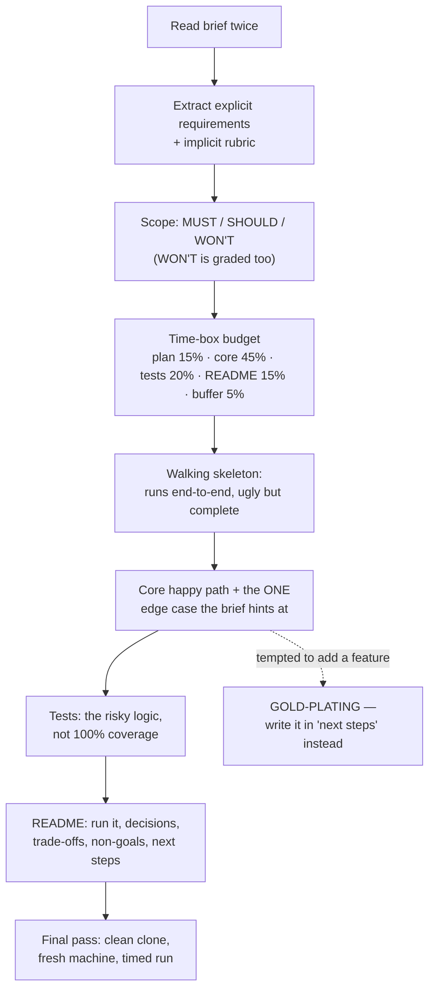

# Take-Home Assignment Coach

A take-home is graded on **judgement under a time-box**, not on how much you built. This skill plans the
scope, protects the clock, and writes the README that makes your trade-offs legible — following the
production-quality code standards in [`AGENTS.md`](../../../AGENTS.md).

## When to use

- You've received a take-home and need a plan before you write a line of code.
- You're 6 hours into a "4-hour" exercise and need to decide what to cut and how to say so.
- You've finished and want a reviewer's-eye pass before submitting.
- **Don't use it for** live coding rounds ([coding-interview-drill](../coding-interview-drill/SKILL.md)) or
  system-design interviews ([system-design-drill](../system-design-drill/SKILL.md)) — different medium,
  different rubric.

## First principles: the rubric is mostly not the feature list

Reviewers usually spend 15–30 minutes and open the README first. They are checking whether the code runs,
whether it's tested, whether it's organised, and whether you made *deliberate* choices. Extra features
rarely add points; unexplained complexity actively loses them.



| What reviewers weight | Typical weight | How to win it | How people lose it |
| --- | --- | --- | --- |
| It runs from a clean clone | make-or-break | one documented command; pin versions | "works on my machine", missing seed data |
| Correctness on the stated requirement | high | re-read the brief and check line by line | solved a more interesting adjacent problem |
| Tests on the risky parts | high | test the domain logic and edge cases | zero tests, or 100% trivial getter tests |
| Structure & readability | high | boring, conventional layout for the stack | clever abstractions, premature layering |
| README / reasoning | high | trade-offs + explicit non-goals | no README, or a wall of setup steps only |
| Scope discipline | medium-high | say what you skipped and why | 3× the time-box, half-finished extras |
| Ops polish (Docker, CI) | low unless asked | only if the brief asks | Kubernetes for a CSV parser |

**Limits, honestly.** Rubrics vary and some companies grade blind on automated tests only; when the brief
is ambiguous, ask the recruiter one specific question — asking is itself a positive signal. And if the
brief asks for 20+ hours of unpaid work, it's reasonable to negotiate the scope or decline; state your
time-box in the README either way, and never exceed it silently.

## Procedure

1. **Read the brief twice and extract two lists**: explicit requirements (quote them) and implied
   evaluation criteria (the stack, the phrase "production-ready", the sample data).
2. **Ask one clarifying question** if genuinely ambiguous — scope, data volume, or whether persistence is
   expected. One good question > five assumptions.
3. **Write MUST / SHOULD / WON'T before coding.** The WON'T list becomes a README section and is where
   your judgement shows.
4. **Budget the clock** against the stated time-box: ~15% planning, 45% core, 20% tests, 15% README, 5%
   buffer. Set a timer per block.
5. **Build a walking skeleton first** — end-to-end and ugly beats beautiful and partial. A running
   half-feature outscores an elegant non-running one every time.
6. **Implement the happy path, then the one edge case the brief hints at** (empty input, duplicate ID,
   malformed row). Handle errors explicitly; don't swallow them.
7. **Test the risky logic**: the domain rules, the boundaries, one end-to-end path. State your testing
   strategy in the README rather than chasing coverage numbers.
8. **Keep the structure boring** and idiomatic for the language. No DI framework, no plugin system, no
   speculative interfaces for a 300-line exercise.
9. **Write the README last but budget for it properly** — it is the highest-leverage file in the repo.
10. **Do the clean-clone check**: fresh directory, follow your own instructions verbatim, time it. Then
    submit and close with the **Learning Footer**.

## Output shape

```
Brief: <one-line restatement>   Stated time-box: <h>   Actual spend: <h> (be honest in the README)
Clarifying question asked: <...> -> answer: <...>
Scope
  MUST:   <...>            (maps to explicit requirement)
  SHOULD: <...>            (do only if buffer remains)
  WON'T:  <...> — because <time-box | not asked | needs product decision>
Time budget: plan <x> · core <x> · tests <x> · README <x> · buffer <x>
Architecture in 3 lines: <...>   Key trade-off: <chose A over B because ...>
Tests: <what is covered and why> · <what is deliberately not> · run with <cmd>
Run instructions (clean clone verified: yes/no): <cmd>
README sections: What it does · Run it · Design decisions · Trade-offs · Non-goals · Next steps · Time spent
Reviewer risk check: runs? <y/n> · tests pass? <y/n> · README first-page answers "how do I run this"? <y/n>
Learning Footer
```

## Worked example — the README that earns the callback

Brief: *"Build a CLI that ingests a CSV of transactions and reports per-account balances. ~4 hours."*

```markdown
# Ledger CLI

Reads a CSV of transactions and prints per-account balances.

## Run it
    python -m pip install -r requirements.txt   # Python 3.11+, no other deps
    python -m ledger sample_data/transactions.csv
    python -m pytest -q                          # 14 tests, ~1s

## Design decisions
- **Streaming parse, not load-all.** Balances are a fold over rows, so memory stays O(accounts)
  rather than O(rows); the brief mentioned "files may be large".
- **Integer minor units (cents).** Floats silently lose money; `Decimal` would also work but
  integers make the invariants obvious in tests.
- **Stdlib only.** A 300-line tool doesn't earn a dependency tree, and it keeps setup to one command.

## Trade-offs
- Errors are **fail-fast with the row number**. A real ingest pipeline would quarantine bad rows and
  continue; that needs a product decision about partial results, so I didn't invent one.
- No persistence layer. The brief asked for a report, not a store.

## Non-goals (deliberately skipped, 4-hour box)
- Multi-currency (needs an FX source and a rate-as-of policy).
- Concurrency — the bottleneck is disk I/O, and a benchmark would have cost more than it saved.
- Docker / CI — not requested; happy to add if useful.

## Tests
Covering the risky parts: the fold arithmetic, malformed/negative/duplicate rows, an empty file, and one
end-to-end run against `sample_data/`. Not chasing coverage on argument parsing.

## Next steps (with more time)
Quarantine-and-continue error mode · `--as-of` date filtering · property-based tests on the fold.

## Time spent
3h50m, within the suggested box.
```

Notice what this README does: it answers "how do I run this" in the first screen, converts every cut into
a *stated* decision, and volunteers the time spent. A reviewer can grade it in ten minutes.

## Tips

- The README is the highest-scoring file — budget real time for it, and put the run command near the top.
- A stated non-goal reads as judgement; the same omission unstated reads as an oversight.
- Never exceed the time-box silently; over-delivering by 3× signals poor prioritisation, not enthusiasm.
- Boring and idiomatic beats clever. Speculative abstractions are the most common self-inflicted wound.
- Test the domain logic and the nasty edge case; coverage percentage impresses nobody.
- Do the clean-clone run before submitting — "it doesn't start" ends the review instantly.
- Pair with [readme-generator](../readme-generator/SKILL.md),
  [test-writer](../test-writer/SKILL.md),
  [coding-interview-drill](../coding-interview-drill/SKILL.md),
  [interview-debrief-coach](../interview-debrief-coach/SKILL.md),
  [job-search-strategy-coach](../job-search-strategy-coach/SKILL.md),
  [portfolio-reviewer](../portfolio-reviewer/SKILL.md), and
  [estimation-coach](../estimation-coach/SKILL.md). Close with the **Learning Footer** (`AGENTS.md`).
