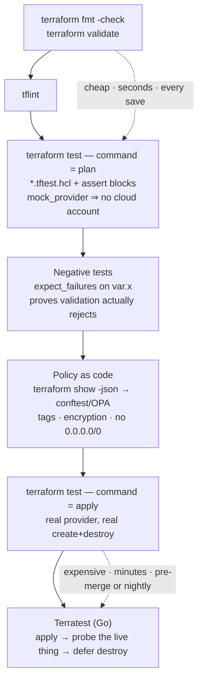

# Terraform Testing Lab

Terraform failures are expensive because the feedback loop usually ends at "it applied". This lab builds a
real test pyramid for infrastructure code — validate, native `terraform test` against a plan, mocked
providers, policy gates, and only then a slow end-to-end apply — all runnable **locally and free** with the
`null`, `local` and `random` providers, in the verify-before-you-teach spirit of
[`AGENTS.md`](../../../AGENTS.md).

## When to use

- A shared module is consumed by five teams and every change is tested by "apply it in dev and see".
- You need to prove a *property* — every bucket encrypted, every resource tagged, no `0.0.0.0/0` ingress —
  rather than a single example.
- A refactor must be shown to be behaviour-preserving before it touches state.
- **Don't use it for** testing the cloud provider itself (that AWS creates an S3 bucket is not your test),
  or as a replacement for `plan` review on production changes. And don't test *state* here — for state
  mechanics see [terraform-state-lab](../terraform-state-lab/SKILL.md).

## First principles: what layer can each test possibly catch?

Terraform's own test framework became generally available in **Terraform 1.6** (HashiCorp, *Terraform 1.6
adds a test framework*, hashicorp.com, October 2023), with **provider mocking, `override_resource` and
`override_module` added in Terraform 1.7** (HashiCorp release notes, January 2024). Tests live in
`*.tftest.hcl` files — by default in the module root and in a `tests/` directory — and are executed with
`terraform test`. Each `run` block is either `command = plan` (fast, no resources created) or
`command = apply` (real resources; Terraform destroys them at the end of the test run).

The single most useful idea is that **each layer catches a different class of defect**, and cost rises
sharply as you go down the table:

| Layer | Tool / command | Catches | Cost | Needs credentials? |
| --- | --- | --- | --- | --- |
| Syntax + schema | `terraform fmt -check`, `terraform validate` | typos, wrong argument names, bad types | ~1s | no |
| Lint / idiom | `tflint` | deprecated syntax, invalid instance types, unused declarations | seconds | no |
| Input contract | `variable` `validation` blocks + `expect_failures` | bad inputs rejected *at plan time* | ~1s | no |
| Unit (plan) | `terraform test` with `command = plan` | resource shape, computed names, counts, conditionals | seconds | no (with mocks) |
| Policy | `conftest test plan.json` / OPA | org rules: tags, encryption, no public ingress | seconds | no |
| Integration (apply) | `terraform test` with `command = apply` | real provider behaviour, dependency ordering | minutes | usually yes |
| End-to-end | Terratest (Go) | "does the thing actually serve traffic" | minutes–hours | yes |



*Figure: the infrastructure test pyramid. Push every assertion as far **up** the diagram as it can
possibly live — a property provable from the plan should never cost you a real apply.*

| `terraform test` construct | Purpose | Gotcha |
| --- | --- | --- |
| `run "name" { … }` | one test case; runs **in order**, sharing state within the file | later runs see earlier runs' state — order is significant |
| `command = plan` \| `apply` | plan-only vs really create | `plan` cannot assert on values only known after apply |
| `variables { … }` | inputs, at file level or per-run | per-run values override file-level ones |
| `assert { condition, error_message }` | the actual check | `condition` must be a bool expression; `error_message` is required |
| `expect_failures = [ … ]` | assert that a check/validation **does** fail | references the failing object (e.g. `var.name`), not a message |
| `run.<name>.<output>` | reuse a previous run's outputs | only works for runs earlier in the same file |
| `mock_provider "aws" {}` (1.7+) | fake provider — no credentials, no API calls | mocked values are generated; don't assert on them as if real |
| `module { source = "./modules/x" }` | test a submodule or a helper setup module | the default is the module under test itself |

⚠ Volatile: `terraform test` gained capabilities in every minor release since 1.6 (mocking, `-junit-xml`
output, parallel runs). Check `terraform version` and the current *Tests* page on
developer.hashicorp.com before assuming a block exists.

## Procedure

1. **Bootstrap a free local module.** No cloud account: use `null_resource`, `local_file`, and `random`.
   ```bash
   mkdir -p tf-test-lab/tests && cd tf-test-lab
   terraform version         # need ≥ 1.6 for `terraform test`, ≥ 1.7 for mock_provider
   ```
2. **Write the module first** with real input validation — `variable "environment" { validation { … } }`.
   Validation you never test is decoration.
3. **Baseline the cheap layers**: `terraform fmt -check -recursive`, `terraform init`,
   `terraform validate`. Fix everything here before writing a single test; these catch a surprising share
   of real defects for zero effort.
4. **Write the first `tests/defaults.tftest.hcl`** with `command = plan` and one `assert` per behaviour you
   actually promise (naming convention, tag presence, resource count). Run `terraform test`.
5. **Watch a test fail on purpose.** Change the expected string, re-run, and read the failure output —
   `terraform test` prints the `error_message` and the run name. A test you have never seen fail is not
   yet a test.
6. **Add negative tests** with `expect_failures`. Pass an invalid `environment` and assert that
   `var.environment` fails. This is the only way to prove the `validation` block works.
7. **Add a mocked-provider test** (`mock_provider "aws" {}`) if your module uses a cloud provider, so unit
   tests run in CI with no credentials and no network. Assert on *your* expressions, not on mock-generated
   values.
8. **Add plan-JSON policy checks** — the same plan, different question ("does this comply?"):
   ```bash
   terraform plan -out=tfplan.binary
   terraform show -json tfplan.binary > tfplan.json
   conftest test tfplan.json --policy policy/
   ```
   Write the Rego so a missing tag or a public CIDR fails the build. See
   [opa-policy-lab](../opa-policy-lab/SKILL.md) for Rego depth.
9. **Add exactly one `command = apply` run** for the behaviour that genuinely cannot be seen in a plan
   (values known only after apply, provider-side defaults). Keep it small: it is the slowest test you own.
10. **Escalate to Terratest only for end-to-end questions** — "the module produced a load balancer that
    returns HTTP 200". Go test, `defer terraform.Destroy(...)` on the first line after apply, unique
    per-run naming to avoid collisions.
11. **Wire it into CI** in cost order: `fmt` → `validate` → `tflint` → `terraform test` → `conftest` →
    (nightly) apply/Terratest. See [ci-pipeline-builder](../ci-pipeline-builder/SKILL.md).
12. **Verify the suite means something**: break the module deliberately (delete a tag, change a name
    prefix) and confirm a test goes red. Then close with the **Learning Footer**.

## Output shape

```
Terraform test suite — <module>        terraform version: <1.x.y>
Layers wired: fmt=<✔> validate=<✔> tflint=<✔> test=<✔> policy=<✔> apply/e2e=<✔/skipped>

Native tests (tests/*.tftest.hcl):
  <file>::<run name>   command=<plan|apply>   asserts=<N>   → <PASS|FAIL>
    - <what it guarantees, in one clause>
  negative: <run name> expect_failures=[<var.x>]            → <PASS|FAIL>
  mocks: mock_provider <name> (no credentials required)     → <yes/no>

Policy gate: conftest/OPA  policies=<N>  denies=<0>  rules: <tagging|encryption|no-public-ingress>
Integration: <run name> command=apply  resources created/destroyed: <N>   duration: <..>
E2E (Terratest): <TestXxx>  probe: <what was asserted about the live resource>  duration: <..>

Mutation check (did the suite actually catch it?):
  removed <tag/name prefix/validation> → <test that went red>   ✔
Uncovered behaviours (known gaps): <...>
Runtime: unit <Ns> · policy <Ns> · integration <Nm>       CI order: <fmt→validate→lint→test→policy>
Next: <terraform-module-coach | opa-policy-lab | ci-pipeline-builder>
Learning Footer
```

## Worked example — a testable module and a suite that runs offline

**`main.tf`** — deliberately uses only providers that need no account, so the whole lab is free:

```hcl
terraform {
  required_version = ">= 1.6.0"
  required_providers {
    random = { source = "hashicorp/random", version = "~> 3.6" }
    local  = { source = "hashicorp/local",  version = "~> 2.5" }
  }
}

variable "name" {
  type        = string
  description = "Base name for generated resources."

  validation {
    condition     = can(regex("^[a-z][a-z0-9-]{2,20}$", var.name))
    error_message = "name must be lowercase alphanumeric with hyphens, 3-21 chars, starting with a letter."
  }
}

variable "environment" {
  type = string

  validation {
    condition     = contains(["dev", "staging", "prod"], var.environment)
    error_message = "environment must be one of: dev, staging, prod."
  }
}

variable "tags" {
  type    = map(string)
  default = {}
}

locals {
  # The behaviour under test: a deterministic naming convention plus mandatory tags.
  full_name = "${var.name}-${var.environment}"

  required_tags = {
    Environment = var.environment
    ManagedBy   = "terraform"
    Name        = local.full_name
  }

  all_tags = merge(local.required_tags, var.tags)

  # Non-prod gets one replica, prod gets three: a conditional worth testing.
  replica_count = var.environment == "prod" ? 3 : 1
}

resource "random_pet" "suffix" {
  length = 2
}

resource "local_file" "config" {
  count    = local.replica_count
  filename = "${path.module}/generated/${local.full_name}-${count.index}.json"
  content  = jsonencode({ name = local.full_name, tags = local.all_tags, index = count.index })
}

output "full_name"     { value = local.full_name }
output "tags"          { value = local.all_tags }
output "replica_count" { value = local.replica_count }
```

**`tests/naming.tftest.hcl`** — plan-only, so it runs in about a second:

```hcl
variables {
  name        = "checkout"
  environment = "dev"
}

run "naming_convention_is_applied" {
  command = plan

  assert {
    condition     = output.full_name == "checkout-dev"
    error_message = "Expected full_name to be 'checkout-dev', got '${output.full_name}'."
  }

  assert {
    condition     = output.tags["ManagedBy"] == "terraform"
    error_message = "Every resource must carry ManagedBy=terraform."
  }

  assert {
    condition     = output.replica_count == 1
    error_message = "Non-prod environments must default to a single replica."
  }
}

run "prod_scales_out" {
  command = plan

  variables {
    environment = "prod"          # per-run override of the file-level value
  }

  assert {
    condition     = output.replica_count == 3
    error_message = "prod must plan 3 replicas, planned ${output.replica_count}."
  }

  assert {
    condition     = length(local_file.config) == 3
    error_message = "Expected 3 planned local_file resources for prod."
  }
}

run "user_tags_do_not_override_required_tags" {
  command = plan

  variables {
    tags = { ManagedBy = "clickops", Team = "payments" }
  }

  # merge(required, user) puts user tags LAST, so this assertion documents a real bug.
  assert {
    condition     = output.tags["Team"] == "payments"
    error_message = "User tags must be preserved."
  }
}
```

**Tracing this before running it** — and finding a genuine defect. `local.all_tags =
merge(local.required_tags, var.tags)` puts the *user* map second, and `merge` lets later maps win. So a
caller passing `ManagedBy = "clickops"` silently overrides the mandatory tag. The third `run` above passes
as written, but the moment you add `condition = output.tags["ManagedBy"] == "terraform"` to it, the suite
goes red and tells you the argument order in `merge` is wrong: it should be
`merge(var.tags, local.required_tags)` so the required tags win. **That is what unit tests on plan output
are for** — the module still applies perfectly; the *policy* is broken.

**`tests/validation.tftest.hcl`** — negative tests, the half people skip:

```hcl
variables {
  name        = "checkout"
  environment = "dev"
}

run "rejects_invalid_environment" {
  command = plan

  variables {
    environment = "production"     # not in the allowed list
  }

  expect_failures = [var.environment]
}

run "rejects_uppercase_name" {
  command = plan

  variables {
    name = "Checkout"
  }

  expect_failures = [var.name]
}
```

`expect_failures` inverts the run: the test passes **because** the plan fails, and it fails if the plan
unexpectedly succeeds — which is exactly what happens if someone deletes the `validation` block.

```bash
terraform init
terraform test                          # runs every tests/*.tftest.hcl
terraform test -filter=tests/validation.tftest.hcl -verbose
```

**Provider mocking, when the module does touch a cloud** (Terraform ≥ 1.7) — the whole point is that CI
needs no credentials:

```hcl
mock_provider "aws" {}

run "bucket_is_encrypted_and_private" {
  command = plan

  assert {
    condition     = aws_s3_bucket_server_side_encryption_configuration.this.rule[0].apply_server_side_encryption_by_default[0].sse_algorithm == "aws:kms"
    error_message = "Buckets must default to KMS encryption."
  }
}
```

Assert on values *your configuration* determines. Attributes the provider computes are mock-generated and
asserting on them tests the mock, not you.

**The policy gate**, asking a different question of the same plan (`conftest`, an Open Policy Agent
project — verify the current Rego syntax on openpolicyagent.org, since OPA v1.0 made `if`/`contains`
mandatory):

```rego
package main

import rego.v1

deny contains msg if {
	resource := input.resource_changes[_]
	resource.change.actions[_] in {"create", "update"}
	not resource.change.after.tags.ManagedBy
	msg := sprintf("%s is missing the required tag ManagedBy", [resource.address])
}
```

```bash
terraform plan -out=tfplan.binary
terraform show -json tfplan.binary > tfplan.json
conftest test tfplan.json --policy policy/          # exit code 1 fails the pipeline
```

**Finally, prove the suite has teeth.** Delete the `ManagedBy` entry from `local.required_tags` and re-run
`terraform test` — if nothing goes red, your tests describe the code rather than the requirement.

## Tips

- **Prefer `command = plan`.** Most module behaviour — names, counts, conditionals, tag merging — is fully
  determined at plan time, and plan tests cost seconds instead of minutes.
- **Every `validation` block deserves an `expect_failures` run.** Untested validation quietly rots, and its
  absence is invisible until a bad input reaches production.
- Runs inside one file share state and execute **in order**; use that deliberately (a setup run, then
  assertions) and never accidentally (a test that only passes because of the run above it).
- Mocks remove credentials, not thinking: assert on expressions you wrote, never on values the mock
  invented.
- Policy-as-code and unit tests answer different questions. Unit tests ask "does the module do what it
  promises?"; policy asks "is the result allowed here?" Keep both, and keep policy in one shared repo.
- Terratest is powerful and slow. Reserve it for genuinely end-to-end assertions, always
  `defer terraform.Destroy(...)` immediately after apply, and randomise names so parallel runs cannot
  collide.
- Run a **mutation check** periodically: break the module on purpose and confirm the suite catches it.
  A green suite that never goes red is a very expensive comment.
- Related: [terraform-module-coach](../terraform-module-coach/SKILL.md) and
  [terraform-modules-lab](../terraform-modules-lab/SKILL.md) for module design,
  [terraform-basics-lab](../terraform-basics-lab/SKILL.md),
  [terraform-state-lab](../terraform-state-lab/SKILL.md),
  [opa-policy-lab](../opa-policy-lab/SKILL.md) for the Rego half,
  [tdd-coach](../tdd-coach/SKILL.md) for the red-green habit, and
  [ci-pipeline-builder](../ci-pipeline-builder/SKILL.md) to run the layers in cost order.
  End with the **Learning Footer** (`AGENTS.md`).
