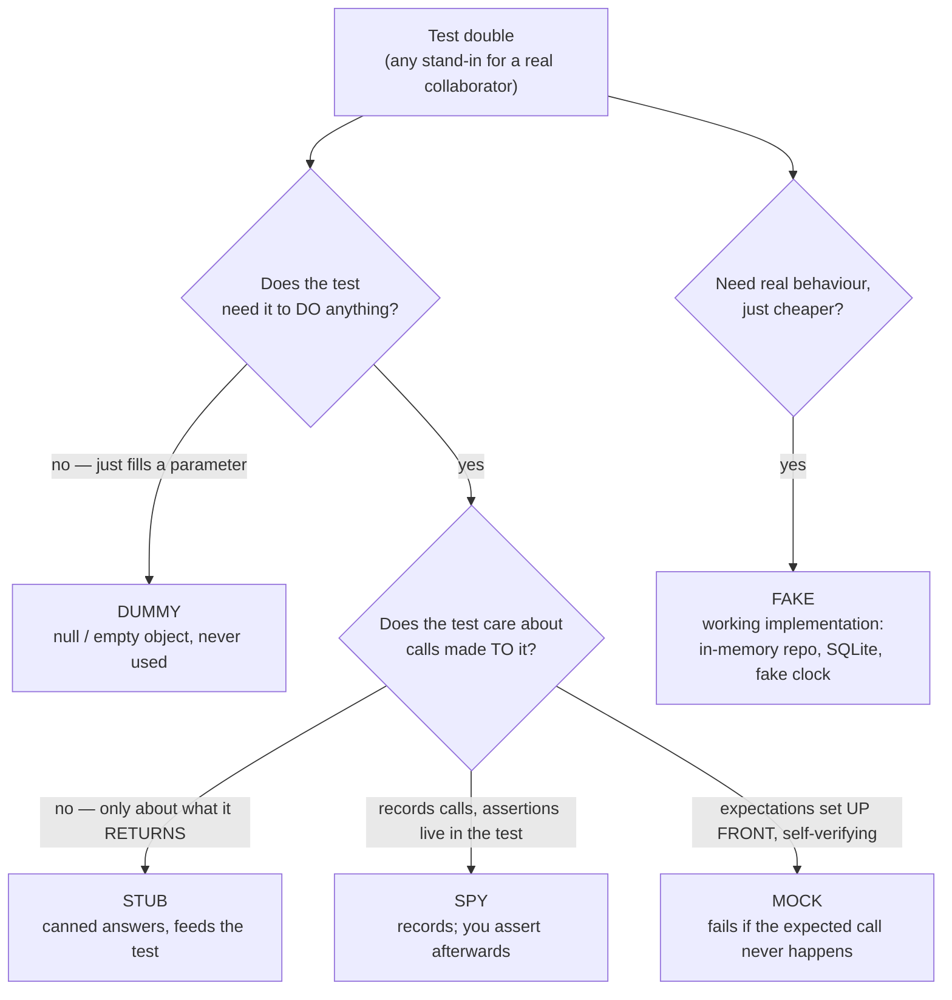

# Test Doubles Coach

"Mock" has become a catch-all word, and the vagueness produces brittle test suites. Teach the five distinct
kinds and the decision behind each, per [`AGENTS.md`](../../../AGENTS.md). Pairs with
[tdd-coach](../tdd-coach/SKILL.md), [test-writer](../test-writer/SKILL.md),
[contract-testing-coach](../contract-testing-coach/SKILL.md), and
[flaky-test-fixer](../flaky-test-fixer/SKILL.md).

## When to use

- The learner says "I'll mock it" for every collaborator, including value objects and their own domain logic.
- Tests break on every refactor even though behaviour is unchanged — the brittleness smell.
- They're testing code that touches HTTP, a database, a clock, randomness, or a payment provider.
- Someone asked "mockist or classicist?" and the answer was a shrug.

## The five doubles

Terminology follows Gerard Meszaros' *xUnit Test Patterns* taxonomy, popularised by Martin Fowler's
"Mocks Aren't Stubs" — cite the primary source with a date when the learner wants to read further.



| Double | Definition | Verifies | Use it when | Cost / risk |
| --- | --- | --- | --- | --- |
| **Dummy** | A placeholder that is passed but never used | nothing | A constructor demands an argument irrelevant to this test | Free |
| **Stub** | Returns canned responses to calls | **state** (the outcome) | You need the collaborator to *provide* input: "the API returns 404", "the user is admin" | Low; can drift from reality |
| **Spy** | A stub that also records how it was called | **behaviour**, asserted after the fact | You need to confirm an outgoing side effect happened (an email was sent) | Medium |
| **Mock** | Pre-programmed with expectations; **fails the test itself** if they aren't met | **behaviour**, specified up front | The interaction *is* the requirement — "must call `charge()` exactly once" | High: couples the test to the call sequence |
| **Fake** | A real, working, lightweight implementation | **state** | You need realistic behaviour across many tests: in-memory repository, in-memory queue, fake clock | Highest to build, cheapest to use; can diverge from prod |

The distinction that matters most in practice: **stubs feed the test; mocks make assertions about the test.**
Over-specify a mock and your test now describes *how* the code works, not *what* it does.

## Choosing a double for a real dependency

| Dependency | Best double | Why |
| --- | --- | --- |
| Clock / `now()` | **Fake** (injectable clock) | Deterministic time removes the biggest flakiness source ([flaky-test-fixer](../flaky-test-fixer/SKILL.md)) |
| Random / UUID | **Fake** (seeded generator) | Reproducible failures |
| Repository / DAO you own | **Fake** in-memory, or the real DB in integration tests | Fakes keep unit tests fast; the real DB proves the SQL |
| Third-party HTTP API | **Fake at your own adapter**, plus contract tests against the real API | Never mock the vendor's SDK — you'd be asserting your *guess* about their behaviour |
| Email / SMS / payment gateway | **Spy** on your own port interface | You care that it was called, not what the vendor did |
| Pure functions, value objects, DTOs | **Nothing — use the real thing** | Doubling them adds coupling and removes coverage |
| Your own domain service | Usually the **real object** | Doubling your own logic is how integration bugs hide |

**Don't mock what you don't own.** Wrap the third party in a thin interface (a *port*) you control, double
the port in unit tests, and verify the real thing separately with contract or integration tests
([contract-testing-coach](../contract-testing-coach/SKILL.md)). Mocking someone else's SDK encodes your
assumptions about their API, and those assumptions never fail the build when the vendor changes.

## London vs Chicago (mockist vs classicist)

| | **London / mockist** (outside-in) | **Chicago / classicist** (inside-out, Detroit) |
| --- | --- | --- |
| Unit under test | One class; **all** collaborators doubled | A behaviour; real collaborators used where cheap |
| Primary verification | Interaction (was it called?) | State (what came out?) |
| Design pressure | Drives interface discovery early | Drives emergent design from working code |
| Test failure locality | Very precise — one class | Broader — a cluster fails together |
| Refactor tolerance | **Low** — internal renames break tests | **High** — internals can change freely |
| Speed | Fastest | Fast, but slower than fully mocked |

Neither is "correct". A pragmatic default: **classicist inside the domain** (real objects, assert state),
**mockist at the boundaries** (double I/O, assert interactions). That gives refactor-safe tests where design
churns most and precise tests where side effects live.

## Over-mocking: the smells

- The test's **arrange block is longer than the production method**.
- A pure refactor with zero behaviour change breaks many tests → the tests assert structure, not outcome.
- Mocks returning mocks returning mocks (train-wreck stubbing) → a Law-of-Demeter violation in the design.
- `verify(x).method()` on **every** call, including queries. Verify **commands** (state-changing calls);
  don't verify **queries** — stub those and assert the outcome instead.
- Every test passes but the app is broken in integration → doubles agree with each other and with nothing real.
- Doubling a class you own *and* asserting its internal call order — that is testing the implementation.

## Procedure

1. **Name the collaborator and ask why it needs replacing**: slow, non-deterministic, has side effects, not
   yet built, or hard to steer into an edge case. **No reason ⇒ use the real object.**
2. **Ask what the test asserts** — the returned value/resulting state, or the fact that an interaction
   happened. State → stub or fake. Interaction → spy or mock.
3. **Check ownership**: is this interface yours? If not, introduce a port you own and double *that*.
4. **Pick the double** from the decision diagram and justify it in one sentence.
5. **Prefer the weakest double that works** — dummy < stub < spy < mock in coupling. Use a fake when the same
   collaborator recurs across many tests; the build cost amortizes and readability improves sharply.
6. **Verify commands, stub queries.** Never assert on a call that only reads.
7. **Write the test and run it** — then apply the two-part sanity check: (a) **mutate the production code's
   behaviour** and confirm the test fails; (b) **rename an internal method or reorder harmless calls** and
   confirm the test still passes. A test that survives (a) or breaks on (b) is worthless or brittle.
   Execute both with `#run` (`learningos_runcode`) rather than reasoning about it.
8. **Cover the double's blind spot**: every fake and stub encodes an assumption about the real dependency.
   Pin it with a contract test or a nightly integration test
   ([contract-testing-coach](../contract-testing-coach/SKILL.md)).
9. **Route onward**: red-green-refactor rhythm → [tdd-coach](../tdd-coach/SKILL.md); test structure and naming
   → [test-writer](../test-writer/SKILL.md); non-determinism →
   [flaky-test-fixer](../flaky-test-fixer/SKILL.md).

## Output shape

```
Test double decision — <collaborator>

Why replace it: <slow | non-deterministic | side effects | unbuilt | hard-to-reach edge case>
   (if none of these -> USE THE REAL OBJECT and stop here)
Test asserts: <resulting state | that an interaction occurred>
Ownership: <I own this interface | third party -> wrap in port <Name> and double the port>

=> Double: <dummy | stub | spy | mock | fake>
   Why: <one sentence>
   Rejected: <mock> because <it would couple the test to call order>

Test sketch (<language> / <framework>):
  arrange: <double setup — keep it shorter than the production method>
  act:     <call the unit>
  assert:  <state assertion>  +  verify(<command only>) <if any>

Sanity checks (#run):
  mutation: break <production behaviour> -> test FAILS  ✓
  refactor: rename/reorder internals     -> test PASSES ✓
Blind spot: this <stub/fake> assumes <...> -> pinned by <contract test | integration test>

School applied: <classicist in the domain | mockist at the boundary> — why here
Next: <tdd-coach | test-writer | contract-testing-coach>
```

## Tips

- Use the precise word. "Mock" for everything hides the actual decision — and the decision is the lesson.
- **Don't mock what you don't own.** Wrap it in a port, double the port, contract-test the real thing.
- **Stub queries, verify commands.** Asserting that a getter was called tests the implementation, not the
  requirement.
- Prefer the weakest double that does the job; coupling rises dummy → stub → spy → mock.
- Fakes cost more up front and pay back across a suite — an in-memory repository and a fake clock are usually
  the two highest-return doubles a codebase can own.
- If the arrange block dwarfs the code under test, the design is telling you the unit has too many
  collaborators; refactor the production code rather than adding more mocks
  ([refactoring-coach](../refactoring-coach/SKILL.md)).
- Every test double is a lie about the world. Keep one layer of tests that uses the truth.
- Prove the test earns its keep: it must fail when behaviour breaks and survive a pure refactor. Run both
  checks with `#run` — a test that has never failed has never been tested.
- End with the **Learning Footer** (`AGENTS.md`).
