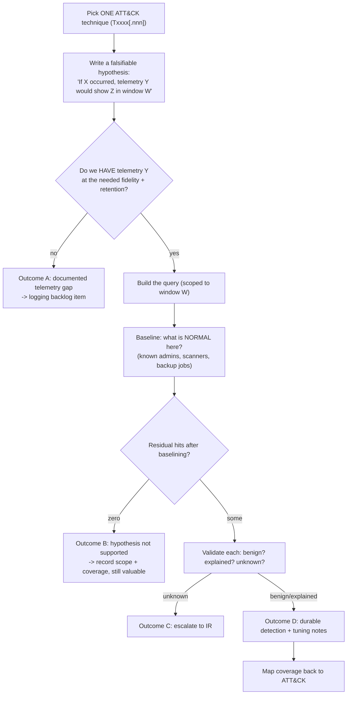

# Threat Hunting Drill

A hunt is an **experiment**, not a search: hypothesis → telemetry → query → validation → durable outcome.
This drill builds the reps, teaching the reasoning at each step per
[`AGENTS.md`](../../../AGENTS.md). Every output is a detection, a baseline, or a documented gap —
never attacker tooling.

## When to use

- The team "hunts" by browsing dashboards and calls whatever looks odd a finding.
- New telemetry (EDR, cloud audit trail, DNS) landed and nobody knows what it can actually prove.
- A detection backlog needs candidates grounded in adversary behaviour rather than vendor marketing.
- **Don't use it for** live incident work ([incident-response-drill](../incident-response-drill/SKILL.md)),
  evidence handling ([dfir-evidence-triage-drill](../dfir-evidence-triage-drill/SKILL.md)), or building,
  obtaining, or running offensive tooling — that is out of scope permanently.

## First principles: hunting is falsification

Hunting assumes a compromise you have not detected and tries to **disprove** it. MITRE ATT&CK gives the
shared vocabulary — Tactics (the why), Techniques and sub-techniques (the how), each with an ID like
`T1078` — and the Pyramid of Pain (David Bianco, 2013) explains why behaviour-level detections are
expensive for an adversary to evade while hash and IP indicators are trivially cheap to rotate.



| Pyramid-of-Pain level | Example artefact | Cost to adversary | Hunt value |
| --- | --- | --- | --- |
| Hash values | file SHA-256 | trivial (recompile) | low — retrospective only |
| IP addresses | C2 IP | trivial (rotate) | low |
| Domain names | C2 domain | easy | low–medium |
| Network/host artefacts | user-agent, registry path, service name | annoying | medium |
| Tools | a specific utility's behaviour | challenging | high |
| **TTPs (behaviour)** | "dormant account performs interactive logon" | **painful** | **highest — hunt here** |

**Trade-off to say out loud:** behavioural hunts have far higher false-positive rates than indicator
matching, which is precisely why the **baseline step is mandatory** — without knowing what normal looks
like in *your* environment, a behavioural query is a noise generator. A hunt that returns zero hits is a
**successful** hunt if you can state the scope and time window it covered; that is coverage evidence, not
a wasted afternoon.

## Procedure

1. **Time-box the rep** (60–90 minutes) and pick **one** technique. Confirm the ID and its current name in
   the live ATT&CK release rather than from memory — technique numbering and structure change between
   versions.
2. **Write the hypothesis in the falsifiable form**: *"If \<technique\> occurred in \<scope\> during
   \<window\>, then \<telemetry source\> would contain \<observable\>."* If you cannot state what would
   disprove it, it is a hunch.
3. **Check telemetry feasibility first** — source, field fidelity, and retention. A hunt that needs 90 days
   of process telemetry against a 7-day retention is a **logging backlog item**, and that is a legitimate
   outcome (route it to [security-logging-audit-coach](../security-logging-audit-coach/SKILL.md)).
4. **Establish the baseline before the query**: which accounts, hosts, and jobs *legitimately* produce this
   observable? Write them down — this list becomes the detection's tuning notes.
5. **Write the query narrow, then widen.** Start with the tightest window and scope; expand only after the
   result set is comprehensible.

   ```bash
   # local rep on exported JSONL — free, no SIEM licence needed
   jq -r 'select(.action=="authn.success" and .method=="interactive")
          | [.ts_utc,.actor.id,.source_ip] | @tsv' auth.jsonl | sort -k2
   ```

   ```sql
   -- portable pattern: interactive logon by an account idle > 30 days
   SELECT a.actor_id, a.ts_utc, a.source_ip, l.last_seen
   FROM   authn a
   JOIN   actor_last_seen l ON l.actor_id = a.actor_id
   WHERE  a.method = 'interactive'
     AND  a.ts_utc >= now() - interval '7 days'
     AND  l.last_seen <  a.ts_utc - interval '30 days';
   ```

6. **Triage every residual hit** into `benign` · `explained` · `unknown`. Any `unknown` stops the hunt and
   starts incident response — do not keep hunting on a live lead.
7. **Convert to a durable outcome**: a detection rule with tuning notes and a runbook, a telemetry gap
   ticket, or a documented negative result with its coverage window.
8. **Record coverage against ATT&CK** so the programme can see which tactics remain unhunted.
9. **Retro in five minutes** — what made the query slow, which field was missing — then close with the
   **Learning Footer**.

## Output shape

```
Hunt: <id> · date=<UTC> · timebox=<min> · hunter=<…>
Technique: <Txxxx[.nnn]> "<name>" · tactic=<…>   (ATT&CK version checked: <version/date>)
Hypothesis: If <technique> occurred in <scope> during <window>, then <telemetry> would show <observable>.
Falsified by: <what result would disprove it>
Telemetry: source=<…> · fields=<…> · retention=<…> · fidelity gaps=<…>
Baseline (known-good producers): <accounts/hosts/jobs> — source of truth=<…>
Query: <the actual query, scoped>
Results: total=<n> · after baseline=<n> · benign=<n> · explained=<n> · unknown=<n>
Verdict: <hypothesis unsupported | benign explained | ESCALATED to IR ref <id>>
Outcome (pick >=1):
  detection: <name> · logic=<…> · severity=<…> · tuning notes=<…> · runbook=<link> · owner=<…>
  telemetry gap: <missing field/source> · owner=<…> · due=<date>
  negative coverage: scope=<…> window=<…> — recorded as evidence
Coverage: ATT&CK tactics hunted this quarter=<list> · unhunted=<list>
Retro: <what slowed the hunt / what to fix next rep>
Next: [detection-engineering-coach] · [security-logging-audit-coach] · [dfir-evidence-triage-drill]
Learning Footer
```

## Worked example — dormant valid accounts (Valid Accounts family)

**Hypothesis:** *If an adversary used a dormant valid account for access in the corporate estate during
the last 7 days, then the authentication log would show an interactive logon success by an account whose
previous activity was more than 30 days earlier.* (Map to the appropriate `T1078` sub-technique after
confirming its current name and numbering in the live ATT&CK release.)

**Falsified by:** zero such logons, or all of them attributable to a known baseline producer.

| Step | Result |
| --- | --- |
| Telemetry | `authn.success` events, 90-day retention, actor + method + source_ip present ✔ |
| Baseline | 3 break-glass accounts (quarterly test), 1 DR account (monthly failover test), 2 seasonal contractors |
| Raw hits | 11 |
| After baseline | 3 |
| Triage | 2 explained (returning parental leave, verified with HR), **1 unknown** |
| Verdict | **Escalated** — unknown hit: dormant service account, interactive logon, source IP outside the admin range |

Durable outcome: detection `dormant-account-interactive-logon` — interactive success where
`last_seen < now - 30d`, **excluding** the baseline list, severity high, runbook "dormant credential use",
owner IAM. Tuning note recorded: break-glass tests must be pre-announced in the change calendar so the
rule can suppress them by ticket rather than by account name, which would otherwise create a permanent
blind spot around exactly the highest-privilege accounts.

## Tips

- One technique per rep. Broad hunts produce broad nothing.
- If you cannot say what would **disprove** the hypothesis, you are browsing, not hunting.
- Baseline before you query — behavioural hunts without a known-good list are noise generators.
- Hunt at the top of the Pyramid of Pain: behaviour costs the adversary far more than hashes or IPs.
- A zero-hit hunt is a result — record the scope and window as coverage evidence.
- Never suppress by account name where the account is high-privilege; suppress by change ticket instead,
  or you build a blind spot exactly where it hurts.
- Stop hunting the moment a lead becomes `unknown`; hand off to IR and preserve evidence
  ([dfir-evidence-triage-drill](../dfir-evidence-triage-drill/SKILL.md)).
- Keep everything defensive: ATT&CK IDs are hypotheses that drive detections, never a build guide.
- Pair with [detection-engineering-coach](../detection-engineering-coach/SKILL.md),
  [security-logging-audit-coach](../security-logging-audit-coach/SKILL.md),
  [incident-response-drill](../incident-response-drill/SKILL.md),
  [alerting-strategy-coach](../alerting-strategy-coach/SKILL.md), and
  [zero-trust-architecture-coach](../zero-trust-architecture-coach/SKILL.md).
  End with the **Learning Footer** (`AGENTS.md`).
