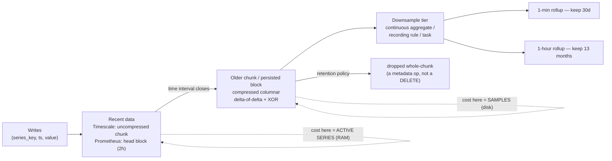

# Time-Series DB Coach

A time-series store is judged by one number you can compute before writing any code: **active series**.
This skill derives cardinality, storage and retention arithmetic from first principles, then maps it onto
TimescaleDB, InfluxDB and Prometheus — teaching the model, not the product, as
[`AGENTS.md`](../../../AGENTS.md) requires.

## When to use

- Choosing a store for metrics, IoT telemetry, financial ticks, or event counters.
- Prometheus is OOM-killed, or your managed metrics bill jumped and nobody can say which label caused it.
- You need 13 months of history but only 7 days at full resolution, and want the tiering design.
- A hypertable is slow, a continuous aggregate is stale, or compression is not kicking in.
- **Don't use it for** statistical modelling of the series themselves (forecasting, seasonality) — that's
  [timeseries-analysis-lab](../timeseries-analysis-lab/SKILL.md); or for deciding *which* metrics to define —
  [metrics-definition-coach](../metrics-definition-coach/SKILL.md).

## First principles: a series is a key, and you are paying per key

A time-series datapoint is `(series_key, timestamp, value)` where `series_key` is the metric name plus the
full set of tag/label values. **Every distinct combination is a separate series**, with its own index entry,
its own in-memory chunk head, and its own compression stream. Therefore:

$$\text{active series} = \sum_{\text{metrics}} \; \prod_{\text{labels}} \lvert \text{label values} \rvert
\qquad
\text{samples/s} = \frac{\text{active series}}{\text{scrape interval (s)}}$$

$$\text{disk} \approx \text{retention}_{\text{s}} \times \text{samples/s} \times \text{bytes per sample}$$

That last formula is the one in the Prometheus operational documentation; with Gorilla-style compression
(delta-of-delta timestamps + XOR'd float values, from Pelkonen et al., *"Gorilla: A Fast, Scalable, In-Memory
Time Series Database"*, VLDB 2015) `bytes per sample` lands around **1–2 bytes** — ⚠ verify the current figure
for your version and workload. Memory, by contrast, scales with **active series**, not with samples, which is
why cardinality kills a Prometheus long before volume does.



*Two different costs at two different stages — RAM tracks series count, disk tracks sample count. Retention
should drop whole chunks/blocks; a row-by-row `DELETE` on a time-series table is an anti-pattern.*

| | **TimescaleDB** (PostgreSQL extension) | **InfluxDB** | **Prometheus** |
| --- | --- | --- | --- |
| Unit of partitioning | **chunk** of a **hypertable**, by time (+ optional space) | shard/bucket by time | 2-hour block |
| Query language | full SQL + joins to relational tables | InfluxQL / Flux / SQL depending on major version | PromQL |
| Ingest model | push (`INSERT`/`COPY`) | push | **pull (scrape)** |
| Downsampling | **continuous aggregates** (incrementally refreshed) | tasks / continuous queries | **recording rules** (no automatic downsampling) |
| Retention | `add_retention_policy()` drops chunks | bucket retention | `--storage.tsdb.retention.time` (default 15d) |
| Long-term storage | native | native | **not designed for it** — remote-write to Thanos/Mimir/Cortex/VictoriaMetrics |
| Best at | time-series that must join business data, SQL teams | high-throughput telemetry | infrastructure monitoring + alerting |

⚠ Version-volatile: InfluxDB's storage engine and query languages changed substantially between major
versions (TSM/InfluxQL → Flux → the Arrow/Parquet-based v3 line), and TimescaleDB renamed/reworked its
compression surface in recent releases. **Verify on the current docs page before quoting a limit or a
setting name.**

## Procedure

1. **Enumerate the labels and their cardinalities first.** For every metric, write `label → distinct values`.
   Anything unbounded (`user_id`, `request_id`, `email`, raw URL path, container id) is a cardinality bomb.
   Multiply — do not estimate.
2. **Compute active series, samples/s and disk** with the three formulas above, at today's scale and at 3×.
   If the number is uncomfortable, fix the *schema*, not the hardware.
3. **Pick the engine from the query pattern**, not the ingest rate: do you need joins to relational data
   (Timescale), alerting and service discovery (Prometheus), or raw telemetry throughput (Influx/Timescale/
   [clickhouse-local-lab](../clickhouse-local-lab/SKILL.md))?
4. **Set up locally, free**:
   ```bash
   docker run -d --name tsdb -e POSTGRES_PASSWORD=pw -p 5432:5432 timescale/timescaledb-ha:pg16
   # or, for metrics:
   docker run -d --name prom -p 9090:9090 prom/prometheus:latest
   ```
5. **Create the hypertable and size the chunk.** The documented guideline is a chunk interval such that the
   most recent chunks (data + indexes) fit comfortably in memory — commonly stated as about 25 % of RAM:
   ```sql
   CREATE EXTENSION IF NOT EXISTS timescaledb;
   CREATE TABLE conditions (
     time        timestamptz NOT NULL,
     device_id   text        NOT NULL,
     temperature double precision,
     humidity    double precision
   );
   -- TimescaleDB 2.13+ dimension-builder form; the positional
   -- create_hypertable('conditions','time') signature is deprecated
   SELECT create_hypertable('conditions', by_range('time', INTERVAL '1 day'));
   CREATE INDEX ON conditions (device_id, time DESC);   -- tag first, time descending
   ```
6. **Add the downsample tier as a continuous aggregate**, then a refresh policy:
   ```sql
   CREATE MATERIALIZED VIEW conditions_hourly
   WITH (timescaledb.continuous) AS
   SELECT time_bucket(INTERVAL '1 hour', time) AS bucket,
          device_id,
          avg(temperature) AS avg_temp,
          max(temperature) AS max_temp,
          count(*)         AS samples
   FROM conditions
   GROUP BY bucket, device_id;

   SELECT add_continuous_aggregate_policy('conditions_hourly',
            start_offset => INTERVAL '3 days',
            end_offset   => INTERVAL '1 hour',
            schedule_interval => INTERVAL '30 minutes');
   ```
   `end_offset` exists so the view never refreshes a bucket that is still receiving data — set it to at least
   your worst-case late-arrival window, or the rollup will be permanently wrong for the newest bucket.
7. **Compress and expire by policy, never by `DELETE`**:
   ```sql
   ALTER TABLE conditions SET (
     timescaledb.compress,
     timescaledb.compress_segmentby = 'device_id',
     timescaledb.compress_orderby   = 'time DESC'
   );
   SELECT add_compression_policy('conditions', INTERVAL '7 days');
   SELECT add_retention_policy('conditions', INTERVAL '90 days');     -- drops whole chunks
   SELECT add_retention_policy('conditions_hourly', INTERVAL '13 months');
   ```
   (Recent TimescaleDB releases renamed parts of this surface — check the current reference page.)
8. **For Prometheus, downsample with recording rules and ship the long tail elsewhere**:
   ```yaml
   groups:
     - name: rollups
       interval: 1m
       rules:
         - record: job:http_requests:rate5m
           expr: sum by (job) (rate(http_requests_total[5m]))
   ```
   ```bash
   promtool check rules rules.yml
   curl -s localhost:9090/api/v1/status/tsdb | jq '.data.seriesCountByMetricName[:10]'  # the top offenders
   ```
9. **Put a cardinality guard in CI**: fail the build if a metric's label set contains an unbounded field, and
   alert on `prometheus_tsdb_head_series` growth ([alerting-strategy-coach](../alerting-strategy-coach/SKILL.md)).
10. **Re-run the arithmetic after every schema change**, record before/after series counts, and close with the
    **Learning Footer**.

## Output shape

```
Workload: <metrics|IoT|events>  writes=<pts/s>  retention: full=<..> rollup1=<..> rollup2=<..>
Cardinality table: <metric> = <label(n) × label(n) × ...> = <series>   TOTAL active series = <N>
Samples/s = series ÷ interval = <..>     Disk ≈ retention × samples/s × <1–2 B> = <GB>
Memory driver: active series (<N>) — headroom at 3× growth: <yes/no>
Engine: <TimescaleDB | InfluxDB | Prometheus (+remote write) | ClickHouse>  because <query pattern>
Partitioning: chunk/block interval = <..>  (recent chunks fit in <~25%> RAM: <yes/no>)
Downsampling: <continuous aggregate | recording rule | task>  buckets=<1m, 1h>  end_offset=<late-arrival window>
Compression: segmentby=<tag> orderby=<time DESC>  after <N days>   observed ratio: <x:1>
Retention: implemented as <drop chunk | bucket policy | --storage.tsdb.retention.time> (NOT row DELETE)
Cardinality guard: <CI check | alert on head_series> — offending labels found: <...>
Next: <observability-plan | metrics-definition-coach | clickhouse-local-lab>
Learning Footer
```

## Worked example — recompute a cardinality explosion, then price the fix

A team adds one label to `http_requests_total`. Existing labels and cardinalities:

| Label | Distinct values |
| --- | --- |
| `job` | 5 |
| `instance` | 200 |
| `method` | 6 |
| `status` | 12 |

Series before: $5 \times 200 \times 6 \times 12 = 72{,}000$.

Someone adds `path` with the **raw** URL, observed at 500 distinct values:

$$5 \times 200 \times 6 \times 12 \times 500 = 36{,}000{,}000 \text{ series}$$

Now price it at a 15-second scrape interval:

| | Before (72 k series) | After (36 M series) |
| --- | --- | --- |
| samples/s = series ÷ 15 s | 4 800 | 2 400 000 |
| disk/day = samples/s × 2 B × 86 400 | 4 800 × 2 × 86 400 ≈ **829 MB/day** | 2 400 000 × 2 × 86 400 ≈ **415 GB/day** |
| 15-day retention | ≈ 12.4 GB | ≈ **6.2 TB** |
| RAM (head series, order-of-magnitude) | tens of MB | tens of GB → **OOM** |

A 500× increase in one label produced a 500× increase in everything. Note carefully *where* the pain lands:
disk grows linearly and is merely expensive; **memory** grows with active series and is what actually kills
the process, because every active series holds an in-memory head chunk.

**The fix ladder, priced:**

| Fix | New series | Verdict |
| --- | --- | --- |
| Drop `path` entirely | 72 000 | free, loses per-route visibility |
| Replace raw `path` with a bounded **route template** (`/users/{id}`), 20 routes | $5 \times 200 \times 6 \times 12 \times 20 = 1{,}440{,}000$ | 25× cheaper than raw path but still 20× the baseline |
| Route template **and** drop `instance` from this metric (aggregate at query time) | $5 \times 6 \times 12 \times 20 = 7{,}200$ | 10× *cheaper than the original*, and the per-instance breakdown is usually reconstructible from a separate, low-cardinality metric |
| Keep raw `path`, put it in logs/traces instead | 72 000 | correct home for unbounded identifiers ([logging-strategy-coach](../logging-strategy-coach/SKILL.md), [distributed-tracing-coach](../distributed-tracing-coach/SKILL.md)) |

Check the third row's arithmetic, because it is the counter-intuitive one: removing a **200-value** label
divides the total by 200, while adding a **20-value** label multiplies it by 20 — net $20/200 = 1/10$. Series
count is a *product*, so the cheapest lever is always the highest-cardinality label you can live without, not
the newest one you added.

The same reasoning applies to a TimescaleDB tag column: `compress_segmentby = 'device_id'` groups compressed
rows per device, so a device set of 50 million makes segments tiny and compression ratios collapse. Segment by
something bounded, and keep the unbounded identifier as a plain column.

## Tips

- Cardinality is a **product**, not a sum. One unbounded label multiplies your entire estate; review label
  sets in code review, not after the OOM.
- Never put user ids, request ids, emails, full URLs, or raw error messages in a label/tag. They belong in
  logs or traces where the storage model is built for high cardinality.
- Retention must be implemented as *dropping a chunk/block*, never as `DELETE FROM … WHERE time < …` — the
  latter creates bloat and vacuum pressure ([mvcc-vacuum-explainer](../mvcc-vacuum-explainer/SKILL.md)).
- Continuous aggregates need an `end_offset` larger than your late-arriving-data window, or the newest bucket
  will be permanently under-counted.
- Prometheus is a monitoring system, not an archive: plan remote-write to a long-term store on day one
  ([victoriametrics-local-lab](../victoriametrics-local-lab/SKILL.md),
  [prometheus-grafana-local-lab](../prometheus-grafana-local-lab/SKILL.md)).
- Index tag-first, time-descending (`(device_id, time DESC)`); a time-only index is nearly useless when every
  query also filters by device ([database-index-coach](../database-index-coach/SKILL.md)).
- If your queries are wide analytical scans rather than per-series lookups, a columnar OLAP engine may beat a
  purpose-built TSDB — compare with [clickhouse-local-lab](../clickhouse-local-lab/SKILL.md) and
  [parquet-internals-coach](../parquet-internals-coach/SKILL.md).
- Wire the results into [observability-plan](../observability-plan/SKILL.md),
  [node-exporter-lab](../node-exporter-lab/SKILL.md) and
  [capacity-planning-coach](../capacity-planning-coach/SKILL.md); practise the SQL side in
  [postgres-local-lab](../postgres-local-lab/SKILL.md). End with the **Learning Footer** (`AGENTS.md`).
