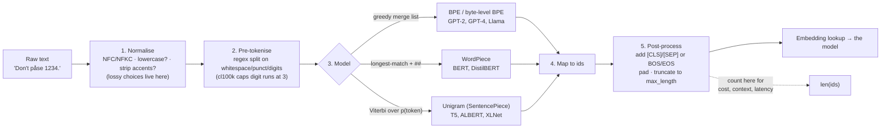

# Tokenizer Explainer

Tokenisation is the layer everyone skips and then blames the model for — following the teach-from-first-
principles and source-discipline rules in [`AGENTS.md`](../../../AGENTS.md). This skill ends with a
**hand-traced merge sequence** you can reproduce in twenty lines of Python.

## When to use

- Someone is estimating API cost or context usage from character or word counts.
- A model "cannot count the r's in strawberry", mangles arithmetic, or spells backwards badly.
- A non-English prompt costs 3× more and fits half as much history, and nobody knows why.
- A fine-tuning or from-scratch project needs a vocabulary size and nobody can justify a number.
- A prompt template adds a trailing space and the outputs change character.
- Special tokens appear literally in the output, or `max_length` truncation is off by two.
- **Don't use it for** embedding-space intuition (that is
  [embeddings-explainer](../embeddings-explainer/SKILL.md)), for attention mechanics (that is
  [transformer-architecture-explainer](../transformer-architecture-explainer/SKILL.md)), or for pricing
  strategy (that is [llm-cost-optimizer](../llm-cost-optimizer/SKILL.md) — this skill supplies the counts it
  needs).

## First principles: the vocabulary is a compression trade-off

A model needs a **finite** input alphabet, and there are only bad extremes:

- **Characters/bytes**: tiny vocabulary, no out-of-vocabulary problem ever, but sequences become very long —
  and self-attention cost grows with the square of sequence length, so this is expensive.
- **Words**: short sequences, but an unbounded vocabulary, a huge embedding matrix, and every unseen word
  collapses to `<unk>` — information destroyed before layer 1.

**Subword** units are the compromise: frequent words stay whole, rare words decompose into reusable pieces,
and nothing is ever unknown. Three algorithms dominate, and they differ in *what they maximise*.

**BPE** (Sennrich, Haddow & Birch, *Neural Machine Translation of Rare Words with Subword Units*,
arXiv:1508.07909, 2015-08-31; ACL 2016) starts from characters and greedily merges the **most frequent
adjacent pair**, $V$ times. The merge list *is* the model, and it is applied in order at inference.

**WordPiece** (Schuster & Nakajima, ICASSP 2012; used by BERT) merges the pair that most increases the
training-corpus likelihood, which in practice means ranking by a *normalised* score rather than raw count:

$$\text{score}(A,B)=\frac{\text{count}(AB)}{\text{count}(A)\cdot\text{count}(B)}$$

The denominator penalises pairs whose parts are already common on their own, so WordPiece prefers merges
that are informative rather than merely frequent. Continuation pieces are marked `##`.

**Unigram LM** (Kudo, *Subword Regularization*, arXiv:1804.10959, 2018-04-29) goes the other way: start
from a large candidate vocabulary and **prune** it with EM, keeping the pieces whose removal costs the least
likelihood, where a sentence's probability marginalises over all segmentations $S(s)$:

$$\mathcal{L}=-\sum_{s\in\text{corpus}}\log\!\!\sum_{x\in S(s)}\prod_{t\in x}p(t)$$

Because it keeps probabilities, Unigram can *sample* segmentations — that is subword regularisation.
**SentencePiece** (Kudo & Richardson, arXiv:1808.06226, 2018-08-19) is the *implementation* that runs BPE or
Unigram directly on raw text with no pre-tokenisation, encoding spaces as `▁` so detokenisation is lossless.

**Byte-level BPE** (GPT-2, Radford et al., 2019) applies BPE over the 256 possible **bytes**, so every
Unicode string is representable with no `<unk>` and no language-specific rules. GPT-2's vocabulary is
**50 257** entries: 256 byte tokens + 50 000 merges + one `<|endoftext|>` token (id **50256**).


*Caption: five stages, and the expensive mistakes (lossy normalisation, off-by-two truncation) live at the edges, not in the middle.*

| Algorithm | Trained by | Applied by | Marker | Used by | Can sample segmentations? |
| --- | --- | --- | --- | --- | --- |
| **BPE** | most-frequent-pair merges | replaying merges in order | `</w>` or none | GPT-2/3/4, Llama, RoBERTa | no (BPE-dropout is an add-on) |
| **WordPiece** | likelihood-maximising merges | greedy longest-match-first | `##` prefix on continuations | BERT, ELECTRA | no |
| **Unigram** | EM pruning from a large seed vocab | Viterbi over token probabilities | `▁` for word start | T5, ALBERT, XLNet, many mBERT-style models | **yes** |
| **Byte-level BPE** | BPE over bytes | as BPE | `Ġ` renders a leading space | GPT-2 onwards | no |

**Why this is not a trivia topic.** Token count is the billing unit, the context-window unit, and (through
attention) a driver of latency. The widely-quoted heuristic "1 token ≈ 4 characters ≈ ¾ of a word in
English" comes from OpenAI's own help documentation — treat it as an estimate to **verify with a real
tokenizer**, never as a contract. And it is *English*-specific: Petrov et al. (*Language Model Tokenizers
Introduce Unfairness Between Languages*, arXiv:2305.15425, 2023-05-24) measured up to **15× differences** in
tokenised length for the same sentence across languages, and Ahia et al. (*Do All Languages Cost the Same?*,
arXiv:2305.13707, 2023-05-23) traced the resulting cost and context-window inequality. Speakers of
under-represented languages pay more money for less usable context — a tokeniser decision with an ethical
footprint.

**Behaviours that are tokenisation, not reasoning:** letter counting ("strawberry" is a couple of tokens,
not nine characters, so the model never *sees* the letters), arithmetic on long numbers (cl100k_base's
pre-tokenisation regex caps digit runs at three characters, so `1234567` is always split, and the split
points move with context), and trailing-whitespace sensitivity (a prompt ending in `" "` produces a
different token sequence than one ending in `"o"`, so the continuation distribution genuinely differs).

⚠ Vocabulary sizes, encoding names and the model→encoding mapping change with every model release —
**verify `tiktoken`'s current mapping and each model card** rather than trusting a remembered table.
Under-trained "glitch" tokens (the `SolidGoldMagikarp` family, reported on LessWrong, 2023-02) are a real
phenomenon but the write-ups are community sources, not peer-reviewed — cite them as such.

## Procedure

1. **Name the exact tokenizer.** "GPT" is not a tokenizer; `cl100k_base` and `o200k_base` are, and
   `bert-base-uncased` is a third. Counts are not transferable between them.
2. **Install and count for real** — never estimate from characters:

   ```bash
   python -m venv .venv && .venv\Scripts\activate
   pip install -U tiktoken transformers
   ```
   ```python
   import tiktoken
   enc = tiktoken.get_encoding("cl100k_base")          # or: tiktoken.encoding_for_model("gpt-4")
   ids = enc.encode("Your prompt here")
   print(len(ids), [enc.decode_single_token_bytes(t) for t in ids])
   ```
3. **Look at the pieces, not just the count.** `decode_single_token_bytes` shows the leading space attached
   to the *following* word — the single most surprising fact for newcomers and the reason trailing spaces in
   templates change behaviour.
4. **Compare tokenizers on the same string**: English vs your target language, code vs prose, a long number,
   an emoji, a rare proper noun. Build the table before you choose a model for a multilingual product.
5. **Inspect special tokens explicitly** for any Hugging Face tokenizer: `tok.special_tokens_map`,
   `tok.all_special_ids`, and the difference between `tok.encode(s)` (adds specials) and
   `tok.tokenize(s)` (does not). Budget `max_length` for them — `[CLS] … [SEP]` costs two, and off-by-two
   truncation silently drops your final sentence.
6. **Trace a merge by hand** on a toy corpus (see the worked example) before trusting any explanation,
   including this one.
7. **Estimate cost and context in tokens, per language**: tokens per request × requests × unit price, and
   tokens per document ÷ context window for chunking decisions. Hand the pricing model to
   [llm-cost-optimizer](../llm-cost-optimizer/SKILL.md); prices change constantly, so read the current page.
8. **Design chunking around token boundaries, not characters.** Splitting a RAG corpus at 1 000 *characters*
   produces wildly variable token counts across languages and code — split by tokens and overlap by tokens
   ([rag-designer](../rag-designer/SKILL.md)).
9. **If you are training a tokenizer**, pick vocabulary size from measured fertility (tokens per word) on
   *your* corpus, not from a default: too small inflates sequence length and latency, too large wastes
   embedding parameters on rare pieces and starves them of gradient.
10. **Re-verify after any model upgrade.** A new model can mean a new encoding, which changes every count,
    every chunk boundary and every cost estimate you derived. Close with the **Learning Footer**.

## Output shape

```
Tokenizer: <cl100k_base | o200k_base | bert-base-uncased | ...>  vocab=<..>  algorithm=<BPE|WordPiece|Unigram>
Text sample: "<...>"      chars=<..>  words=<..>  tokens=<..>   chars/token=<..>

| text                        | chars | tokens | chars/token | pieces (first 8)          |
|-----------------------------|-------|--------|-------------|---------------------------|
| English prose               | <..>  | <..>   | <..>        | <..>                      |
| <target language>           | <..>  | <..>   | <..>        | <..>                      |
| source code                 | <..>  | <..>   | <..>        | <..>                      |
| long number 1234567         | <..>  | <..>   | <..>        | <..>                      |

Special tokens: <map> · added by encode(): <n> · max_length budget = <limit> − <n>
Leading-space behaviour: "word" -> <..> tokens ; " word" -> <..> tokens   (template risk: <y/n>)
Language cost ratio: <lang> / English = <..>x tokens  ⇒ <..>x cost, <..>x effective context
Behaviour explained: <letter counting | arithmetic | whitespace sensitivity> ← caused by <which stage>
Cost estimate: <tokens/req> x <reqs> x <price/1k, VERIFY on current pricing page> = <..>
Chunking: split by TOKENS at <n> with <m> overlap (not characters)
Next: <llm-cost-optimizer | rag-designer | embeddings-explainer>
Learning Footer
```

## Worked example — five BPE merges, traced by hand, then verified in code

This is the algorithm from the Sennrich et al. paper (Algorithm 1), on the paper's own toy corpus. Pure
standard library, free, instant.

```python
# bpe_trace.py
import re, collections

def get_stats(vocab):
    pairs = collections.Counter()
    for word, freq in vocab.items():
        symbols = word.split()
        for i in range(len(symbols) - 1):
            pairs[symbols[i], symbols[i + 1]] += freq
    return pairs

def merge_vocab(pair, v_in):
    bigram = re.escape(' '.join(pair))
    pattern = re.compile(r'(?<!\S)' + bigram + r'(?!\S)')   # match only whole symbols
    return {pattern.sub(''.join(pair), word): freq for word, freq in v_in.items()}

vocab = {'l o w </w>': 5, 'l o w e r </w>': 2, 'n e w e s t </w>': 6, 'w i d e s t </w>': 3}
for step in range(1, 6):
    pairs = get_stats(vocab)
    best = max(pairs, key=pairs.get)      # ties broken by first-seen order — implementation-defined!
    vocab = merge_vocab(best, vocab)
    print(f"merge {step}: {best}  count={pairs[best]}")
print(vocab)
```

**Trace it before running it.** Words are split into characters with an end-of-word marker `</w>` so that
`low` at the end of a word can differ from `low` inside one. Counting every adjacent pair in the four words,
weighted by frequency:

| pair | count | pair | count |
| --- | --- | --- | --- |
| `(l,o)` | 5+2 = 7 | `(e,s)` | 6+3 = **9** |
| `(o,w)` | 5+2 = 7 | `(s,t)` | 6+3 = **9** |
| `(w,</w>)` | 5 | `(t,</w>)` | 6+3 = **9** |
| `(w,e)` | 2+6 = 8 | `(n,e)`, `(e,w)` | 6, 6 |
| `(e,r)`, `(r,</w>)` | 2, 2 | `(w,i)`,`(i,d)`,`(d,e)` | 3, 3, 3 |

Three pairs tie at 9. `max()` over a `Counter` returns the **first** maximum in insertion order, and
insertion order follows the scan, so `(e,s)` wins. The full sequence is:

```
merge 1: ('e', 's')      count=9    → n e w es t </w> ; w i d es t </w>
merge 2: ('es', 't')     count=9    → n e w est </w>  ; w i d est </w>
merge 3: ('est', '</w>') count=9    → n e w est</w>   ; w i d est</w>
merge 4: ('l', 'o')      count=7    → lo w </w>       ; lo w e r </w>
merge 5: ('lo', 'w')     count=7    → low </w>        ; low e r </w>
```

and the final vocabulary state is
`{'low </w>': 5, 'low e r </w>': 2, 'n e w est</w>': 6, 'w i d est</w>': 3}`.

Three things this trace teaches that prose cannot:

1. **`est</w>` became a single token** — a genuine morphological suffix, learned from raw counts with no
   linguistic knowledge whatsoever.
2. **The tie-break is implementation-defined.** Three pairs had count 9; a different library ordering
   produces a different merge list and therefore a different tokenizer. This is why you must pin the
   tokenizer, not just the algorithm.
3. **`low` and `lower` now share the prefix `low`**, which is the entire point of subwords: the rare word
   gets its representation from pieces the model has already seen many times.

The regex deserves one line of attention: `(?<!\S)` and `(?!\S)` are negative look-around assertions for
"not preceded/followed by a non-space", i.e. they anchor the match to whole space-separated symbols. Without
them, merging `('e','s')` would also corrupt a symbol like `es` that already exists elsewhere in the string.

Now connect it to a production tokenizer:

```python
import tiktoken
enc = tiktoken.get_encoding("cl100k_base")
for s in ["lowest", " lowest", "strawberry", "1234567", "internationalisation"]:
    ids = enc.encode(s)
    print(f"{s!r:>24} -> {len(ids):2d} tokens {[enc.decode_single_token_bytes(t) for t in ids]}")
```

Read the output for three patterns rather than memorising ids (which are version-specific): the leading
space in `" lowest"` is absorbed *into* the following token rather than standing alone; `"1234567"` is split
because `cl100k_base`'s pre-tokenisation regex caps digit runs at three characters, which is a concrete,
inspectable reason long-number arithmetic is hard; and a long rare word decomposes into several pieces, so
the model reasons over chunks, never over letters. If you ever need to prove that last point in an argument,
this three-line script is the fastest way to do it.

## Tips

- **Count tokens, never characters.** The 4-chars-per-token heuristic is English-only and is a rough
  estimate from vendor documentation, not a guarantee.
- Pin the tokenizer alongside the model: a new model release can mean a new encoding, which invalidates
  every count, chunk boundary and cost estimate downstream.
- The leading space belongs to the next token in byte-level BPE — trailing whitespace in a prompt template
  really does change the model's continuation distribution.
- Reserve budget for special tokens when setting `max_length`; `[CLS]`/`[SEP]` or BOS/EOS quietly consume
  positions and cause off-by-two truncation of your most important final sentence.
- Non-English text can cost several times more tokens for the same meaning — measure the ratio for your
  languages before promising a price or a context window.
- Letter counting, digit arithmetic and reversal failures are tokenisation artefacts; fix them with tools
  (call a calculator, split the string in code), not with more prompting.
- When training a tokenizer, choose vocabulary size from measured fertility on *your* corpus; defaults are
  someone else's corpus.
- Related: [embeddings-explainer](../embeddings-explainer/SKILL.md) for what happens to the ids next,
  [transformer-architecture-explainer](../transformer-architecture-explainer/SKILL.md) for why sequence
  length costs what it costs, [llm-cost-optimizer](../llm-cost-optimizer/SKILL.md) for turning counts into
  money, [rag-designer](../rag-designer/SKILL.md) for token-aware chunking,
  [prompt-optimizer](../prompt-optimizer/SKILL.md) for shortening prompts without losing meaning, and
  [fine-tuning-planner](../fine-tuning-planner/SKILL.md) when a domain vocabulary is genuinely the problem.
  End with the **Learning Footer** (`AGENTS.md`).
