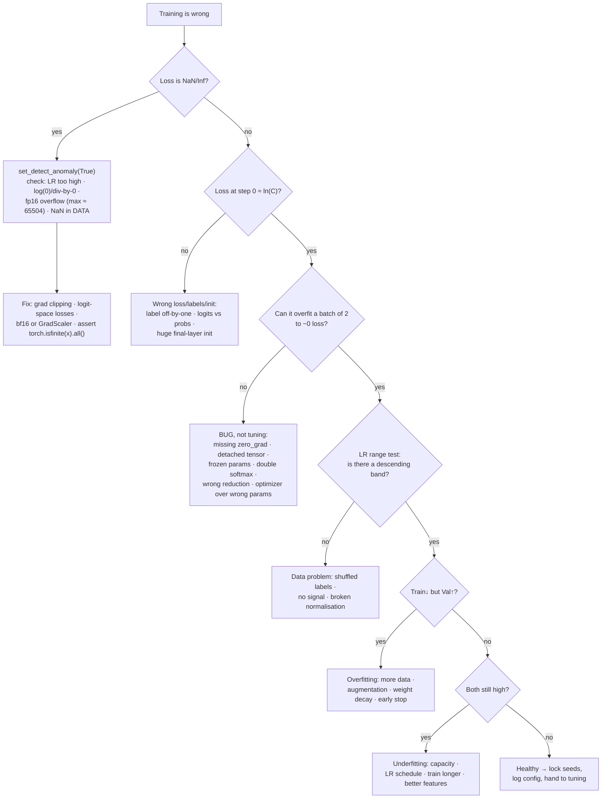

# Training Debug Coach

A model that will not train is almost never a hyperparameter problem — it is a **bug**, and bugs are found by
falsifiable tests, not by lowering the learning rate again. Follows the verify-before-you-assert discipline
in [`AGENTS.md`](../../../AGENTS.md).

## When to use

- The loss is flat, oscillating, or exactly constant from step 1.
- `nan` appears in the loss (or in the weights) after N steps and the run silently continues.
- Training accuracy is 99% and validation is 61%, or both are stuck at chance.
- Validation loss is *lower* than training loss — a specific, diagnosable signature, not luck.
- Two runs with the same config give different answers and nobody can reproduce yesterday's result.
- The instinct is to reach for a bigger model or a hyperparameter sweep before the model can overfit two
  examples. **Do the overfit test first**; if it fails, tuning is provably a waste of compute.
- **Don't use it for** genuinely tuned-but-mediocre models (that is
  [hyperparameter-tuning-lab](../hyperparameter-tuning-lab/SKILL.md) and
  [feature-engineering-coach](../feature-engineering-coach/SKILL.md)), for post-deployment degradation
  (that is [model-monitoring-coach](../model-monitoring-coach/SKILL.md)), or for pure speed problems.

## First principles: make the model *prove* it can learn before you tune it

Three cheap tests dominate everything else, in this order.

**1. The loss at initialisation is predictable.** A randomly initialised classifier over $C$ classes should
put roughly equal mass on each class, so cross-entropy starts at

$$\mathcal{L}_0 = -\ln\tfrac{1}{C} = \ln C \quad\Rightarrow\quad C{=}10 \to 2.303,\;\; C{=}2 \to 0.693$$

If your run starts at 7.4, the last layer is badly initialised, the labels are misaligned, or the loss is
not what you think it is. This costs one forward pass and eliminates a whole class of bugs.

**2. A correct model can memorise two examples.** Take a batch of 2, turn off augmentation and
regularisation, and drive the loss to ~0. A model with enough capacity that *cannot* do this has a broken
gradient path — a detached tensor, a frozen parameter, a wrong reduction, or a loss that does not depend on
the output. Popularised as the central move in Karpathy's *A Recipe for Training Neural Networks*
(2019-04-25 — a practitioner blog post, cited here as craft knowledge, not as a peer-reviewed result).

**3. Underfitting and overfitting are different diseases with opposite treatments.** Read the *pair* of
curves, never one alone:

| Train loss | Val loss | Diagnosis | Treatment |
| --- | --- | --- | --- |
| high | high | underfitting / bug | more capacity, higher LR, longer — but run test 2 first |
| low | high, rising | overfitting | more data, augmentation, regularisation, early stopping |
| low | low | healthy | stop touching it |
| flat at $\ln C$ | flat at $\ln C$ | no learning at all | LR ≈ 0, frozen params, detached graph, or labels are noise |
| decreasing | **lower than train** | not a miracle | dropout/BN active in train but not eval, or val set is easier/leaked |


*Caption: each diamond is a test you can run in under a minute; never skip ahead to the tuning box.*

| Symptom | Most likely cause | One-command test |
| --- | --- | --- |
| Loss exactly constant | optimizer stepping the wrong params, or `lr=0` | `print(sum(p.numel() for p in opt.param_groups[0]['params']))` |
| Loss decreases then explodes | LR too high / no clipping | halve LR; `clip_grad_norm_(params, 1.0)` |
| NaN after k steps | fp16 overflow, `log(0)`, exploding grads | `torch.autograd.set_detect_anomaly(True)` |
| Loss plateaus ≈ 1.46 with 10 classes | **double softmax** (see worked example) | feed raw logits to `CrossEntropyLoss` |
| Val loss < train loss | dropout/BN on in train, off in eval | compare `model.eval()` loss on the *train* set |
| Val accuracy ≈ chance, train ≈ 100% | leakage-free but overfit, or label shuffle in val | shuffle-label control run |
| Great val, terrible test | tuned on val too many times | fresh held-out set |
| Results differ run to run | no seeding / nondeterministic kernels | `torch.use_deterministic_algorithms(True)` |
| Loss improves then flatlines at $\ln C$ | ReLU death / vanishing grads | log per-layer `grad.norm()` each epoch |

**Numerical facts worth memorising.** fp16's largest finite value is **65 504** and its smallest normal is
$\approx 6.1\times10^{-5}$, which is why fp16 training needs loss scaling (`torch.amp.GradScaler`) while
bf16 — same exponent range as fp32, fewer mantissa bits — usually does not. And always use the fused,
logit-space loss (`CrossEntropyLoss`, `BCEWithLogitsLoss`): they apply the log-sum-exp trick internally, so
they do not evaluate $\log(0)$.

## Procedure

1. **Freeze the run before debugging it.** Seed everything and record versions; an intermittent bug you
   cannot reproduce cannot be fixed:

   ```python
   import random, numpy as np, torch
   def seed_all(s=0):
       random.seed(s); np.random.seed(s); torch.manual_seed(s); torch.cuda.manual_seed_all(s)
       torch.use_deterministic_algorithms(True)      # raises on nondeterministic kernels — that is the point
       torch.backends.cudnn.benchmark = False
   ```
   On CUDA ≥ 10.2 also export `CUBLAS_WORKSPACE_CONFIG=:4096:8`, and pass a `generator` plus
   `worker_init_fn` to `DataLoader` so worker shuffling is deterministic too (PyTorch *Reproducibility*
   docs — check them for your version).
2. **Look at the data with your eyes.** Print 10 samples *after* the full pipeline: shapes, dtypes, ranges,
   the label distribution, and whether images/text still look like themselves post-augmentation. Assert
   `torch.isfinite(x).all()` and `0 <= y < C`. More "model bugs" are data bugs than not.
3. **Check the loss at initialisation** against $\ln C$ (or the variance of $y$ for regression). One forward
   pass, huge diagnostic value.
4. **Run the input-independent baseline.** Zero out the inputs and train. The loss should stall *worse* than
   with real data. If it does not, your model is not using its input — that is a plumbing bug.
5. **Overfit a batch of 2 to ~0 loss** with regularisation, dropout and augmentation disabled. Do not
   proceed until this passes. It is the single highest-yield test in this skill.
6. **Assert every parameter receives gradient.** After one `backward()`, list parameters whose `.grad` is
   `None` or all-zero. `None` means the tensor never entered the graph (a `.detach()`, a `.item()`, a
   `with torch.no_grad()`, or a parameter created after the optimizer).
7. **Test cross-sample independence** (with `model.eval()`): the gradient of sample $j$'s output w.r.t.
   sample $i$'s input must be exactly zero for $i \ne j$. This catches a wrong `reshape`/`transpose` that
   mixes the batch dimension. ⚠ BatchNorm in *train* mode mixes the batch legitimately, so this test is only
   meaningful in eval mode — a false failure here is itself informative.
8. **Run an LR range test** rather than guessing: sweep the learning rate exponentially over a few hundred
   steps and plot loss vs LR (Smith, *Cyclical Learning Rates for Training Neural Networks*,
   arXiv:1506.01186, 2015-06-03). Pick roughly an order of magnitude below the minimum of the curve. If
   there is no descending band at any LR, the problem is the data, not the optimiser.
9. **Instrument gradients and activations, not just loss.** Log per-layer `p.grad.norm()` and the fraction
   of dead ReLUs each epoch. Vanishing (norms → 0 in early layers) and exploding (norms ↑ monotonically) look
   identical on a loss curve and need opposite fixes.
10. **Only now separate over/underfitting** using the table above, change **one** thing at a time, and
    re-run the same seed. Record every experiment with
    [ml-experiment-tracker](../ml-experiment-tracker/SKILL.md). Close with the **Learning Footer**.

## Output shape

```
Symptom: <flat | NaN at step k | diverging | train-val gap | irreproducible>
Setup: <framework+version> · <device> · dtype=<fp32|fp16+GradScaler|bf16> · seed=<..> deterministic=<y/n>

Test ladder:
  [ ] data eyeballed (shapes/dtype/range/labels)   -> <finding>
  [ ] loss @ init  = <..>   expected ln(C) = <..>  -> <pass/fail>
  [ ] input-independent baseline worse than real   -> <pass/fail>
  [ ] overfit batch of 2 -> final loss <..>        -> <pass/fail>   ← gate: do not tune until green
  [ ] every param has non-None, non-zero grad      -> <pass/fail: names>
  [ ] cross-sample independence (model.eval())     -> <pass/fail>
  [ ] LR range test: descending band at <..>       -> chosen LR <..>
  [ ] grad norms per layer: <min>..<max>           -> <vanishing|exploding|healthy>

Root cause: <the one thing>          Evidence: <the test that failed and its number>
Fix applied: <single change>         Re-run same seed: loss <before> -> <after>
Curves now: train <..> / val <..>    Diagnosis: <underfit|overfit|healthy>
Repro: <cmd> · versions <..> · determinism flags <..> · run recorded in <tracker>
Next: <hyperparameter-tuning-lab | imbalanced-data-coach | distributed-training-coach>
Learning Footer
```

## Worked example — a four-assertion sanity harness, and the 1.46 fingerprint

CPU-only, free, a few seconds to run: `pip install torch`.

```python
# sanity.py
import math, torch, torch.nn as nn, torch.nn.functional as F

C, D = 10, 20
torch.manual_seed(0)

def make_model():
    return nn.Sequential(nn.Linear(D, 64), nn.ReLU(), nn.Linear(64, C))

def check_init_loss(model, x, y):
    model.eval()
    with torch.no_grad():
        loss = F.cross_entropy(model(x), y).item()
    exp = math.log(C)
    assert abs(loss - exp) < 0.30, f"init loss {loss:.3f} vs ln(C)={exp:.3f}"
    return loss

def check_overfit_two(model, steps=300, lr=1e-2):
    x, y = torch.randn(2, D), torch.tensor([0, 1])      # 2 samples, no augmentation, no dropout
    opt = torch.optim.Adam(model.parameters(), lr=lr)
    model.train()
    for _ in range(steps):
        opt.zero_grad(set_to_none=True)
        loss = F.cross_entropy(model(x), y)
        loss.backward()
        opt.step()
    assert loss.item() < 1e-2, f"cannot memorise 2 examples: {loss.item():.4f} -> BUG, not tuning"
    return loss.item()

def check_all_params_get_grad(model, x, y):
    model.zero_grad(set_to_none=True)
    F.cross_entropy(model(x), y).backward()
    dead = [n for n, p in model.named_parameters()
            if p.requires_grad and (p.grad is None or torch.all(p.grad == 0))]
    assert not dead, f"no gradient reaches: {dead}"

def check_sample_independence(model, batch=4, target=1):
    model.eval()                                        # BatchNorm/Dropout OFF — see the caveat below
    x = torch.randn(batch, D, requires_grad=True)
    model(x)[target].sum().backward()
    leaked = [i for i in range(batch) if i != target and x.grad[i].abs().sum() > 0]
    assert not leaked, f"sample {target} depends on samples {leaked} -> batch dim is being mixed"

m = make_model()
x, y = torch.randn(64, D), torch.randint(0, C, (64,))
print("init loss     :", round(check_init_loss(m, x, y), 4), "  (ln 10 =", round(math.log(C), 4), ")")
check_all_params_get_grad(m, x, y)
check_sample_independence(m)
print("overfit-2 loss:", round(check_overfit_two(make_model()), 6))
print("all sanity checks passed")
```

**Trace it.** With PyTorch's default `nn.Linear` initialisation the final logits have a standard deviation of
roughly 0.25, and for small logit spread $\mathbb{E}[\text{CE}] \approx \ln C + \sigma^2/2$, so the printed
init loss lands just above $\ln 10 = 2.3026$ — comfortably inside the 0.30 tolerance. `check_overfit_two`
drives a 64-unit MLP onto two points with Adam for 300 steps; that converges to a loss far below $10^{-2}$.
`check_all_params_get_grad` passes because the whole tensor is tested (`torch.all(p.grad == 0)`), not
individual weights — a few dead ReLU units are normal and must not fail the assertion.
`check_sample_independence` passes because an MLP is applied row-wise, so `x.grad[0]` is exactly zero after
backpropagating only `out[1]`.

Now break it on purpose, with the most instructive bug in the list:

```python
class DoubleSoftmax(nn.Module):
    def __init__(self):
        super().__init__(); self.net = make_model()
    def forward(self, x):
        return F.softmax(self.net(x), dim=-1)   # BUG: CrossEntropyLoss will softmax this again

try:
    check_overfit_two(DoubleSoftmax())
except AssertionError as e:
    print("caught:", e)
```

**Trace the fingerprint.** `CrossEntropyLoss` applies `log_softmax` to whatever it receives. Fed a
probability vector $p$ (entries in $[0,1]$, summing to 1), the *best case* is a perfect one-hot
$p=(1,0,\dots,0)$, which gives

$$\mathcal{L}_{\min} = \log\!\big(e^{1} + (C-1)e^{0}\big) - 1 = \ln(e + 9) - 1 = 2.4612 - 1 = \mathbf{1.4612}$$

for $C=10$. So the buggy model **cannot** push its loss below ≈1.46 no matter how long you train — the
gradient is squashed because the logit range is capped at 1 instead of being unbounded. That plateau is a
fingerprint: a classification loss stuck a hair above 1.46 with ten classes is almost always a double
softmax. Note also that the *initial* loss check would have passed (a near-uniform $p$ still gives ≈2.30),
which is exactly why the overfit-a-batch gate exists as a separate test rather than as a nicety.

## Tips

- **Overfit two examples before you tune anything.** If that fails, every hour of hyperparameter search is
  wasted, and you now know it in 10 seconds.
- Compare the loss at step 0 against $\ln C$; a mismatch localises the bug to labels, init, or the loss
  function before you have burned a single epoch.
- Always pass **logits** to `CrossEntropyLoss`/`BCEWithLogitsLoss`. Applying softmax/sigmoid yourself is the
  most common silent trainer-killer and it does not raise.
- `None` gradients mean the parameter is not in the graph; all-zero gradients mean it is in the graph but
  unused — different bugs, different fixes.
- Validation loss below training loss is a signature, not a win: dropout and BatchNorm behave differently in
  `train()` and `eval()`, so compare like with like before celebrating.
- NaN is a *location* problem: `set_detect_anomaly(True)` names the offending op, then check LR, fp16 range,
  and NaNs already present in the input.
- Change one thing per run, keep the seed fixed, and record the config — otherwise you are not debugging,
  you are sampling.
- Related: [pytorch-training-loop-lab](../pytorch-training-loop-lab/SKILL.md) and
  [pytorch-autograd-lab](../pytorch-autograd-lab/SKILL.md) for the mechanics,
  [pytorch-dataloader-lab](../pytorch-dataloader-lab/SKILL.md) for data-side bugs,
  [floating-point-numerics-coach](../floating-point-numerics-coach/SKILL.md) for fp16/bf16 range,
  [hyperparameter-tuning-lab](../hyperparameter-tuning-lab/SKILL.md) once the model provably learns,
  [distributed-training-coach](../distributed-training-coach/SKILL.md) before scaling a fixed run, and
  [ml-experiment-tracker](../ml-experiment-tracker/SKILL.md) to keep the evidence.
  End with the **Learning Footer** (`AGENTS.md`).
