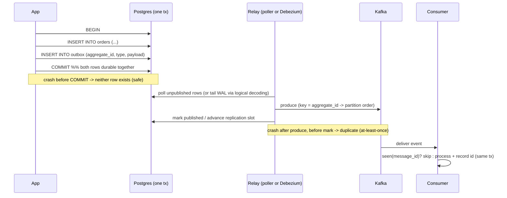

# Transactional Outbox Lab

Prove — locally, with a crash test — that a database write and an event publish can be made atomic,
per [`AGENTS.md`](../../../AGENTS.md). Pairs with
[saga-pattern-coach](../saga-pattern-coach/SKILL.md),
[event-sourcing-coach](../event-sourcing-coach/SKILL.md),
[idempotency-coach](../idempotency-coach/SKILL.md) and
[kafka-connect-lab](../kafka-connect-lab/SKILL.md).

## When to use

- A service does `save()` then `publish()` and sometimes loses events (or emits events for rolled-back
  writes) — the **dual-write problem**.
- You need reliable domain events for a [saga](../saga-pattern-coach/SKILL.md) or a
  [CQRS](../cqrs-coach/SKILL.md) read model.
- Choosing between a polling publisher and Debezium log-tailing CDC.
- Someone claims "we'll use a distributed transaction (2PC) across the DB and the broker".

## Mental model — first principles

There is no atomic commit across two systems without a coordinator. So **stop trying**: make both
writes hit the *same* transactional resource (the database), and let a separate process move the
message outward. The message becomes durable exactly when the business row does.



## Delivery approach comparison

| | Polling publisher | Log tailing (Debezium CDC) |
| --- | --- | --- |
| How it works | `SELECT … WHERE published_at IS NULL … FOR UPDATE SKIP LOCKED` | Reads the WAL via logical decoding (`pgoutput`) |
| Latency | Poll interval (10–500 ms typical) | Near-real-time |
| DB load | Extra queries + updates on every poll | Minimal query load; holds a replication slot |
| Ops complexity | Low — it is just your app | Higher — Kafka Connect, connector config, slots |
| Ordering | Per-key if you order by id and key by aggregate | Preserved from the log, keyed per aggregate |
| Failure mode to watch | Poller stalls → outbox grows | **Unconsumed slot → WAL never recycled → disk fills** |
| Delivery semantics | At-least-once | At-least-once |
| Cleanup | Delete/archive published rows | Debezium outbox SMT can delete rows via tombstones |

Grounding: Debezium documentation, "Outbox Event Router" SMT and the Debezium connector for
PostgreSQL (logical decoding, publication + replication slot); PostgreSQL documentation, "Logical
Decoding" and `pg_replication_slots`; Apache Kafka documentation on partition ordering (order is
guaranteed **within a partition**, hence keying by aggregate id); Richardson, microservices.io —
*Transactional Outbox* and *Polling Publisher* patterns.

## Procedure

1. **Start the stack locally (free, Docker only).** Postgres must run with logical decoding enabled:
   `docker run -d --name pgbox -e POSTGRES_PASSWORD=devpass -p 127.0.0.1:5432:5432 postgres:16 \
   -c wal_level=logical` and a KRaft-mode broker (`apache/kafka:3.7.0`) — see
   [kafka-kraft-local-lab](../kafka-kraft-local-lab/SKILL.md). Confirm with `docker ps` and
   `SHOW wal_level;` (must print `logical`) **before** continuing.
2. **Create the schema**: `orders(id uuid primary key, customer_id int, total numeric, status text)`
   and `outbox(id bigserial primary key, aggregate_type text, aggregate_id uuid, event_type text,
   payload jsonb, created_at timestamptz default now(), published_at timestamptz)`, plus a partial
   index `CREATE INDEX ON outbox (id) WHERE published_at IS NULL;` so the poller stays cheap.
3. **Write both rows in one transaction** in the application: `BEGIN; INSERT INTO orders …; INSERT
   INTO outbox …; COMMIT;`. No broker call inside the transaction, ever — a broker call cannot be
   rolled back and its timeout would hold locks open.
4. **Path A — polling relay.** Claim rows with
   `SELECT * FROM outbox WHERE published_at IS NULL ORDER BY id LIMIT 100 FOR UPDATE SKIP LOCKED;`
   produce each to Kafka with `key = aggregate_id`, then `UPDATE outbox SET published_at = now()`.
   `SKIP LOCKED` lets several relay instances run without duplicating work.
5. **Path B — Debezium.** Start Kafka Connect, register the Postgres connector against the `outbox`
   table, and enable the **Outbox Event Router** SMT so each row becomes an event on a topic derived
   from `aggregate_type`, keyed by `aggregate_id`. Watch the replication slot lag with
   `SELECT slot_name, active, pg_size_pretty(pg_wal_lsn_diff(pg_current_wal_lsn(), confirmed_flush_lsn))
   FROM pg_replication_slots;`
6. **Make the consumer idempotent** — this is mandatory, because both paths are at-least-once. Keep
   `processed_messages(message_id uuid primary key, processed_at timestamptz)` and, in **one**
   transaction: insert the id (a duplicate hits the primary key → skip), apply the effect, commit.
7. **Preserve ordering where it matters:** key by `aggregate_id` so all events for one aggregate land
   in one partition; order across aggregates is not guaranteed and consumers must not assume it.
8. **Run it with `#run` (`learningos_runcode`)** against the live stack: place 1,000 orders, consume,
   and print counts. Include the edge cases — (a) a transaction that **rolls back** after inserting
   the outbox row (assert **zero** events published), (b) the relay killed *between* produce and mark
   (assert a duplicate arrives and the idempotent consumer applies it **once**), (c) an oversized
   payload and a `NULL`/malformed payload (assert it is rejected, not silently dropped), (d) two relay
   instances running concurrently (assert no double-publish thanks to `SKIP LOCKED`).
9. **Verification step (must pass):** `SELECT count(*) FROM orders;` **==** number of distinct
   `message_id`s applied by the consumer **==** distinct event keys in the topic; and
   `SELECT count(*) FROM outbox WHERE published_at IS NULL;` drains to 0. Then hard-kill the app
   mid-load (`docker kill`), restart, and re-assert the same three equalities.
10. **Add cleanup and alerting:** delete or archive published outbox rows on a schedule (unbounded
    growth bloats the table — see [mvcc-vacuum-explainer](../mvcc-vacuum-explainer/SKILL.md)), and
    alert on oldest unpublished row age and replication-slot lag.
11. **Tear down:** `docker rm -f pgbox kafka connect`; if you used Debezium, **drop the replication
    slot first** (`SELECT pg_drop_replication_slot('…');`) so WAL is released.

## Output shape

```
Transactional outbox — <service> / <EventType>

Stack: postgres:16 (wal_level=logical) + apache/kafka:3.7.0 (KRaft) [+ Kafka Connect/Debezium]  ✔ up

Schema: orders(...) | outbox(id, aggregate_type, aggregate_id, event_type, payload jsonb,
                             created_at, published_at)  + partial index WHERE published_at IS NULL

Write path: BEGIN → INSERT orders → INSERT outbox → COMMIT     (no broker call inside tx ✔)
Relay: <polling: SKIP LOCKED, interval=<ms>  |  Debezium + Outbox Event Router SMT>
Ordering key: aggregate_id → single partition per aggregate
Consumer: processed_messages(message_id PK) + effect in ONE tx → idempotent

#run results
  1000 orders placed  → outbox rows 1000 → events consumed <n> → distinct applied 1000 ✔
  edge: rollback after outbox insert → events published = 0 ✔
  edge: relay killed after produce   → duplicate delivered, applied once ✔
  edge: 2 relays concurrently        → double-publish = 0 ✔
  edge: malformed payload            → rejected + logged, not dropped ✔

VERIFY  orders == distinct applied == distinct keys ✔ | unpublished drains to 0 ✔ | after crash ✔
Ops: cleanup job <schedule> | alerts: oldest-unpublished > <s>, slot lag > <MB>
```

## Tips

- **Never call the broker inside the database transaction.** It cannot be rolled back, and a slow
  broker turns into held locks and a stalled database.
- **Outbox gives at-least-once, not exactly-once.** The idempotent consumer is what makes the *effect*
  exactly-once; skipping it means duplicate charges.
- **Pitfall — an inactive replication slot.** Postgres retains WAL for it forever and fills the disk.
  Monitor `pg_replication_slots.active` and always drop slots you abandon.
- **Pitfall — no cleanup.** An ever-growing outbox slows the poller and bloats the table.
- **Pitfall — ordering assumptions.** Kafka orders within a partition only; without keying by
  aggregate id, `Cancelled` can be processed before `Placed`.
- **Pitfall — publishing the whole row instead of a designed event.** Leaking your schema makes the
  event a coupling surface; publish an explicit contract (see
  [domain-driven-design-coach](../domain-driven-design-coach/SKILL.md)).
- ⚠ Dev only: bind ports to `127.0.0.1`, throwaway passwords, and delete containers when done.
- Cite Debezium docs (Outbox Event Router), the PostgreSQL "Logical Decoding" chapter, and the Kafka
  docs by name — never invent connector options.
- End with the **Learning Footer** (`AGENTS.md`) — one crash test to repeat, one consumer to make
  idempotent.
