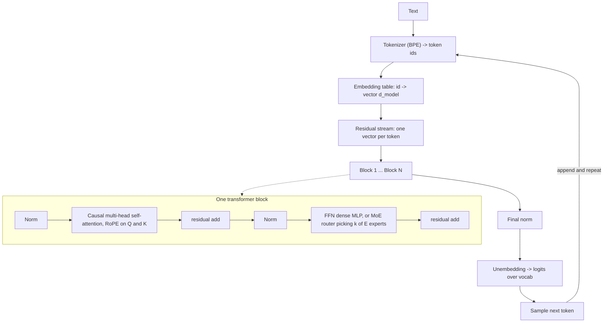

# Transformer Architecture Explainer

Build the transformer up from a single question — *how does one token look at another?* — following the
first-principles teaching and source-discipline rules in [`AGENTS.md`](../../../AGENTS.md). Every block
exists to solve a concrete failure of the block before it; that causal chain is the lesson.

## When to use

- The learner can call an LLM API but cannot explain what happens between the prompt and the logits.
- They need to reason about **cost**: why context length hurts, why the KV cache eats VRAM, why a
  Mixture-of-Experts model with huge total parameter counts can be served with modest compute per token.
- They are about to quantize ([llm-quantization-lab](../llm-quantization-lab/SKILL.md)), fine-tune
  ([peft-lora-lab](../peft-lora-lab/SKILL.md)), or self-host
  ([vllm-inference-lab](../vllm-inference-lab/SKILL.md)) and need the mental model those depend on.
- They are choosing embedding models ([embeddings-explainer](../embeddings-explainer/SKILL.md)) and want to
  know what the encoder actually encodes.

## The forward pass, once



**The core intuition:** the residual stream is a shared workspace, one vector per token. *Attention* moves
information **between** tokens; the *FFN* transforms information **within** a token. Stacking those two
alternating operations, each writing back into the same stream, is the entire architecture
(Vaswani et al., *Attention Is All You Need*, arXiv:1706.03762, 2017-06-12).

## Why Q, K and V — derived, not declared

A token needs to ask a question, other tokens need to advertise what they offer, and something must be
retrieved. Three roles means three projections of the same vector:

- **Q** (query) — what *this* token is looking for.
- **K** (key) — what *that* token advertises.
- **V** (value) — what actually gets copied when the match succeeds.

Score = `Q·Kᵀ / √d_k`, softmax over the row, then a weighted sum of `V`. The `√d_k` divisor is not
decoration: dot products of `d_k` random components have variance growing with `d_k`, so without it the
softmax saturates and gradients vanish. **Causal masking** sets future positions to `-inf` *before* the
softmax, which is what lets one forward pass train on every next-token prediction at once. **Multi-head**
splits `d_model` into `h` subspaces so different heads attend on different relations in parallel.

## Design choices and their trade-offs

| Component | Options | Trade-off the learner must be able to state |
| --- | --- | --- |
| Position info | Learned absolute · sinusoidal · **RoPE** · ALiBi | Learned absolute cannot extrapolate past trained length; RoPE rotates Q/K by position so scores depend on *relative* distance and extrapolates far better (Su et al., *RoFormer*, arXiv:2104.09864, 2021-04-20) |
| Norm placement | Post-LN (original) · **Pre-LN** (modern) | Pre-LN keeps a clean residual path and trains deep stacks stably; post-LN can reach slightly better loss but is fragile without warmup |
| Norm type | LayerNorm · RMSNorm | RMSNorm drops mean-centering and bias — fewer ops, near-equal quality, so most recent open models use it |
| KV head sharing | MHA · **GQA** · MQA | MHA = best quality, biggest KV cache; MQA = one KV head, smallest cache, some quality loss; GQA groups heads as the middle ground |
| FFN | Dense MLP · **MoE** (route to k of E experts) | Dense: params ≈ FLOPs per token. MoE: huge *total* params, small *active* params per token → cheaper compute, but far more VRAM to hold and a router that can load-imbalance |
| Activation | ReLU · GELU · SwiGLU | SwiGLU costs a third weight matrix but consistently wins per-parameter, which is why gated FFNs are narrower than the classic 4×d_model |
| Decoding | No cache · **KV cache** | Without a cache each new token re-computes all previous K/V; with it, per-step work drops but VRAM grows linearly with tokens × layers × kv-heads |

**Where the parameters and the time actually go:** most of the weights sit in the FFNs, but attention is the
term that grows *quadratically* with sequence length — `n²·d` work and an `n×n` score matrix.
FlashAttention does not change that asymptotic; it avoids materializing the `n×n` matrix in HBM, making
attention memory-efficient and much faster in practice (Dao et al., arXiv:2205.14135, 2022-05-27).

## Procedure

1. **Calibrate.** Ask what the learner already trusts — dot products? softmax? tensor shapes? Teach from the
   highest concept they genuinely own; do not restate what they know.
2. **Start with the failure, not the fix.** "A bag of word vectors gives *bank* no way to see *river*."
   Introduce attention as the answer to that failure, never as a definition.
3. **Derive Q/K/V** with the three-roles argument, then write one head as explicit shapes:
   `X:[n,d] → Q,K,V:[n,d_k] → scores:[n,n] → out:[n,d_k]`. Ask the learner to predict each shape *before*
   you reveal it — shapes are the anchor.
4. **Add the mask** and show why it makes training parallel across positions while inference stays serial.
5. **Add residual + norm**, framing the residual stream as the read/write workspace that makes very deep
   stacks trainable at all.
6. **Add the FFN**, then the **MoE** variant, and make the learner say the difference between *total* and
   *active* parameters out loud.
7. **Introduce RoPE last** among components — it only makes sense once Q·K is understood.
8. **Do the cost arithmetic together.** Have them compute a KV-cache size:
   `bytes ≈ 2 (K and V) × layers × kv_heads × head_dim × seq_len × batch × dtype_bytes`. Plug in their own
   model and watch a "small" model become VRAM-bound at long context.
9. **Verify with `#run` (`learningos_runcode`)**: implement one causal attention head in ~20 lines of NumPy
   or PyTorch, run it on real inputs including edge cases — sequence length 1, an all-identical input row,
   a fully masked position — and confirm each softmax row sums to 1 and future weights are exactly 0.
   Teach from the printed output, not from the assumed one.
10. **Route onward:** shrink it with [llm-quantization-lab](../llm-quantization-lab/SKILL.md), adapt it with
    [peft-lora-lab](../peft-lora-lab/SKILL.md), serve it with
    [vllm-inference-lab](../vllm-inference-lab/SKILL.md), or connect it to retrieval via
    [embeddings-explainer](../embeddings-explainer/SKILL.md) and
    [rag-designer](../rag-designer/SKILL.md).

## Output shape

```
Topic: <e.g. why long context is expensive>   Level: <beginner|intermediate|advanced>

First principle: <the failure this component fixes>
Mechanism (shapes first):
  X:[n,d] -> Q,K,V:[n,d_k] -> scores:[n,n] (+causal mask) -> softmax -> @V -> [n,d_k]
Design choice: <e.g. RoPE over learned absolute, because ...>
Trade-off: <what it costs — memory | quality | extrapolation>

Cost arithmetic:
  attention work ~ O(n^2 * d)      FFN holds most of the parameters
  KV cache bytes ~ 2 * layers * kv_heads * head_dim * seq * batch * dtype_bytes
  worked example: <their model> at <their context> -> <GB>

#run check: <one causal head on real input -> rows sum to 1, future weights = 0 -> PASS/FAIL>
Edge cases run: <n=1 | identical rows | fully masked position> -> <real output>

Misconception corrected: <the one they held>
Next: <quantization | LoRA | vLLM serving | embeddings>
```

## Tips

- Teach **shapes before symbols** — a learner who can predict every tensor shape understands attention; one
  who can recite `softmax(QKᵀ/√d)V` may not.
- The residual stream is the best single metaphor available: attention *reads and writes*, the FFN *edits*.
- Never say "attention is O(n²)" without saying *of what* — quadratic in **sequence length**, linear in
  model width; the FFN is where the parameters live.
- Pitfalls to name explicitly: confusing heads with layers; thinking multi-head means multiple models;
  believing FlashAttention changes the asymptotic cost; assuming an MoE's total parameter count predicts
  serving speed (it predicts **VRAM**, not FLOPs per token).
- Ground every claim in a named primary source (the original transformer paper, RoFormer, FlashAttention,
  the Hugging Face Transformers documentation) with a date — never invent a version number, config key, or
  API surface.
- Close with the **Learning Footer** (`AGENTS.md`) so the learner leaves with one recap, one pitfall, and
  one thing to run next.
