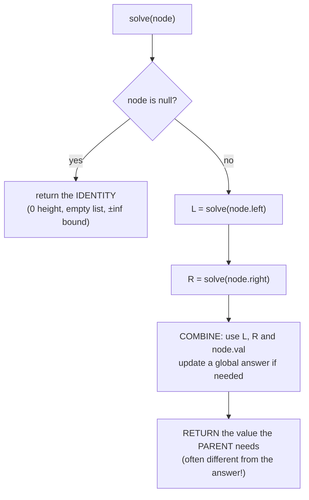

# Tree Algorithms Coach

Almost every tree problem is the same question asked once per node — **what do I need from my children, and
what do I hand to my parent?** Teach that frame first, per [`AGENTS.md`](../../../AGENTS.md). Pairs with
[recursion-backtracking-coach](../recursion-backtracking-coach/SKILL.md),
[graph-algorithms-coach](../graph-algorithms-coach/SKILL.md), and
[dsa-patterns-coach](../dsa-patterns-coach/SKILL.md).

## When to use

- The learner can write a traversal but freezes on "compute X for every subtree".
- They confuse the four traversals, or need the iterative version because recursion is banned/too deep.
- BST invariants are shaky — `validate` checked only parent-vs-child, or delete-with-two-children is fuzzy.
- They've heard "segment tree" and "Fenwick tree" and don't know which problem each one solves.

## The mental model

A tree is a graph with no cycles and one path between any two nodes, so DFS never needs a `visited` set.
Every recursive tree function is three decisions:



**The single most important distinction:** the value you *return upward* is often not the answer you are
computing. Diameter returns *height* but updates a global *diameter*. Rob-the-tree returns a *pair*
(take, skip) but the answer is `max` of the root pair. Naming the two separately kills most tree bugs.

## The four traversals

| Traversal | Visit order | Recursive shape | Reach for it when |
| --- | --- | --- | --- |
| **Pre-order** | node → left → right | act, then recurse | Copying/serializing a tree; passing info **down** (depth, path, bounds) |
| **In-order** | left → node → right | recurse, act, recurse | **BST → sorted sequence**; k-th smallest; validating a BST |
| **Post-order** | left → right → node | recurse both, then act | Any subtree aggregate: height, sum, diameter, deletion, tree DP |
| **Level-order (BFS)** | depth 0, then 1, … | queue, process one level per outer iteration | Per-level answers, minimum depth, right-side view, shortest hops |

```python
# Post-order recursive: the default shape for subtree aggregates.
def height(node):
    if node is None:
        return 0                       # identity for "height"
    return 1 + max(height(node.left), height(node.right))

# Iterative in-order (explicit stack) — needed when recursion is banned or too deep.
def inorder(root):
    stack, cur, out = [], root, []
    while cur or stack:
        while cur:                     # go as far left as possible
            stack.append(cur)
            cur = cur.left
        cur = stack.pop()
        out.append(cur.val)            # visit
        cur = cur.right
    return out

# Level-order: the inner for-loop is what makes levels separable.
from collections import deque
def levels(root):
    if not root: return []
    q, out = deque([root]), []
    while q:
        level = []
        for _ in range(len(q)):        # freeze the level size FIRST
            n = q.popleft()
            level.append(n.val)
            if n.left:  q.append(n.left)
            if n.right: q.append(n.right)
        out.append(level)
    return out
```

Every traversal is O(n) time. Recursive space is O(h) — that's O(log n) balanced, **O(n) in a degenerate
chain**, which is exactly when the recursive version blows the stack.

## Core problems and the pattern each teaches

| Problem | Traversal | Return upward | Global/answer |
| --- | --- | --- | --- |
| Height / max depth | post-order | `1 + max(L, R)` | the root's return |
| **Diameter** | post-order | height | `max(ans, L + R)` at each node |
| Balanced check | post-order | height, or a sentinel `-1` for "unbalanced" | short-circuit on the sentinel |
| Subtree sum / count | post-order | `node.val + L + R` | aggregate as you go |
| **Rob the tree** (no two adjacent) | post-order | pair `(rob_this, skip_this)` = `(val + L.skip + R.skip, max(L) + max(R))` | `max(root pair)` |
| **LCA, plain binary tree** | post-order | the node if it is `p`, `q`, or a node where both sides returned non-null | first such node |
| **LCA in a BST** | top-down walk | — | descend while both targets are on the same side; the split point is the LCA — O(h) |
| Validate BST | pre-order with bounds | pass `(low, high)` **down**; every node must satisfy `low < val < high` | fails on the first violation |
| k-th smallest in BST | in-order | count as you visit | stop at the k-th |
| Path sum / root-to-leaf paths | pre-order | carry the running path down; **un-choose on the way out** | collect at leaves |

**BST delete — the only fiddly one.** Three cases: no child → detach; one child → splice the child in; two
children → replace the value with the **in-order successor** (leftmost node of the right subtree), then
delete that successor from the right subtree (it has at most one child, so it reduces to an easier case).

## Beyond plain binary trees — what each structure buys you

| Structure | Solves | Build / Query / Update | Reach for it when |
| --- | --- | --- | --- |
| **Balanced BST** (AVL, red-black) | Keeps `h = O(log n)` under insert/delete via rotations | — / O(log n) / O(log n) | Ordered map/set with worst-case guarantees (most standard libraries) |
| **Fenwick tree (BIT)** | Prefix sums with point updates | O(n) / O(log n) / O(log n) | You only need **invertible** aggregates (sum, xor); ~10 lines, small constant |
| **Segment tree** | *Any* associative range query (min, max, gcd, sum) + point/range update | O(n) / O(log n) / O(log n) | Non-invertible aggregates, range assignment (with lazy propagation) |
| **Trie** | Prefix queries over strings/bits | O(total chars) / O(len) | Autocomplete, XOR-maximum ([string-algorithms-coach](../string-algorithms-coach/SKILL.md)) |

Decision rule: **need only prefix sums → Fenwick** (simpler, faster constant). **Need range min/max/gcd or
lazy range updates → segment tree.** Don't reach for either until a naive O(n) per query is proven too slow.

## Procedure

1. **Draw a 5–7 node tree by hand**, including one degenerate branch. Every subsequent claim gets checked
   against this drawing.
2. **Ask the framing question**: "what does this node need from its children, and what must it return to its
   parent?" Write both down — explicitly note when they differ.
3. **Pick the traversal** from the table using the direction information flows: **down** → pre-order,
   **up** → post-order, **sorted order in a BST** → in-order, **by level** → BFS.
4. **Write the base case first** and name its identity value (`0`, `null`, `-inf`, empty list). Most tree
   bugs are a missing or wrong base case.
5. **Write the combine step**, then decide whether the answer is the return value or a separate accumulator.
6. **Trace it by hand** on the drawn tree, node by node, before running anything.
7. **Verify with `#run` (`learningos_runcode`)** on real inputs: empty tree, single node, left-only chain
   (the stack-depth case), a perfectly balanced tree, and duplicate values. Teach from the real output.
8. **State complexity**: O(n) time for a full traversal, O(h) space recursive; O(h) for BST search/LCA where
   `h` is O(log n) balanced and O(n) degenerate ([complexity-analyzer](../complexity-analyzer/SKILL.md)).
9. **Route onward**: general recursion and pruning →
   [recursion-backtracking-coach](../recursion-backtracking-coach/SKILL.md); trees-as-graphs, cycles and
   shortest paths → [graph-algorithms-coach](../graph-algorithms-coach/SKILL.md); state/transition design for
   heavier tree DP → [dynamic-programming-coach](../dynamic-programming-coach/SKILL.md).

## Output shape

```
Tree lesson — <problem>

Hand-drawn instance:      (root 5) -> L(3 -> 2, 4)  R(8 -> null, 9)
Framing:
  need from children: <e.g. height of each side>
  return to parent:   <height>      answer accumulator: <global diameter>   (they DIFFER)
Traversal: <pre | in | post | level> because info flows <down | up | sorted | per level>

Base case: node is null -> return <identity>
Combine:   <expression using L, R, node.val>

Code (<language>):
  <recursive template>
  <iterative variant if recursion is banned / depth is a risk>

Hand trace on the drawn tree: <node -> (L, R) -> returned>
#run check: empty | single node | left-chain | balanced | duplicates -> real outputs -> PASS/FAIL
Complexity: O(n) time / O(h) space   (h = O(log n) balanced, O(n) degenerate)

Pitfall avoided: <missing base case | wrong return value | BST bounds not propagated>
Next: <recursion-backtracking-coach | graph-algorithms-coach | dynamic-programming-coach>
```

## Tips

- Separate **"what I return"** from **"the answer"**. Diameter, balanced-check, and rob-the-tree all hinge on
  this; conflating them is the single most common tree bug.
- Validating a BST by comparing each node only to its parent is **wrong** — pass `(low, high)` bounds down,
  or check that an in-order traversal is strictly increasing.
- In level-order, freeze `len(queue)` before the inner loop; reading it live merges the levels.
- Recursion depth equals tree **height**, not node count — a 10⁵-node left-chain overflows the default stack
  in Python/Java. Have the iterative template ready.
- In-order on a BST is sorted: many "BST" problems collapse to a one-pass scan of that sequence.
- Fenwick for prefix sums, segment tree for arbitrary associative range queries — and neither until the naive
  scan is *measured* too slow.
- Test the degenerate shapes (empty, single node, one-sided chain) with `#run`; balanced examples hide bugs.
- Use original or classic examples only — never reproduce paywalled problem statements from LeetCode,
  Codeforces, HackerRank, or CodeChef; link out to those platforms to practise.
- End with the **Learning Footer** (`AGENTS.md`).
