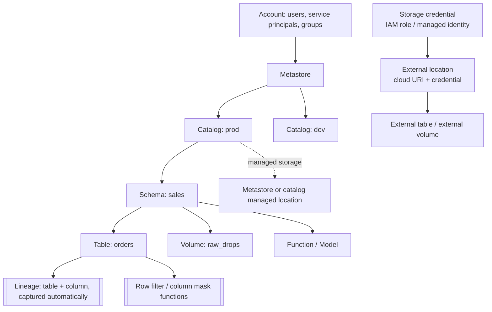

# Unity Catalog Coach

Governance is not a checklist — it is a **single object model** that answers "who can see what, where does it
live, and where did it come from". Teach it that way, following [`AGENTS.md`](../../../AGENTS.md). The
table format underneath is covered by [`delta-lake-lab`](../delta-lake-lab/SKILL.md); the physical design by
[`lakehouse-designer`](../lakehouse-designer/SKILL.md).

## When to use

- Data is governed per-workspace today and the same table has three different owners and no lineage.
- The learner cannot explain what `DROP TABLE` does to the files — the managed vs external question.
- Access requests are being solved by copying data into filtered tables instead of row filters and masks.
- An audit asks "who queried this column last quarter, and what fed it?" and nobody can answer.

## First principles: identity outside, data inside, one namespace across

Unity Catalog puts a **metastore** above workspaces, so a data asset is defined once and shared, while
identities (users, service principals, groups) are managed at the **account** level. That is what makes the
three-level namespace `catalog.schema.table` meaningful — `catalog` is the isolation unit (per environment,
per business domain, per tenant), not a workspace accident.



| Securable | Managed | External |
| --- | --- | --- |
| **Table** | UC owns the lifecycle *and* the files in the managed location; `DROP` deletes data (retained briefly, then purged) | UC governs access, you own the path; `DROP` removes the metadata only, **files stay** |
| **Volume** (files, not tables) | files under the managed location, governed like a table | a path inside an external location, ideal for landing zones and non-tabular data |
| Best for | almost everything — predictable, optimizable, cheaper to operate | migration, data shared with non-Databricks engines, paths you cannot move |
| Cost | UC can apply automatic maintenance/optimization | you own compaction, retention, and orphan files |

Access to cloud storage is *never* granted to a cluster directly. A **storage credential** wraps the cloud
identity (IAM role / managed identity / service principal); an **external location** binds a cloud URI to
that credential; then you grant on the external location. Nobody needs the underlying secret, and every path
has one governed owner (Databricks documentation, *Unity Catalog* and *Manage external locations and storage
credentials*, docs.databricks.com).

| Privilege pattern | What it does | Trap |
| --- | --- | --- |
| `GRANT USE CATALOG` / `USE SCHEMA` | traversal — required *in addition* to `SELECT` | the #1 "permission denied on a table I was granted" cause |
| `GRANT SELECT ON TABLE` | read the table | inherited by nothing below; grants flow **downward** from catalog → schema → table |
| `GRANT SELECT ON SCHEMA` | read every current *and future* table in it | convenient and broad — deliberate, not lazy |
| Ownership | full control, including `GRANT` | owning as an individual creates a bus factor — own with a **group** |
| `GRANT ... ON ALL TABLES` (one-off) vs schema-level | point-in-time vs inherited | one-off grants silently miss new tables |

**Row filters and column masks** implement fine-grained access without duplicating data. Both are SQL UDFs
attached to a table: a row filter returns a boolean and is applied as a `WHERE`; a column mask returns the
column's type and rewrites the value on read. Inside them, `is_account_group_member()` / `current_user()`
make the policy dynamic, so one table serves every audience (Databricks documentation, *Filter sensitive
table data using row filters and column masks*).

## Procedure

1. **Map the estate first**: environments, domains, regions, and which teams must never see each other's
   data. The catalog layout falls out of this — commonly `prod` / `staging` / `dev`, or one catalog per
   business domain.
2. **Enable the metastore per region** and attach workspaces. State the rule out loud: identities live at
   the account level, data at the metastore level, compute in the workspace.
3. **Set up storage access properly** — create the storage credential, then the external location, then
   grant on the external location. Never hand a cluster a raw key or mount a bucket.
4. **Choose managed by default.** Reach for external tables only for migration, cross-engine sharing, or
   paths you genuinely cannot relocate — and write down why, because `DROP` behaves differently forever
   after.
5. **Use volumes for non-tabular data** (landing files, images, model artifacts) so governance covers the
   `Files` world too, instead of falling back to un-governed cloud paths.
6. **Design privileges as inheritance, not a spreadsheet.** Grant to **groups**, at the highest sensible
   level (usually schema), and always pair `SELECT` with `USE CATALOG` + `USE SCHEMA`. Make groups own
   objects.
7. **Add fine-grained controls where duplication was the old answer**: a row filter for tenant/region
   scoping, a column mask for PII (email, card, national ID). Test with a user *in* and *out* of the group —
   both paths, every time.
8. **Verify lineage.** Unity Catalog captures table and column lineage automatically for queries run on
   UC-enabled compute; open a downstream table and confirm the upstream columns. Use it for impact analysis
   before a schema change, alongside [`data-contract-designer`](../data-contract-designer/SKILL.md).
9. **Use system tables for evidence** — billing/usage and audit history answer "who queried what" and "what
   does this cost" without a bespoke logging pipeline.
10. **Share deliberately**: Delta Sharing for cross-org reads without copies; a separate catalog when the
    boundary must be hard.
11. **Review quarterly**: orphaned grants, individually-owned objects, external locations nobody claims, and
    tables with no downstream lineage (candidates for deletion).

## Output shape

```
Unity Catalog design — <estate> · metastore: <region> · workspaces: <n>

Namespace:
  <prod|dev>.<domain>.<table>          isolation unit = catalog (why: <env|domain|tenant>)
Storage:
  storage credential <name> -> external location <abfss://…|s3://…>
  managed tables -> <metastore|catalog> managed location   (DROP deletes data)
  external tables -> <path>                                 (DROP keeps data)
  volumes: <managed|external> for <landing|artifacts>

Privileges (to GROUPS, at schema level):
  GRANT USE CATALOG ON CATALOG prod TO `<group>`
  GRANT USE SCHEMA, SELECT ON SCHEMA prod.sales TO `<group>`
  owner of prod.sales = `<group>`   (no individual owners)

Fine-grained:
  row filter  <fn>(<col>)  -> is_account_group_member('<group>') OR <col> = <scope>
  column mask <fn>(<col>)  -> masked unless is_account_group_member('<pii-group>')
  tested as: in-group -> <rows/values> · out-of-group -> <rows/values>

Lineage:   <upstream> -> <table>.<column> -> <downstream>  (auto-captured on UC compute)
Audit:     system tables -> access history <query> · billing usage <cost>
Sharing:   Delta Sharing to <recipient> | separate catalog because <hard boundary>

Next: lakehouse-designer | delta-lake-lab | fabric-lakehouse-coach
```

## Tips

- `SELECT` without `USE CATALOG` and `USE SCHEMA` fails. Teach traversal privileges first and you prevent
  most access tickets.
- Grant to groups, own with groups. An object owned by a departing employee is a governance outage waiting
  to happen.
- `DROP TABLE` on a **managed** table removes the data; on an **external** table it removes only the
  metadata. That one sentence is the whole managed-vs-external decision, and it belongs in your runbook.
- Prefer row filters and column masks over "make a filtered copy". Copies drift, multiply storage, and
  quietly escape the audit trail.
- Schema-level grants cover **future** tables; one-off `ON ALL TABLES` grants do not. Use the former unless
  you truly mean a snapshot.
- Lineage is captured for work run on Unity Catalog-enabled compute — jobs that bypass UC leave gaps, so
  check coverage before you trust an impact analysis.
- Cross-link onward: [`delta-lake-lab`](../delta-lake-lab/SKILL.md) for what a managed table actually is,
  [`fabric-lakehouse-coach`](../fabric-lakehouse-coach/SKILL.md) for the Microsoft-side equivalent,
  [`dbt-model-coach`](../dbt-model-coach/SKILL.md) for models that must respect these grants, and
  [`data-warehouse-modeling`](../data-warehouse-modeling/SKILL.md) for the gold layer being governed.
- End with the **Learning Footer** (`AGENTS.md`) — one privilege chain the learner must reconstruct unaided,
  and one masked column for them to test from both sides.
