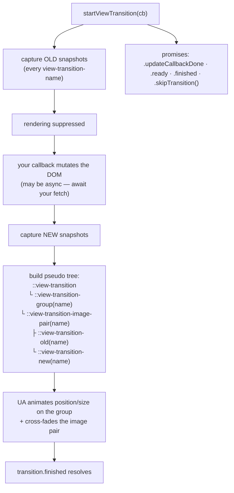

# View Transitions Lab

A runnable lab for animating *state changes*, not elements: **snapshot old → mutate DOM → snapshot new →
animate between them**. The browser does the FLIP maths; you name the things that should feel continuous.
Follows the first-principles and accessibility guidance in [`AGENTS.md`](../../../AGENTS.md).

## When to use

- You want a shared-element / morph transition (list → detail, thumbnail → hero) without a JS animation lib.
- You have a classic multi-page app and want cross-document transitions with no framework at all.
- Your transition "does nothing", flickers, or throws about duplicate names.
- **Don't use it for** general motion design, easing curves, or scroll-linked effects — see
  [animation-coach](../animation-coach/SKILL.md).

## First principles: a pseudo-element tree built from two snapshots

Per the W3C CSS View Transitions specification, `document.startViewTransition(cb)` freezes rendering, takes
a snapshot of every element with a `view-transition-name`, runs your callback (which mutates the DOM), takes
a second set of snapshots, then builds a **pseudo-element tree overlaying the page** and animates it. The
default is a cross-fade of the whole page (`::view-transition-old(root)` → `::view-transition-new(root)`);
naming more elements creates more independent groups.



| Concept | API / syntax | What it does | Gotcha |
| --- | --- | --- | --- |
| Start a transition | `document.startViewTransition(cb)` | snapshot → run `cb` → animate | feature-detect; if absent just call `cb()` |
| Promises | `.updateCallbackDone`, `.ready`, `.finished` | DOM done / pseudo tree ready / animation over | animate with WAAPI **after** `.ready` |
| Name a participant | `view-transition-name: hero` | pairs old and new snapshots | must be **unique per document at capture time** or the transition is skipped |
| Root | `view-transition-name: root` (UA default on `:root`) | whole-page cross-fade | override it to stop the page-wide fade |
| Style the animation | `::view-transition-group(name)` etc. | your keyframes, duration, easing | these live in the **top-layer overlay**, not in your normal stacking context |
| Group many names | `view-transition-class` (Level 2) | style a set of groups at once | check support before relying on it |
| Cross-document (MPA) | `@view-transition { navigation: auto; }` | same-origin navigations animate | must be declared on **both** the outgoing and incoming document |
| MPA hooks | `pageswap` / `pagereveal` events | `event.viewTransition` on each side | use to set names per-navigation, then clear them |
| Reduced motion | `@media (prefers-reduced-motion: reduce)` | you must opt out yourself | the default cross-fade **is** an animation — it is not exempt |

**Trade-offs to say out loud:** snapshotting suppresses rendering for the duration of your callback, so an
un-awaited slow fetch inside `startViewTransition` freezes the page — fetch first, transition second. Each
named element is an extra snapshot and an extra animated group, so naming fifty list items costs real
presentation time (the third phase of INP). And because names must be unique, the usual pattern is to set
`view-transition-name` on exactly one item *just before* the transition and remove it in `.finished`.

## Procedure

1. **Feature-detect and degrade honestly** — never gate the state change itself:
   `if (!document.startViewTransition) { update(); return; }`.
2. **Fetch and prepare data *before* calling `startViewTransition`.** The callback should be a fast DOM
   mutation, because rendering is suppressed while it runs.
3. **Name only what must feel continuous**: the hero image, the card that becomes the page, the header.
   Everything else rides the default root cross-fade.
4. **Guarantee uniqueness** — assign the name to the clicked element immediately before the call and clear
   it in `transition.finished.finally()`. Two elements sharing a name aborts the whole transition.
5. **Style the pseudo tree** in plain CSS: `::view-transition-old(hero)` / `::view-transition-new(hero)` for
   the cross-fade, `::view-transition-group(hero)` for duration/easing of the morph.
6. **Go cross-document** for an MPA: add `@view-transition { navigation: auto; }` to both pages' CSS
   (same-origin only), then use `pageswap` and `pagereveal` to set per-navigation names.
7. **Honour `prefers-reduced-motion`** by cancelling the animations on the pseudo-elements — a snap is a
   legitimate, accessible outcome.
8. **Verify** in DevTools: the Animations panel lists the `::view-transition-*` animations, and you can slow
   them to 10 % to inspect the morph.
9. Close with the **Learning Footer**.

## Output shape

```
Mode: <same-document (SPA) | cross-document (MPA)>      Same-origin: <yes/no>
Named participants: <name> -> <old element> => <new element>   (uniqueness strategy: <...>)
Callback: <the DOM mutation only>     Data fetched BEFORE the call: <yes/no>
CSS: ::view-transition-group(<n>) { … }  ::view-transition-old/new(<n>) { … }
MPA opt-in: @view-transition { navigation: auto; } on <outgoing> + <incoming>
Reduced motion: @media (prefers-reduced-motion: reduce) -> <animation: none | shorter fade>
Fallback when unsupported: <plain state update, no animation>
Code: <runnable HTML/CSS/JS>
Verify: DevTools > Animations (slow to 10%); toggle OS reduced-motion; disable the API and re-test
Next: <animation-coach | inp-optimization-lab | accessibility-audit>
Learning Footer
```

## Worked example — list → detail morph, with reduced-motion and a real fallback

Save as `vt-lab.html` and open it. Click a card: the thumbnail morphs into the detail hero, everything else
cross-fades.

```html
<!doctype html>
<meta charset="utf-8"><title>View Transitions lab</title>
<style>
  body { font: 16px/1.5 system-ui, sans-serif; margin: 2rem; }
  .grid { display: grid; grid-template-columns: repeat(auto-fit, minmax(9rem, 1fr)); gap: 1rem; }
  .thumb { aspect-ratio: 1; border-radius: .5rem; cursor: pointer; }
  .hero  { inline-size: min(100%, 28rem); aspect-ratio: 16/9; border-radius: 1rem; }

  /* The morph: the group animates position + size between the two snapshots. */
  ::view-transition-group(hero) { animation-duration: .35s; animation-timing-function: ease-in-out; }
  /* The cross-fade of the two images inside that group. */
  ::view-transition-old(hero) { animation: fade .35s ease-out both reverse; }
  ::view-transition-new(hero) { animation: fade .35s ease-in  both; }
  @keyframes fade { from { opacity: 0 } to { opacity: 1 } }

  /* Accessibility: the DEFAULT cross-fade is still motion — you must opt out explicitly. */
  @media (prefers-reduced-motion: reduce) {
    ::view-transition-group(*),
    ::view-transition-old(*),
    ::view-transition-new(*) { animation: none !important; }
  }
</style>

<div id="app">
  <div class="grid" id="grid"></div>
</div>

<script type="module">
const colours = ['#0b63ce', '#c62828', '#2e7d32', '#6a1b9a'];
const grid = document.getElementById('grid');
grid.innerHTML = colours.map((c, i) =>
  `<div class="thumb" data-i="${i}" style="background:${c}"></div>`).join('');

// Always call this — it degrades to an instant update where the API is absent.
function transition(updateDom) {
  if (!document.startViewTransition) { updateDom(); return { finished: Promise.resolve() }; }
  return document.startViewTransition(updateDom);
}

grid.addEventListener('click', async (e) => {
  const el = e.target.closest('.thumb');
  if (!el) return;
  const i = Number(el.dataset.i);

  // 1. Do the slow work FIRST — rendering is suppressed inside the callback.
  const detail = await new Promise(r => setTimeout(() => r({ i, colour: colours[i] }), 120));

  // 2. Uniqueness: exactly one element may carry the name at capture time.
  el.style.viewTransitionName = 'hero';

  const t = transition(() => {
    document.getElementById('app').innerHTML =
      `<div class="hero" style="background:${detail.colour};view-transition-name:hero"></div>
       <p><button id="back">← back</button> item ${detail.i}</p>`;
  });

  // 3. Always clear the name, success or failure, or the NEXT transition aborts on a duplicate.
  t.finished.finally(() => { el.style.viewTransitionName = ''; });

  await t.finished.catch(() => {});
  document.getElementById('back')?.addEventListener('click', () => location.reload());
});
</script>
```

Reason it through: the 120 ms "fetch" is awaited *outside* `startViewTransition`, so the callback is a single
synchronous `innerHTML` write and rendering is suppressed for one frame rather than 120 ms. The clicked
thumbnail and the new hero both carry `view-transition-name: hero`, but never at the same capture — the old
snapshot is taken before the callback, the new one after — so the browser pairs them and animates
position, size and content. Clearing the name in `.finished.finally()` is what makes the *second* click
work; skip it and you get two `hero` names in the document and a silently skipped transition.

For a multi-page app, delete all of the JavaScript above and put this in the CSS of **both** pages:

```css
@view-transition { navigation: auto; }   /* same-origin navigations only */
```

then set per-navigation names in the `pageswap` (outgoing) and `pagereveal` (incoming) events, each of which
exposes `event.viewTransition` so you can await `.ready` and inspect the activation URL.

## Tips

- **Nothing animates until something is named.** Without a `view-transition-name` you only get the default
  root cross-fade — and if you set `:root { view-transition-name: none }` you get nothing at all.
- Duplicate names are the number-one failure: set the name late, clear it in `.finished.finally()`.
- Never `await` a network request *inside* the callback; rendering is suppressed for its entire duration.
- The pseudo-elements render in the **top layer**, so your `z-index`, `overflow: hidden` and `transform` on
  ancestors do not apply to them — style the groups directly.
- Use `.ready` (not `.finished`) as the hook for custom Web Animations API keyframes on the pseudo-elements.
- Every named participant costs a snapshot and an animated group — that lands in the presentation-delay
  third of INP; measure it in [inp-optimization-lab](../inp-optimization-lab/SKILL.md).
- Reduced motion is not automatic. Ship the `@media (prefers-reduced-motion: reduce)` block above and verify
  with [accessibility-audit](../accessibility-audit/SKILL.md) and
  [accessibility-remediation-coach](../accessibility-remediation-coach/SKILL.md).
- Pair with [animation-coach](../animation-coach/SKILL.md),
  [modern-css-features-lab](../modern-css-features-lab/SKILL.md),
  [web-components-lab](../web-components-lab/SKILL.md) (names must be unique across shadow trees too), and
  [web-perf-audit](../web-perf-audit/SKILL.md). Check current support on MDN and the CSS View Transitions
  spec before shipping (`AGENTS.md` §2), then end with the **Learning Footer** (`AGENTS.md`).
