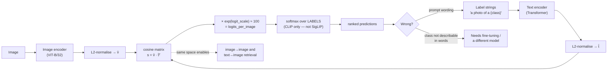

# Vision-Language Model Lab

One shared embedding space for pixels and words, run end-to-end on a laptop for €0 — following the
verify-before-you-teach and source-discipline rules in [`AGENTS.md`](../../../AGENTS.md). Everything below
is CPU-friendly; nothing here needs a GPU or a paid API.

## When to use

- The learner wants an image classifier but has no labelled training set — zero-shot is the honest first try.
- They can say "CLIP embeds images and text together" but cannot produce the logits from the embeddings.
- A caption model is producing confident nonsense and they need to know *which* component to blame.
- They need to find "the red mug on the left" in an image and have never met open-vocabulary detection.
- Somebody is about to fine-tune a VLM before checking whether prompt wording alone fixes the problem.
- **Don't use it for** text-only retrieval (that is [embeddings-explainer](../embeddings-explainer/SKILL.md)),
  for building a retrieval *system* (that is [rag-designer](../rag-designer/SKILL.md)), or for tasks needing
  precise counting, OCR of dense text, or exact spatial reasoning — those are documented weak spots, not
  prompt-engineering problems.

## First principles: contrastive alignment, then a temperature

CLIP (Radford et al., *Learning Transferable Visual Models From Natural Language Supervision*,
arXiv:2103.00020, 2021-02-26) trains **two encoders** — one for images, one for text — on 400M image–text
pairs with a single objective: in a batch of $B$ pairs, the $B$ matching pairs must score higher than the
$B^2-B$ mismatched ones. With L2-normalised embeddings $\hat{v}_i$ and $\hat{t}_j$, similarity is a cosine,
scaled by a learned temperature $\tau$, and the loss is symmetric cross-entropy over rows and columns:

$$s_{ij}=\hat{v}_i^\top \hat{t}_j,\qquad
\mathcal{L}=\tfrac12\Big(\underbrace{-\tfrac1B\sum_i \log\tfrac{e^{s_{ii}/\tau}}{\sum_j e^{s_{ij}/\tau}}}_{\text{image}\to\text{text}}
+\underbrace{-\tfrac1B\sum_j \log\tfrac{e^{s_{jj}/\tau}}{\sum_i e^{s_{ij}/\tau}}}_{\text{text}\to\text{image}}\Big)$$

Two consequences do all the work in practice:

1. **Classification becomes retrieval.** A class label is just text. Embed "a photo of a cat", embed the
   image, take the cosine — no classifier head, no training, no labelled data. That is why CLIP ViT-L/14
   matches the original ResNet-50's ImageNet accuracy *zero-shot* (paper, §1).
2. **The temperature is doing the confidence.** CLIP's learned $1/\tau = \exp(\texttt{logit\_scale})$ is
   clipped at 100. Raw cosines between a real image and a real caption typically sit in a narrow band
   (roughly 0.15–0.35), so *before* scaling nothing looks decisive; multiply by ~100 and a 0.05 cosine gap
   becomes a 5-logit gap, which softmax turns into near-certainty. **CLIP's confidence is a scaling
   artefact, not calibrated probability** — treat the ranking as meaningful and the probability as decoration.


*Caption: one cosine matrix, one temperature — everything CLIP does downstream is a slice of this picture.*

| Model family | Objective | Softmax over labels? | CPU-friendly checkpoint | Good for |
| --- | --- | --- | --- | --- |
| **CLIP** (arXiv:2103.00020, 2021) | softmax InfoNCE, in-batch negatives | yes | `openai/clip-vit-base-patch32` (~151M params) | zero-shot classification, retrieval, dedup |
| **SigLIP** (Zhai et al., arXiv:2303.15343, 2023-03-27) | **sigmoid** per pair, no batch-wide normaliser | **no** — each pair scores independently | `google/siglip-base-patch16-224` | same tasks, better small-batch training; scores are per-pair |
| **BLIP** captioning (Li et al., arXiv:2201.12086, 2022-01-28) | image-conditioned language modelling | n/a | `Salesforce/blip-image-captioning-base` | captions, VQA-lite |
| **LLaVA-style VLM** (Liu et al., *Visual Instruction Tuning*, arXiv:2304.08485, 2023-04-17) | vision encoder → projection → instruction-tuned LLM | n/a | 7B is GPU-scale; use a sub-1B "small VLM" on CPU | free-form Q&A about an image |
| **OWL-ViT** (Minderer et al., arXiv:2205.06230, 2022-05-12) | open-vocabulary detection | n/a | `google/owlvit-base-patch32` | grounding a phrase to a **box** |

⚠ Model IDs, parameter counts and the small-VLM landscape change fast — **read the current model card**
before quoting a size or a licence, and never assume a checkpoint is permissive.

**Prompt templates are not cosmetic.** The CLIP paper reports that prompt engineering plus ensembling over
templates improved ImageNet accuracy by nearly 5 points. `"cat"`, `"a photo of a cat"` and
`"a photo of a cat, a type of pet"` are three different vectors; the training captions were sentences, so
sentence-shaped prompts land closer to the training distribution.

**Where these models genuinely fail:** counting, left/right relations, attribute binding ("red cube *on*
blue sphere"), and dense-text OCR. Winoground (Thrush et al., arXiv:2204.03162, 2022-04-07) showed that
strong image–text models score around chance when the *only* difference between two captions is word order.
That is an architectural limitation of a single pooled embedding per image — no prompt fixes it.

## Procedure

1. **Set up, free and offline-ish** (weights download once, then it's local):

   ```bash
   python -m venv .venv && .venv\Scripts\activate       # Windows; source .venv/bin/activate elsewhere
   pip install -U torch transformers pillow scikit-image
   ```
2. **Pick images you know the answer to.** `scikit-image` ships sample photographs — `data.chelsea()` (a
   cat), `data.astronaut()` (a person), `data.coffee()` (a cup of coffee). A first call may fetch a sample
   once via `pooch`; after that it is fully offline. Any local JPEG works too.
3. **Write labels as sentences, not words**, and keep a second template set so you can measure the
   difference: `["a photo of a {}", "a close-up photo of a {}", "a blurry photo of a {}"]`.
4. **Run zero-shot classification** with `CLIPModel` + `CLIPProcessor`, taking
   `outputs.logits_per_image.softmax(dim=1)` (the model card's exact recipe).
5. **Reproduce the logits by hand** — this is the step that converts "I used CLIP" into "I understand CLIP":
   `get_image_features`, `get_text_features`, L2-normalise both, matrix-multiply, multiply by
   `model.logit_scale.exp()`, then `torch.allclose` against `logits_per_image`. If it does not match, you
   have found a normalisation bug in your own code, which is the point.
6. **Ensemble prompts.** Average the *normalised* text embeddings across templates, re-normalise the mean,
   then score. Averaging un-normalised vectors lets long strings dominate.
7. **Probe the failure modes deliberately.** Ask it to distinguish "two cats" from "three cats", and
   "the cat is left of the cup" from "the cup is left of the cat". Record that it fails; a lab that only
   shows successes teaches nothing about deployment.
8. **Caption an image** with `BlipForConditionalGeneration` (`Salesforce/blip-image-captioning-base`,
   CPU-runnable) and compare its caption to your zero-shot label. Captioners hallucinate plausible context;
   zero-shot classifiers can only pick from your list — different failure surfaces, different mitigations.
9. **Ground a phrase to a region** with `OwlViTForObjectDetection` and
   `processor.post_process_object_detection(outputs, threshold=0.1, target_sizes=...)`; sweep the threshold
   and note how recall/precision trade. ⚠ Post-processing helper names differ between OWL-ViT and OWLv2 and
   across `transformers` releases — check `dir(processor)` rather than copying a blog post.
10. **Evaluate on a real held-out set before believing anything.** Zero-shot is a *baseline*, and a small
    labelled probe set (even 100 images) tells you whether to ship it, prompt-engineer it, or fine-tune.
    Hand the harness to [eval-designer](../eval-designer/SKILL.md). Close with the **Learning Footer**.

## Output shape

```
Task: <zero-shot classification | caption | grounding>   Images: <n, source>   Hardware: CPU
Model: <hf id> · params <..> · licence <from the model card>

Prompt template(s): <"a photo of a {}", ...>       ensembled: <yes/no, k templates>
| image        | top-1 label      | prob  | raw cosine | runner-up      | margin |
|--------------|------------------|-------|------------|----------------|--------|
| <..>         | <..>             | <..>  | <..>       | <..>           | <..>   |

Hand-reproduction check: normalise → v̂·t̂ᵀ × exp(logit_scale) == logits_per_image  ✓ (allclose)
Temperature: exp(logit_scale) = <..>   ⇒ cosine gap <..> became logit gap <..>
Prompt sensitivity: "<word>" <acc> → "a photo of a <word>" <acc> → ensemble <acc>
Failure probes: counting <pass/fail> · left-right <pass/fail> · attribute binding <pass/fail>
Calibration note: softmax prob is temperature-scaled, NOT calibrated — decisions use rank + margin
Grounding (if used): query "<phrase>" → <k> boxes @ threshold <..>; false positives <..>
Decision: <ship zero-shot | ensemble prompts | needs labelled data / fine-tune>
Next: <embeddings-explainer | eval-designer | fine-tuning-planner>
Learning Footer
```

## Worked example — zero-shot on three known images, then rebuild the logits by hand

Free, CPU-only, ~600 MB of weights downloaded once.

```python
# clip_zeroshot.py
import torch
from PIL import Image
from skimage import data
from transformers import CLIPModel, CLIPProcessor

model = CLIPModel.from_pretrained("openai/clip-vit-base-patch32").eval()
proc  = CLIPProcessor.from_pretrained("openai/clip-vit-base-patch32")

images = [Image.fromarray(data.chelsea()),    # a cat  — ground truth we control
          Image.fromarray(data.astronaut()),  # a person in a spacesuit
          Image.fromarray(data.coffee())]     # a cup of coffee
names  = ["chelsea(cat)", "astronaut(person)", "coffee(cup)"]
classes = ["cat", "astronaut", "cup of coffee", "rocket", "bicycle"]
labels  = [f"a photo of a {c}" for c in classes]

inputs = proc(text=labels, images=images, return_tensors="pt", padding=True)
with torch.no_grad():
    out = model(**inputs)
probs = out.logits_per_image.softmax(dim=1)          # rows = images, cols = labels
for n, row in zip(names, probs):
    k = int(row.argmax())
    print(f"{n:>18} -> {classes[k]:<14} p={row[k]:.3f}  runner-up={classes[int(row.argsort()[-2])]}")
```

Expect `chelsea → cat`, `astronaut → astronaut`, `coffee → cup of coffee`, each with a probability close to
1.0. Now show *why* that probability is close to 1.0 — and that it is not evidence of certainty:

```python
with torch.no_grad():
    v = model.get_image_features(**proc(images=images, return_tensors="pt"))
    t = model.get_text_features(**proc(text=labels, return_tensors="pt", padding=True))
v = v / v.norm(dim=-1, keepdim=True)                 # L2-normalise: turns dot product into cosine
t = t / t.norm(dim=-1, keepdim=True)
cos    = v @ t.T                                     # values live in a narrow band, ~0.15–0.35
scale  = model.logit_scale.exp()                     # the learned temperature, clipped at 100
logits = scale * cos
print("exp(logit_scale) =", round(float(scale), 2))
print("raw cosines (row 0):", [round(float(x), 3) for x in cos[0]])
print("allclose to logits_per_image:", torch.allclose(logits, out.logits_per_image, atol=1e-3))
```

**Trace it.** `logits_per_image` in `transformers` is *defined* as
`logit_scale.exp() * image_embeds @ text_embeds.T` on already-normalised embeddings, so the `allclose` check
must pass — if it fails for you, you skipped a `norm(dim=-1, keepdim=True)`, which is the single most common
bug when people reimplement this. Then read the two printed lines together: the top cosine might be ~0.30
and the runner-up ~0.22 — an 0.08 difference, i.e. the model is *mildly* more confident. Multiply by ~100
and that becomes an 8-logit gap; with five labels, $e^{8}\approx 2981$ against four near-tied alternatives
gives $2981/(2981+4)\approx 0.9987$. The near-certainty was manufactured by the temperature. That is exactly why step 7's failure probes matter: a wrong answer arrives
with the same 0.99 as a right one.

Finally, make prompt sensitivity concrete instead of theoretical:

```python
def score(templates):
    labs = [tpl.format(c) for tpl in templates for c in classes]
    with torch.no_grad():
        e = model.get_text_features(**proc(text=labs, return_tensors="pt", padding=True))
    e = e / e.norm(dim=-1, keepdim=True)
    e = e.view(len(templates), len(classes), -1).mean(0)   # ensemble AFTER normalising
    e = e / e.norm(dim=-1, keepdim=True)                   # re-normalise the mean
    return (scale * (v @ e.T)).softmax(dim=1).argmax(dim=1)

print("bare word :", [classes[i] for i in score(["{}"])])
print("sentence  :", [classes[i] for i in score(["a photo of a {}"])])
print("ensembled :", [classes[i] for i in score(
      ["a photo of a {}", "a close-up photo of a {}", "a blurry photo of a {}", "a picture of a {}"])])
```

Note the ordering inside `score`: normalise → mean → **re-normalise**. Skipping the second normalisation
silently shrinks the ensembled vector (the mean of unit vectors has norm < 1 unless they are identical),
which rescales every logit for that class and quietly biases the comparison. Small detail, real bug.

## Tips

- **Zero-shot is a baseline, not a product.** Measure it on a labelled probe set before shipping; "it looked
  right on five images" is not an evaluation.
- The softmax probability is a temperature artefact — rank and *margin* are the trustworthy signals, and
  neither is calibrated. See [confidence-calibration-coach](../confidence-calibration-coach/SKILL.md).
- Always L2-normalise before the dot product, and re-normalise after averaging embeddings; both omissions
  produce plausible-but-wrong numbers rather than errors.
- SigLIP's sigmoid objective means per-pair scores, so **do not softmax across labels** for it — that is a
  silent misuse that still prints a pretty table.
- Prompt templates move accuracy by points, not decimals; try 3–5 and ensemble before concluding a model is
  weak on your domain.
- Counting, spatial relations and attribute binding are known architectural weaknesses — design around them
  (crop, detect-then-ask, or use a grounding model) rather than prompting harder.
- Check the licence and intended-use section of every model card; CLIP's own card explicitly warns against
  unvetted deployment for surveillance and fine-grained identification.
- Related: [embeddings-explainer](../embeddings-explainer/SKILL.md) for the vector-space intuition,
  [transformer-architecture-explainer](../transformer-architecture-explainer/SKILL.md) for what each encoder
  is doing, [hybrid-search-reranking-coach](../hybrid-search-reranking-coach/SKILL.md) for turning CLIP into
  image search, [eval-designer](../eval-designer/SKILL.md) for the probe set,
  [fine-tuning-planner](../fine-tuning-planner/SKILL.md) when zero-shot genuinely is not enough, and
  [llm-quantization-lab](../llm-quantization-lab/SKILL.md) to shrink a larger VLM to CPU size.
  End with the **Learning Footer** (`AGENTS.md`).
