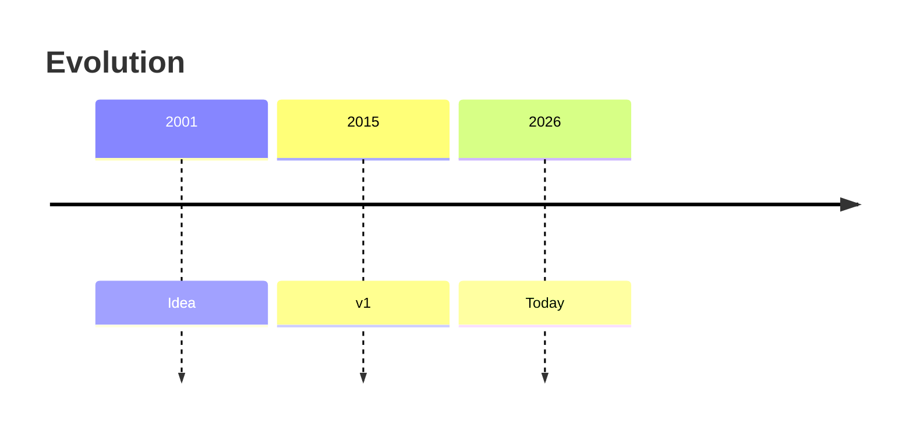
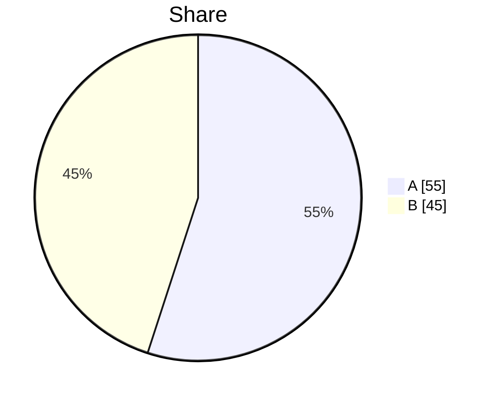
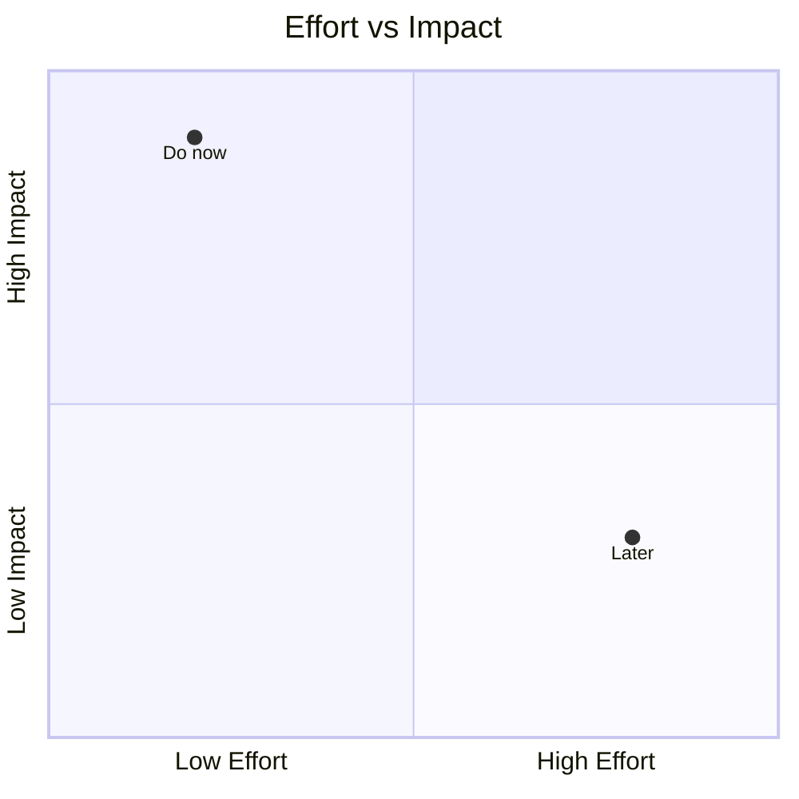
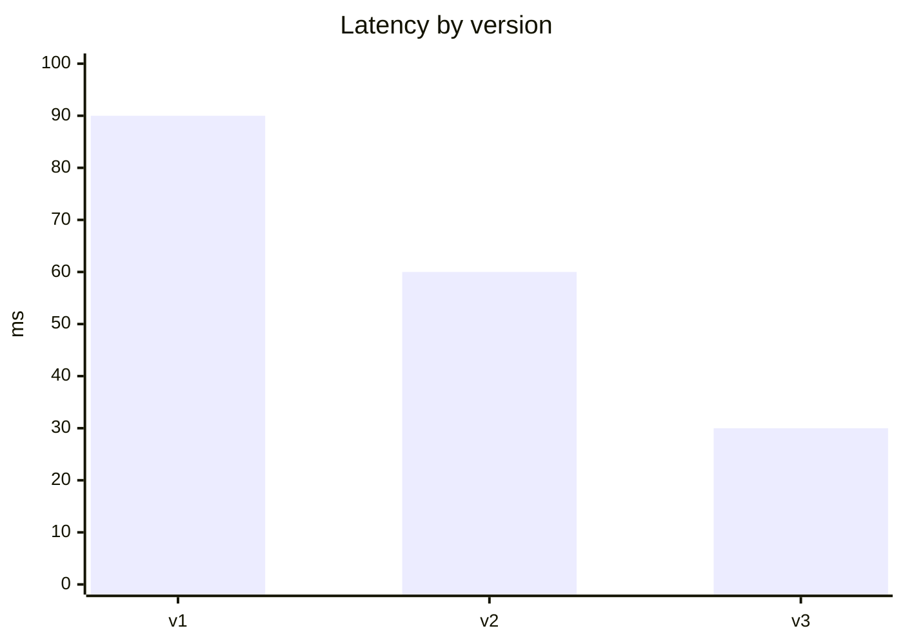

# Visual Explainer

A picture in the right form makes an idea click. This skill **picks the visualization that fits the idea**
(not always a flowchart) and renders it — following [`AGENTS.md`](../../../AGENTS.md) §4. Ask the learner
their **preferred style** first when it isn't known, then default to rich, varied visuals.

## When to use

- The learner asks to "see" something, or a text explanation isn't landing.
- Any structural, sequential, relational, hierarchical, quantitative, or time-based idea.
- Onboarding — establish how visual the learner wants things, and remember it.

## Procedure

1. **Ask/recall the learner's visual preference** (once): diagram-heavy ↔ concise, and any favourite
   formats. Save it to the learner profile so every future answer matches. Default to rich visuals.
2. **Classify what the idea is about** — process, interaction, structure, state, hierarchy, sequence,
   comparison, proportion, trend, flow/volume, time/evolution, or real data — then pick from the table.
3. **Render it minimally and correctly**: label everything, keep it small, and add a **one-line caption**
   plus a short prose/alt-text summary for accessibility. Never invent structure you can't justify (§2).
4. **Layer if needed**: a big idea may want two views (e.g., a `flowchart` of the pipeline + a `table` of
   trade-offs). Prefer two small correct visuals over one overloaded one.
5. **For real data**, prefer a **data chart** — in the VS Code extension the bundled **Flint-Chart** MCP
   renders bar/line/pie/scatter locally (see [progress-charts](../progress-charts/SKILL.md)); otherwise use
   Mermaid `xychart-beta` or a table. **Verify the numbers** before charting them.

## Pick the visualization

| The idea is about… | Use | Mermaid keyword |
|---|---|---|
| a process / decision / pipeline | flowchart | `flowchart` |
| an interaction / protocol over time | sequence diagram | `sequenceDiagram` |
| entities & relationships / a schema | ER or class diagram | `erDiagram` / `classDiagram` |
| a lifecycle / state machine | state diagram | `stateDiagram-v2` |
| a topic breakdown / concept map | mind map | `mindmap` |
| history / evolution over time | timeline | `timeline` |
| a user's steps & sentiment | user journey | `journey` |
| proportions of a whole | pie chart | `pie` |
| a 2×2 prioritization / trade-off | quadrant | `quadrantChart` |
| trend / quantity comparison | xy chart | `xychart-beta` |
| flows / volumes between stages | sankey | `sankey-beta` |
| a plan / schedule · branching | gantt · git graph | `gantt` · `gitGraph` |
| system context / containers | C4 | `C4Context` |
| requirements & their links | requirement diagram | `requirementDiagram` |
| a comparison / option matrix | **Markdown table** | — |
| math / complexity | **KaTeX** `$…$` / `$$…$$` | — |
| tracing an algorithm step by step | **ASCII step table / number line / box drawing** | — |
| real metrics / benchmarks / survey | **data chart** (Flint-Chart) or `xychart-beta` | — |

## Output shape

```
Concept · what it's about (structure|flow|state|comparison|trend|time|data…)
Chosen visual: <type> — because <one-line reason>
```mermaid
<the diagram>        ← or a KaTeX block, table, ASCII trace, or Flint-Chart data-chart spec
```
Caption: <one line> · Alt-text: <short prose summary for accessibility>
(optional) Second view: <table / second diagram> — <why>
```

## Quick syntax reminders (the less-used types)






## Tips

- Match the format to the **idea**, and to the **learner's** stated preference — don't reflex to a flowchart.
- Small and labelled beats big and clever; always add a caption + alt-text so it's accessible.
- Diagrams obey source discipline (§2): don't draw relationships or numbers you can't justify — verify data first.
- If a diagram type isn't supported by the client, fall back to a table or an ASCII sketch rather than nothing.
- Pair with [concept-explainer](../concept-explainer/SKILL.md), [architecture-diagram](../architecture-diagram/SKILL.md),
  [algorithm-visualizer](../algorithm-visualizer/SKILL.md), and [progress-charts](../progress-charts/SKILL.md).
  End with the **Learning Footer** (`AGENTS.md`).
