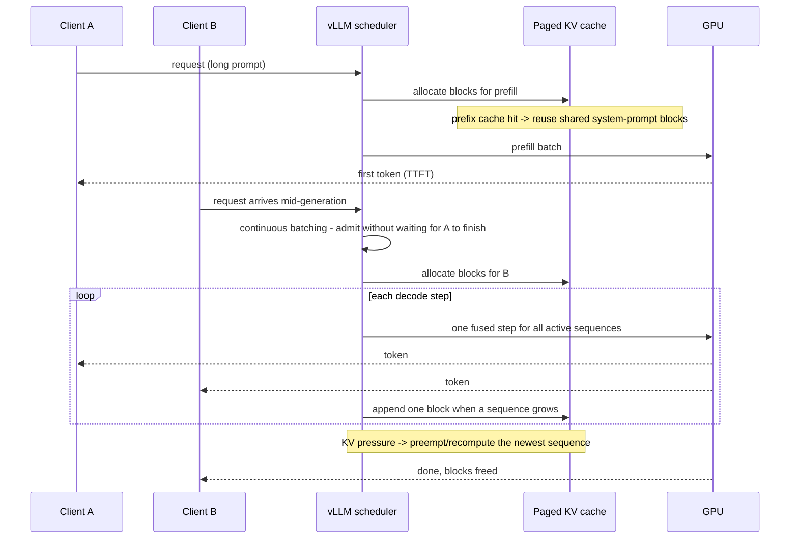

# vLLM Inference Lab

Serve a model yourself, then **measure the thing users feel** — following the teaching and source-discipline
rules in [`AGENTS.md`](../../../AGENTS.md). Throughput and latency are different goals, often in direct
conflict; this lab makes that conflict visible on your own hardware.

## When to use

- The learner wants an OpenAI-compatible endpoint they own — for privacy, cost, or to serve a fine-tuned
  model from [peft-lora-lab](../peft-lora-lab/SKILL.md) or a quant from
  [llm-quantization-lab](../llm-quantization-lab/SKILL.md).
- Their local server "feels slow" and they have no numbers to explain it.
- They need to understand KV-cache memory before choosing a context length — the mechanics live in
  [transformer-architecture-explainer](../transformer-architecture-explainer/SKILL.md).
- No GPU? Do the concepts and the measurement protocol against a local
  [ollama-local-llm-lab](../ollama-local-llm-lab/SKILL.md) server (llama.cpp under the hood) — vLLM targets
  GPUs, so be explicit about which parts the learner can reproduce.

## First principle: the bottleneck is memory, not math

Generation is **memory-bandwidth bound**, not FLOP bound: each new token re-reads the whole weight matrix
and the growing KV cache. Two consequences drive everything below. First, **batching is nearly free** —
more concurrent requests reuse the same weight read, so throughput climbs while per-token latency barely
moves, until the KV cache runs out. Second, **the KV cache is the real capacity limit**, and classic
serving wasted most of it on fragmentation by pre-reserving contiguous space for the maximum sequence
length. PagedAttention borrows the operating-system idea of paging: store KV in fixed-size blocks, keep a
block table per sequence, and allocate on demand — near-zero waste and cheap sharing between sequences
(Kwon et al., *Efficient Memory Management for LLM Serving with PagedAttention*, arXiv:2309.06180,
2023-09-12).



## Feature → what it actually buys

| Feature | Optimizes | Cost / caveat |
| --- | --- | --- |
| **PagedAttention** | KV memory efficiency → more concurrent sequences | Always on; block size is a tuning knob, not a magic number |
| **Continuous batching** | Throughput under concurrency | Individual latency rises as the batch grows; great for many users, neutral for one |
| **Prefix caching** | TTFT when many requests share a long prefix | Only helps if the prefix is *byte-identical* — put the variable part last |
| **Speculative decoding** | Inter-token latency at low concurrency | Needs a good draft model; acceptance rate decides the win, and it can *hurt* under heavy batching |
| **Tensor parallelism** | Fitting/serving big models across GPUs | Adds inter-GPU communication; pointless for a model that already fits |
| **Quantized weights** | Memory footprint → longer context or bigger batch | Quality must be re-verified — see [llm-quantization-lab](../llm-quantization-lab/SKILL.md) |
| **`--max-model-len` down** | Frees KV cache for more concurrency | Truncates long requests; decide from real traffic, not from the model card |
| **`--gpu-memory-utilization` up** | Bigger KV pool | Too high risks OOM under bursty load; leave headroom |

**Metric discipline:** *TTFT* (time to first token) is dominated by prefill and queueing; *ITL/TPOT*
(inter-token latency) is dominated by decode; *throughput* (total output tokens/sec across all requests) is
what capacity planning uses. Optimizing one usually taxes another — always report all three at a stated
concurrency level.

## Procedure

1. **Write the SLO first.** e.g. "TTFT p95 < 1 s and ≥ 20 tokens/sec per user at 8 concurrent users."
   Without it, every measurement is unfalsifiable.
2. **Install and start the server** (Linux + NVIDIA GPU is the supported path; check the vLLM installation
   docs for your CUDA/driver combination before assuming):

   ```bash
   python -m venv .venv && source .venv/bin/activate
   pip install -U vllm
   vllm serve Qwen/Qwen2.5-0.5B-Instruct --max-model-len 4096 --gpu-memory-utilization 0.85
   ```

3. **Verify it is really up** before measuring anything:

   ```bash
   curl http://localhost:8000/v1/models
   curl http://localhost:8000/v1/chat/completions -H "Content-Type: application/json" \
     -d '{"model":"Qwen/Qwen2.5-0.5B-Instruct","messages":[{"role":"user","content":"Say hi in five words."}]}'
   ```

   Read the startup log for the reported KV-cache size / maximum concurrency — that line explains most
   "why is it slow" questions before you run a single benchmark.
4. **Measure single-stream latency.** One request at a time: TTFT and inter-token latency, using streaming
   so first-token time is real. Do 10 runs and report the median and p95, never a single sample.
5. **Measure under concurrency.** Sweep 1, 2, 4, 8, 16 concurrent clients and plot throughput vs. per-user
   latency. The knee in that curve is your true capacity — and the moment continuous batching stops being
   free.
6. **Turn on prefix caching** and re-measure TTFT with a long shared system prompt. Then deliberately break
   the sharing (insert a timestamp at the *front* of the prompt) and watch the gain vanish — that is the
   lesson, not the flag.
7. **Try speculative decoding** with a small draft model at concurrency 1 and at concurrency 8; report the
   acceptance rate and both latency numbers. Expect it to help the first case and possibly hurt the second.
8. **Run all of it via `#run` (`learningos_runcode`)** with a real client script, on real inputs and edge
   cases: an empty prompt, a prompt at `max-model-len`, a prompt that *exceeds* it (does it error cleanly?),
   a request cancelled mid-stream, and a burst of requests arriving at once. Report the actual outputs and
   the actual error bodies.
9. ⚠ **Verification step:** the lab is complete when a single table holds TTFT p50/p95, ITL, and total
   throughput for **each configuration at each concurrency level**, and the learner can point to the config
   that meets the SLO and say which knob bought it.
10. **Route onward:** budget it with [llm-cost-optimizer](../llm-cost-optimizer/SKILL.md), guard quality with
    [eval-designer](../eval-designer/SKILL.md), or put the endpoint behind an agent with
    [agent-designer](../agent-designer/SKILL.md) and
    [function-calling-coach](../function-calling-coach/SKILL.md).

## Output shape

```
SLO: TTFT p95 < <..>s, >= <..> tok/s per user at <N> concurrent
Model: <..>   GPU: <..>   Server: vllm serve <flags>
Startup log says: KV cache <..> GB, max concurrency ~<..>

| config              | conc | TTFT p50 | TTFT p95 | inter-token | total tok/s |
|---------------------|------|----------|----------|-------------|-------------|
| base                | 1    | <..>     | <..>     | <..>        | <..>        |
| base                | 8    | <..>     | <..>     | <..>        | <..>        |
| + prefix caching    | 8    | <..>     | <..>     | <..>        | <..>        |
| + speculative       | 1    | <..>     | <..>     | <..>        | <..>        |

#run evidence: <health check output -> benchmark script -> measured numbers>
Edge cases run: <empty | at max-model-len | over the limit | cancelled stream | burst> -> <real responses>
Bottleneck: <KV cache | prefill | draft acceptance | queueing>
Decision: ship <config> — meets SLO because <number>
Next: <cost model | eval gate | agent integration>
```

## Tips

- **Never benchmark at concurrency 1 and quote it as capacity.** Serving performance is a curve; a single
  point is marketing.
- The startup log's KV-cache line is the most under-read diagnostic in LLM serving — lowering
  `--max-model-len` often buys more real concurrency than any other change.
- Prefix caching rewards prompt *architecture*: stable system prompt first, volatile content last. Design
  for it and it pays every request.
- Speculative decoding is a latency trick at low load, not a throughput trick; measure acceptance rate or
  you are guessing.
- Warm up before measuring — the first requests pay compile/allocation costs and will flatter or ruin your
  numbers.
- Ground flags and endpoints in the official vLLM documentation (and the OpenAI API reference for the
  request/response schema) — check the docs at run time and never invent a flag or a version.
- Close with the **Learning Footer** (`AGENTS.md`): recap, the pitfall, and the next configuration to sweep.
