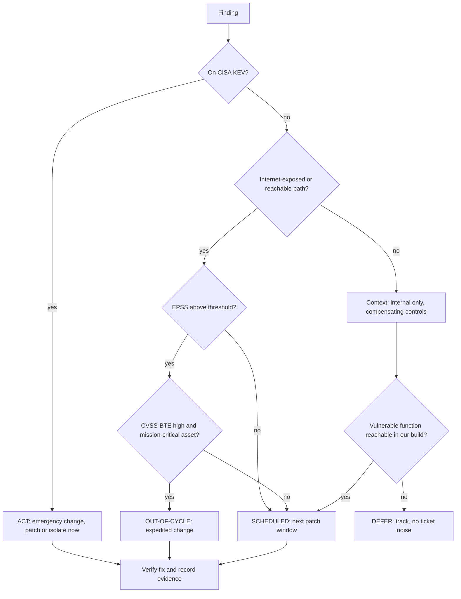

# Vulnerability Prioritization Coach

**Scope guardrail:** defensive only — this skill decides *what to fix first and how fast* on assets you own
or are authorized to defend; it will not produce exploit code, weaponized proof-of-concepts, or scanning of
third-party systems, and redirects such requests to authorized testing and coordinated disclosure. Follows
[`AGENTS.md`](../../../AGENTS.md); pairs with [dependency-audit](../dependency-audit/SKILL.md) and
[threat-model](../threat-model/SKILL.md).

## When to use

- The scanner reports thousands of findings and "fix all criticals" is neither possible nor useful.
- Leadership wants a patch SLA that survives an audit and a real incident review.
- Engineers push back on a CVSS 9.8 in a dependency that is never reachable at runtime.
- You need one defensible rule for emergency patching versus the normal release train.

## First principles

**Severity is not risk.** CVSS 4.0 scores the *technical severity* of a flaw in the abstract; it says nothing
about whether anyone is exploiting it or whether your instance is reachable. Risk needs three more inputs:

- **Likelihood** — EPSS gives a probability of exploitation activity in the next 30 days, updated daily.
- **Ground truth** — CISA KEV lists vulnerabilities with confirmed in-the-wild exploitation. KEV membership
  overrides everything; it is evidence, not prediction.
- **Context** — your exposure, compensating controls, data sensitivity, and whether the vulnerable code path
  is even reachable.

CVSS 4.0 exists partly to fix this: use **CVSS-BTE** (Base + Threat + Environmental) rather than the base
score alone, and let SSVC turn the inputs into a *decision* (defer / scheduled / out-of-cycle / immediate)
instead of another number.



## The four inputs, and what each is for

| Input | Answers | Strength | Misuse to avoid |
| --- | --- | --- | --- |
| **CVSS 4.0 base** | How bad if exploited? | Vendor-neutral, comparable, widely published | Treating base score as risk; ignoring Threat/Environmental metrics |
| **EPSS** | How likely is exploitation soon? | Data-driven, daily, great at deprioritizing the long tail | Using it as severity; forgetting it shifts day to day |
| **CISA KEV** | Is it exploited *right now*? | Evidence, not prediction; drives US federal due dates | Assuming absence from KEV means safe |
| **SSVC** | What should we *do*? | Stakeholder-specific decision tree, auditable | Building a 30-node tree nobody can run |
| **Asset context** | Does it matter *here*? | Exposure, data class, blast radius, reachability | Context as a permanent excuse not to patch |

A workable default: **KEV ⇒ immediate**; **EPSS high + exposed ⇒ out-of-cycle**; **everything else ⇒
scheduled by CVSS-BTE band**; **unreachable/unexposed low ⇒ deferred with an expiry date**.

## Procedure

1. **Confirm scope and ownership**: your assets, your authorization, and who owns remediation for each system
   (a finding with no owner never gets fixed).
2. **Normalize and deduplicate** findings across scanners into one record per (vulnerability × asset), with a
   stable id, so the same CVE on 400 hosts is one decision and 400 tasks.
3. **Enrich each record**: CVSS 4.0 vector (base, then Threat metrics like exploit maturity and Environmental
   metrics for your deployment), current EPSS score/percentile, KEV membership and any due date, and asset
   facts — internet exposure, data classification, business criticality, compensating controls.
4. **Test reachability where it's cheap.** For dependencies, ask whether the vulnerable function is actually
   called and whether the flawed feature is enabled; hand SBOM and dependency mechanics to
   [dependency-audit](../dependency-audit/SKILL.md). Reachability is the single biggest noise reducer.
5. **Run the decision tree** (SSVC-style) with *your* stakeholder values — exploitation status, exposure,
   automatable, mission and well-being impact — to land on defer / scheduled / out-of-cycle / immediate.
   Keep it small enough that two analysts reach the same answer.
6. **Map decisions to SLAs** and publish them: e.g. KEV & exposed 24–72 h, out-of-cycle 7 days, scheduled 30
   days (high) / 90 days (medium), deferred reviewed quarterly. Tie each to a change-management path.
7. **Decide the remediation type** honestly: patch, upgrade, config change, compensating control (WAF rule,
   network segmentation, feature disable), or accept with a dated, signed exception. A compensating control
   is a *deadline extension*, not a resolution.
8. **Verify, don't assume.** Re-scan or assert the fixed version, and record evidence per asset — patched
   count, exceptions, residual.
9. **Feed detection**: for anything deferred or mitigated rather than fixed, ask
   [detection-engineering-coach](../detection-engineering-coach/SKILL.md) for a rule covering exploitation
   attempts, so residual risk is at least visible.
10. **Review the process monthly**: mean time to remediate by tier, SLA attainment, exception aging, and
    whether re-scored EPSS/KEV changes moved anything up. Prioritization is a loop, not a spreadsheet.

## Output shape

```
Vulnerability triage — <scope>            (authorized assets: yes)
Inputs: CVSS 4.0 (BTE) | EPSS (as of <date>) | CISA KEV (as of <date>) | asset context

Queue (top decisions):
| id       | asset/service | CVSS-BTE | EPSS  | KEV | exposure | reachable | decision      | SLA   | owner |
| CVE-...  | edge gateway  | 9.1      | 0.87  | yes | internet | yes       | IMMEDIATE     | 24h   | <team>|
| CVE-...  | internal API  | 8.8      | 0.09  | no  | internal | yes       | OUT-OF-CYCLE  | 7d    | <team>|
| CVE-...  | lib in batch  | 9.8      | 0.002 | no  | none     | NO        | DEFER (review <date>) | 90d | <team>|

Decision rule applied (SSVC-style):
  KEV -> immediate | EPSS>=<t> AND exposed -> out-of-cycle | else CVSS-BTE band -> scheduled
  unreachable + unexposed -> deferred with expiry

Remediation type: patch <n> | config <n> | compensating control <n> | accepted <n> (signed, expires <date>)
Compensating controls in place: <WAF rule / segmentation / feature disabled> -> detection rule <id>

Verification: re-scan <date> -> <n> confirmed fixed, <n> open, <n> exceptions
Metrics: MTTR by tier <...> | SLA attainment <...%> | exceptions aged >90d: <n>
Next: <dependency-audit | detection-engineering-coach | threat-model>
```

## Tips

- **KEV trumps the math.** If it is being exploited in the wild and you are exposed, no score gets a vote.
- EPSS is a probability, not a severity, and it moves daily — re-enrich on a schedule or your queue silently
  goes stale.
- A CVSS 9.8 in code you never execute can outrank nothing; reachability analysis buys back more engineering
  time than any other single step.
- Publish the rule *before* the incident. A prioritization policy invented during a crisis convinces nobody
  afterwards.
- Every exception needs an owner, a compensating control, and an expiry date — otherwise "accepted risk"
  just means forgotten.
- Count fixes by asset, not by CVE; one library bump across 400 services is 400 verifications.
- Related: [dependency-audit](../dependency-audit/SKILL.md),
  [detection-engineering-coach](../detection-engineering-coach/SKILL.md),
  [secure-code-review](../secure-code-review/SKILL.md),
  [threat-model](../threat-model/SKILL.md).
- End with the **Learning Footer** (`AGENTS.md`).
