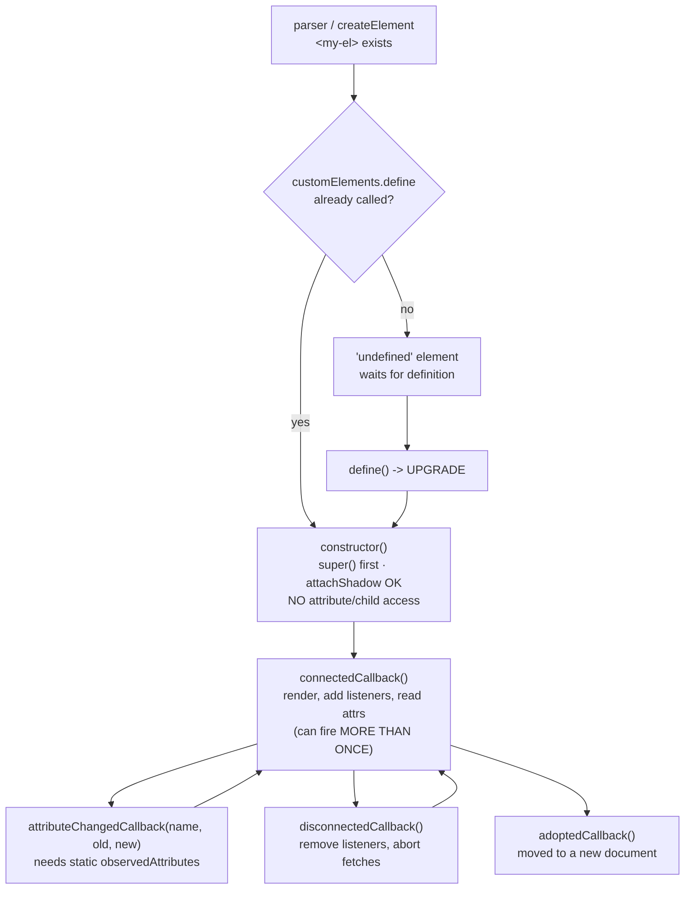

# Web Components Lab

A runnable lab for the four platform primitives that make a framework-free component: **custom elements →
shadow DOM → slots → `ElementInternals`**. Built up in the order the browser processes them. Follows the
first-principles and verify-before-you-teach rules in [`AGENTS.md`](../../../AGENTS.md).

## When to use

- You need one component to work across React, Angular, Svelte, a CMS template, and a plain HTML page.
- You want real style encapsulation, or a design-system control that must submit inside a `<form>`.
- Your component is server-rendered and you need shadow DOM without a flash of unstyled content.
- **Don't use it for** deciding the component's *API surface* or props taxonomy — do that first with
  [component-designer](../component-designer/SKILL.md).

## First principles: definition, upgrade, then encapsulation

Per the WHATWG HTML Standard, a custom element name **must contain a hyphen** (so it can never collide with
a future built-in). An element may exist in the DOM *before* its class is defined; when
`customElements.define()` runs, every matching element is **upgraded** — its constructor runs late, on an
element that may already have attributes, children, and properties set by a framework.



| Primitive | API | Buys you | Gotcha |
| --- | --- | --- | --- |
| Custom element | `customElements.define('my-el', cls)` | a real HTML tag with lifecycle | hyphen required; the constructor must not touch attributes or children |
| Attribute reflection | `static observedAttributes = ['value']` | HTML-driven configuration | attributes are **strings**; keep a property as the typed source of truth |
| Shadow DOM | `this.attachShadow({ mode: 'open' })` | style + DOM encapsulation | outer CSS cannot reach in — that is the point *and* the complaint |
| Styling hooks | `:host`, `::slotted()`, `::part()` / `exportparts` | controlled theming | `::slotted()` accepts only a **compound** selector of top-level assigned nodes |
| Shared styles | `new CSSStyleSheet()` + `adoptedStyleSheets` | one parsed sheet across N instances | far cheaper than a `<style>` per instance |
| Slots | `<slot>`, `<slot name="x">`, `slotchange` | composition with light DOM | slotted nodes stay in the light DOM and inherit **its** inherited styles |
| Declarative Shadow DOM | `<template shadowrootmode="open">` | SSR with no FOUC, no JS needed | `innerHTML` ignores it — use `setHTMLUnsafe()` |
| Form participation | `static formAssociated = true` + `attachInternals()` | submits, validates, resets like `<input>` | `setFormValue()` must be called on every change, not just on submit |
| Accessibility | `internals.role`, `internals.ariaLabel` | default semantics without host attributes | author-set ARIA attributes on the host **override** internals |

**Trade-offs to say out loud:** shadow DOM's encapsulation is absolute — global utility classes, Tailwind,
and page-level resets stop at the boundary, so you must deliberately expose CSS custom properties and
`part`s as your theming API. `mode: 'closed'` buys almost no security (the constructor can always leak the
root) while making testing and debugging harder; prefer `open`. And a form-associated element is a genuine
commitment: you must maintain value, validity, reset and state-restore behaviour yourself.

## Procedure

1. **Name and define.** Hyphenated tag, class extends `HTMLElement`, `customElements.define(...)`. Keep the
   constructor to `super()` + `attachShadow()` + `attachInternals()` — nothing that reads the DOM.
2. **Render in `connectedCallback`**, and guard it: it can fire more than once if the node is moved. Undo
   everything in `disconnectedCallback` (listeners, observers, `AbortController.abort()`).
3. **Reflect only what belongs in HTML.** Declare `static observedAttributes`, convert strings to typed
   values in `attributeChangedCallback`, and keep a JS property as the source of truth. Handle the
   *property-set-before-upgrade* case by deleting and re-assigning own properties on connect.
4. **Adopt a shared stylesheet** with `new CSSStyleSheet()` + `replaceSync()` + `adoptedStyleSheets`, rather
   than injecting a `<style>` tag per instance.
5. **Compose with slots**, expose named slots for optional regions, and listen to `slotchange` if you must
   react to what the consumer passed in.
6. **Server-render with Declarative Shadow DOM**: emit `<template shadowrootmode="open">` inside the host so
   the HTML parser attaches the root before your JS loads; on the client, adopt it instead of re-rendering.
7. **Make it form-associated** when it replaces an `<input>`: `static formAssociated = true`,
   `attachInternals()`, then `setFormValue()` on every change and `setValidity()` with an anchor element.
   Implement `formResetCallback`, `formDisabledCallback` and `formStateRestoreCallback`.
8. **Verify**: submit the form and inspect `FormData`, press *Reset*, trip the validation message, and tab
   through with a screen reader.
9. Close with the **Learning Footer**.

## Output shape

```
Tag: <my-element>          Extends: HTMLElement        Shadow: <open|closed|none> (+ delegatesFocus?)
Attributes (observed): <name: type> …        Properties (source of truth): <name: type> …
Slots: <default> · <named: x, y>             Events: <CustomEvent name, bubbles/composed>
Theming API: custom props <--x> · parts <part="y"> · exportparts <...>
Form: formAssociated=<yes|no>  value via internals.setFormValue()  validity via setValidity()
A11y: internals.role=<...> · internals.ariaLabel=<...> · keyboard: <keys handled>
SSR: <Declarative Shadow DOM template | client-only>
Code: <runnable HTML/JS>
Verify: submit -> FormData · reset · invalid message · keyboard + screen reader pass
Next: <component-designer | accessibility-audit | modern-css-features-lab>
Learning Footer
```

## Worked example — a form-associated `<star-rating>`

Save as `wc-lab.html` and open it. Submit the form with no rating to see native validation; pick a rating
and submit to see it in `FormData`; press *Reset* to watch `formResetCallback` restore the default.

```html
<!doctype html>
<meta charset="utf-8"><title>Web Components lab</title>

<form id="f">
  <!-- Declarative Shadow DOM: the parser attaches this root BEFORE any script runs (no FOUC). -->
  <star-rating name="score" required>
    <template shadowrootmode="open">
      <style>:host{display:inline-flex;gap:.25rem}button{font-size:1.4rem;background:none;border:0}</style>
      <slot name="label"></slot>
    </template>
    <span slot="label">Rate us:</span>
  </star-rating>
  <button>Submit</button><button type="reset">Reset</button>
</form>
<pre id="out"></pre>

<script type="module">
const sheet = new CSSStyleSheet();          // parsed ONCE, shared by every instance
sheet.replaceSync(`
  :host { display: inline-flex; gap: .25rem; align-items: center; }
  :host(:state(invalid)) { outline: 2px solid #c62828; border-radius: .25rem; }
  button { font-size: 1.4rem; line-height: 1; background: none; border: 0; cursor: pointer;
           color: var(--star-color, #bbb); }        /* theming API: a custom property */
  button[aria-checked="true"] { color: var(--star-color-on, #f5a623); }
  ::slotted(span) { margin-inline-end: .5rem; }     /* compound selector only */
`);

class StarRating extends HTMLElement {
  static formAssociated = true;                     // makes it a real form control
  static observedAttributes = ['value', 'required'];
  #internals; #abort; #value = 0;

  constructor() {
    super();                                        // must be first
    // Adopt a parser-created (declarative) root if present, otherwise create one.
    const root = this.shadowRoot ?? this.attachShadow({ mode: 'open', delegatesFocus: true });
    root.adoptedStyleSheets = [sheet];
    this.#internals = this.attachInternals();
    this.#internals.role = 'radiogroup';            // semantics without polluting the host
    this.#internals.ariaLabel = 'Star rating';
  }

  get value() { return this.#value; }
  set value(v) { this.#value = Number(v) || 0; this.#sync(); this.#render(); }

  connectedCallback() {
    // Property may have been set by a framework BEFORE upgrade — re-apply through the setter.
    for (const p of ['value']) {
      if (Object.hasOwn(this, p)) { const v = this[p]; delete this[p]; this[p] = v; }
    }
    this.#render();
    this.#abort = new AbortController();
    this.shadowRoot.addEventListener('click', (e) => {
      const b = e.target.closest('button'); if (!b) return;
      this.value = Number(b.dataset.v);
      this.dispatchEvent(new CustomEvent('change', { bubbles: true, composed: true }));
    }, { signal: this.#abort.signal });
    this.#sync();
  }
  disconnectedCallback() { this.#abort?.abort(); }   // symmetry: undo everything you did
  attributeChangedCallback(n, _o, v) { if (n === 'value') this.value = v; else this.#sync(); }

  #sync() {
    this.#internals.setFormValue(this.#value ? String(this.#value) : null);
    const missing = this.hasAttribute('required') && !this.#value;
    this.#internals.states[missing ? 'add' : 'delete']('invalid');
    this.#internals.setValidity(
      missing ? { valueMissing: true } : {},
      missing ? 'Please choose a rating.' : '',
      this.shadowRoot.querySelector('button') ?? undefined);   // anchor for the browser bubble
  }
  #render() {
    const stars = [1, 2, 3, 4, 5].map(i =>
      `<button type="button" role="radio" data-v="${i}"
        aria-checked="${i === this.#value}" aria-label="${i} of 5">★</button>`).join('');
    const slot = '<slot name="label"></slot>';
    this.shadowRoot.innerHTML = `${slot}${stars}`;   // adoptedStyleSheets survive innerHTML
  }
  formResetCallback() { this.value = 0; }
  formDisabledCallback(disabled) { this.toggleAttribute('inert', disabled); }
  formStateRestoreCallback(state) { this.value = Number(state) || 0; }
}
customElements.define('star-rating', StarRating);

document.getElementById('f').addEventListener('submit', (e) => {
  e.preventDefault();
  document.getElementById('out').textContent =
    JSON.stringify(Object.fromEntries(new FormData(e.target)), null, 2);
});
</script>
```

Reason it through: the constructor reuses `this.shadowRoot` when the Declarative Shadow DOM template already
created one — re-calling `attachShadow` on the same element throws, which is the classic hydration crash.
`setFormValue(null)` (not `''`) tells the browser the control has *no* value, so `valueMissing` and the
native "Please choose a rating." bubble work exactly like `<input required>`. The `change` event sets
`composed: true` so it crosses the shadow boundary; without it, listeners on the `<form>` would never see it.

## Tips

- **The constructor is not a render hook.** Touching attributes or children there breaks upgrade and
  `document.createElement`. Do it in `connectedCallback`, and make that method idempotent.
- Handle the *property-before-upgrade* case (the `delete this[p]` dance above) or frameworks that set
  properties on an undefined element will silently lose the value.
- Prefer `adoptedStyleSheets` over a per-instance `<style>`: one parse, N instances, and it is what makes a
  list of 500 components affordable.
- Expose theming deliberately: CSS custom properties **do** inherit through the shadow boundary; class names
  do not. Add `part="…"` for structural styling and `exportparts` when you nest components.
- `::slotted()` matches only top-level assigned nodes with a compound selector — `::slotted(div p)` never
  matches. Style deeper content from the light DOM instead.
- `innerHTML` will not parse `<template shadowrootmode>`; use `setHTMLUnsafe()`, and serialise with
  `getHTML({ serializableShadowRoots: true })`.
- Custom events must set `composed: true` to escape the shadow root, and `bubbles: true` to be delegated.
- ARIA set via `ElementInternals` is a *default*: an author attribute on the host wins. Verify with
  [accessibility-audit](../accessibility-audit/SKILL.md) and
  [accessibility-remediation-coach](../accessibility-remediation-coach/SKILL.md).
- Pair with [component-designer](../component-designer/SKILL.md) for the API,
  [modern-css-features-lab](../modern-css-features-lab/SKILL.md) (shadow trees are cascade step 2),
  [micro-frontend-coach](../micro-frontend-coach/SKILL.md) for cross-team distribution,
  [view-transitions-lab](../view-transitions-lab/SKILL.md), and
  [angular-signals-lab](../angular-signals-lab/SKILL.md) / [svelte-runes-lab](../svelte-runes-lab/SKILL.md)
  for framework interop. Verify each API against MDN and the WHATWG HTML Standard (`AGENTS.md` §2), then end
  with the **Learning Footer** (`AGENTS.md`).
