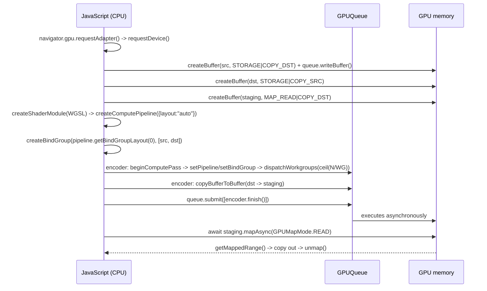

# WebGPU Compute Lab

GPU compute taught as a data round trip: **device → buffers → bind group → dispatch → readback**, following
the first-principles, run-it-yourself approach in [`AGENTS.md`](../../../AGENTS.md). Everything here follows
the **W3C WebGPU and WGSL specifications** and runs free in a browser with a local static server.

## When to use

- The learner wants data-parallel compute on the web and is coming from WebGL fragment-shader hacks.
- Their dispatch "runs" but the output buffer reads back as all zeros — nearly always a usage-flag,
  staging-buffer, or `mapAsync` ordering mistake.
- They need to reason about workgroup size, occupancy, and device limits instead of copying a magic `64`.
- Don't use it for rendering pipelines or shading maths — see [shader-coach](../shader-coach/SKILL.md) —
  or for cluster-scale parallelism, see
  [mpi-openmp-parallel-lab](../mpi-openmp-parallel-lab/SKILL.md).

## First principles: the GPU cannot see your JavaScript memory

WebGPU (W3C "GPU for the Web" Working Group) exposes an explicit, validated API: you allocate GPU buffers,
declare exactly how each will be used, record commands into an encoder, submit them to a queue, and then —
separately — copy results into a **mappable** buffer to read them. WGSL is its shading language, also a W3C
specification. Browser support has shipped broadly since 2023; check your target browser's current status
before promising it to users.



| Usage flag | Means | You need it for |
| --- | --- | --- |
| `STORAGE` | readable/writable by a shader | any compute input or output |
| `UNIFORM` | small, read-only, fast broadcast | parameters (size, scale, iteration) |
| `COPY_DST` | can be written by `writeBuffer`/copies | uploading input, filling staging |
| `COPY_SRC` | can be copied *from* | moving results to staging |
| `MAP_READ` | CPU can map it | **staging only** — cannot be combined with `STORAGE` |

| WGSL concept | Syntax | Note |
| --- | --- | --- |
| Storage binding | `@group(0) @binding(0) var<storage, read> src : array<f32>;` | `read_write` for outputs |
| Uniform binding | `@group(0) @binding(2) var<uniform> params : Params;` | struct fields have alignment rules |
| Entry point | `@compute @workgroup_size(64) fn main(...)` | size is compile-time; ≤ device limits |
| Global index | `@builtin(global_invocation_id) gid : vec3<u32>` | `gid.x` = workgroup_id.x·64 + local index |
| Shared memory | `var<workgroup> tile : array<f32, 64>;` | needs `workgroupBarrier()` before reuse |
| Bounds guard | `if (i >= arrayLength(&src)) { return; }` | dispatch rounds **up** to whole workgroups |

**Trade-off to say out loud:** `layout: "auto"` is perfect for learning and prototypes but derives a layout
you cannot share between pipelines; production code declares an explicit `GPUBindGroupLayout` so one bind
group serves several pipelines. Likewise a workgroup size of 64 is a sane default (a multiple of the 32/64
hardware wave size), but the correct value is found by measuring against
`device.limits.maxComputeInvocationsPerWorkgroup`.

## Procedure

1. **Serve over a secure context.** WebGPU requires HTTPS or `localhost`:
   ```bash
   python3 -m http.server 8080      # then open http://localhost:8080/ — file:// will NOT work
   ```
   Headless alternative: Deno exposes WebGPU behind an unstable flag
   (`deno run --unstable-webgpu main.js`) — run `deno --help` to confirm the flag on your version.
2. **Feature-detect, never assume**: `if (!navigator.gpu) { ... }`, then `requestAdapter()` (may resolve to
   `null`), then `requestDevice()`. Print `adapter.info` and the limits you rely on.
3. **Turn on error reporting immediately** — WebGPU is validated, and the message tells you the exact rule:
   ```js
   device.addEventListener("uncapturederror", (e) => console.error(e.error.message));
   ```
4. **Allocate three buffers**: input (`STORAGE|COPY_DST`), output (`STORAGE|COPY_SRC`), staging
   (`MAP_READ|COPY_DST`). Trying to map a `STORAGE` buffer is the single most common beginner error and is
   forbidden by the specification.
5. **Write the WGSL** with an explicit bounds guard, because `dispatchWorkgroups(ceil(N/WG))` always
   launches ≥ N invocations.
6. **Record and submit**: begin a compute pass, set pipeline and bind group, dispatch, `pass.end()`, then
   `copyBufferToBuffer` *in the same encoder*, then `queue.submit`.
7. **Read back**: `await staging.mapAsync(GPUMapMode.READ)`, copy out of `getMappedRange()` (the view dies
   at `unmap()` — always `.slice(0)`), then `unmap()`.
8. **Verify against the CPU**: compute the same result in JavaScript and assert element-wise equality
   before you time anything.
9. **Then measure**: time `N` = 1e3 … 1e7 on CPU vs GPU and find the crossover. Small problems are *slower*
   on the GPU because upload + submit + readback latency dominates — that lesson is the point. Close with
   the **Learning Footer**.

## Output shape

```
Computation: <map | reduce | stencil | matmul>   N = <elements>   dtype = <f32|u32|i32>
Adapter/limits: maxComputeInvocationsPerWorkgroup=<...> maxStorageBufferBindingSize=<...>
Buffers: src <STORAGE|COPY_DST> · dst <STORAGE|COPY_SRC> · staging <MAP_READ|COPY_DST>
Bindings: @group(0) @binding(<n>) var<storage, <read|read_write>> <name> : <type>
Workgroup: @workgroup_size(<x>) · dispatchWorkgroups(<ceil(N/x)>) · bounds guard present: <yes>
Readback: copyBufferToBuffer -> mapAsync(READ) -> getMappedRange().slice(0) -> unmap()
Verification: CPU reference vs GPU — max abs diff = <...>   (must be 0 or float-epsilon)
Timing: CPU <ms> vs GPU <ms> (incl. upload/readback)   crossover at N ~ <...>
Pitfall checked: MAP_READ not combined with STORAGE · unmap after copy · guard on tail invocations
Next: <shader-coach | mpi-openmp-parallel-lab | web-perf-audit>
Learning Footer
```

## Worked example — square every element of an array, verified against the CPU

`index.html` (one file, no build step, no dependencies):

```html
<!doctype html>
<meta charset="utf-8">
<title>WebGPU compute lab</title>
<script type="module">
const N = 1024, WG = 64;

if (!navigator.gpu) throw new Error("WebGPU unavailable — check your browser's WebGPU status.");
const adapter = await navigator.gpu.requestAdapter();
if (!adapter) throw new Error("No GPUAdapter (no compatible GPU / blocked by policy).");
const device = await adapter.requestDevice();
device.addEventListener("uncapturederror", (e) => console.error("WebGPU:", e.error.message));

const input = new Float32Array(N);
for (let i = 0; i < N; i++) input[i] = i;

const src = device.createBuffer({ size: input.byteLength,
  usage: GPUBufferUsage.STORAGE | GPUBufferUsage.COPY_DST });
device.queue.writeBuffer(src, 0, input);

const dst = device.createBuffer({ size: input.byteLength,
  usage: GPUBufferUsage.STORAGE | GPUBufferUsage.COPY_SRC });

// MAP_READ may only pair with COPY_DST — never with STORAGE.
const staging = device.createBuffer({ size: input.byteLength,
  usage: GPUBufferUsage.MAP_READ | GPUBufferUsage.COPY_DST });

const module = device.createShaderModule({ code: /* wgsl */ `
@group(0) @binding(0) var<storage, read>       src : array<f32>;
@group(0) @binding(1) var<storage, read_write> dst : array<f32>;

@compute @workgroup_size(${WG})
fn main(@builtin(global_invocation_id) gid : vec3<u32>) {
  let i = gid.x;
  if (i >= arrayLength(&src)) { return; }   // dispatch rounds UP to whole workgroups
  dst[i] = src[i] * src[i];
}`});

const pipeline = device.createComputePipeline({
  layout: "auto", compute: { module, entryPoint: "main" } });

const bindGroup = device.createBindGroup({
  layout: pipeline.getBindGroupLayout(0),
  entries: [{ binding: 0, resource: { buffer: src } },
            { binding: 1, resource: { buffer: dst } }],
});

const encoder = device.createCommandEncoder();
const pass = encoder.beginComputePass();
pass.setPipeline(pipeline);
pass.setBindGroup(0, bindGroup);
pass.dispatchWorkgroups(Math.ceil(N / WG));   // 16 workgroups x 64 invocations = 1024
pass.end();
encoder.copyBufferToBuffer(dst, 0, staging, 0, input.byteLength);
device.queue.submit([encoder.finish()]);

await staging.mapAsync(GPUMapMode.READ);
const out = new Float32Array(staging.getMappedRange().slice(0));  // copy BEFORE unmap
staging.unmap();

let maxDiff = 0;
for (let i = 0; i < N; i++) maxDiff = Math.max(maxDiff, Math.abs(out[i] - input[i] * input[i]));
console.log("out[0,1,7,1023] =", out[0], out[1], out[7], out[N - 1]);  // 0 1 49 1046529
console.log("max |gpu - cpu| =", maxDiff);                             // 0
</script>
```

```bash
python3 -m http.server 8080 && open http://localhost:8080   # console prints 0 1 49 1046529, diff 0
```

1023² = 1 046 529 — checking one value by hand is how you catch an off-by-one in the dispatch.

## Tips

- **All zeros back?** In order: is `COPY_SRC` on the output buffer, is `COPY_DST` on staging, did you
  `copyBufferToBuffer` *before* `finish()`, and did you `await mapAsync` after `submit`?
- `getMappedRange()` hands you a view that is detached by `unmap()` — always `.slice(0)` before unmapping.
- `dispatchWorkgroups(N)` dispatches **workgroups**, not threads: with `@workgroup_size(64)` that is 64·N
  invocations. Forgetting the division is the classic 64× overshoot.
- Always guard with `arrayLength(&buf)`; without it the tail workgroup writes out of bounds (clamped by
  the spec, but your results are wrong).
- WGSL has no implicit numeric conversions: convert explicitly (`f32(i)`) and suffix integer literals
  (`64u`) where the type is ambiguous.
- Respect device limits (`maxComputeInvocationsPerWorkgroup`, typically 256; `maxStorageBufferBindingSize`);
  exceeding them is a validation error, not a silent slowdown.
- Small N is *slower* on the GPU. Measure the crossover before claiming a speedup —
  [web-perf-audit](../web-perf-audit/SKILL.md) has the measurement discipline.
- Pair with [shader-coach](../shader-coach/SKILL.md) for rendering and WGSL maths,
  [mpi-openmp-parallel-lab](../mpi-openmp-parallel-lab/SKILL.md) for CPU-side parallelism,
  [game-optimization-coach](../game-optimization-coach/SKILL.md) for frame budgets, and
  [openxr-xr-basics-coach](../openxr-xr-basics-coach/SKILL.md) when the compute feeds an XR frame.
  End with the **Learning Footer** (`AGENTS.md`).
