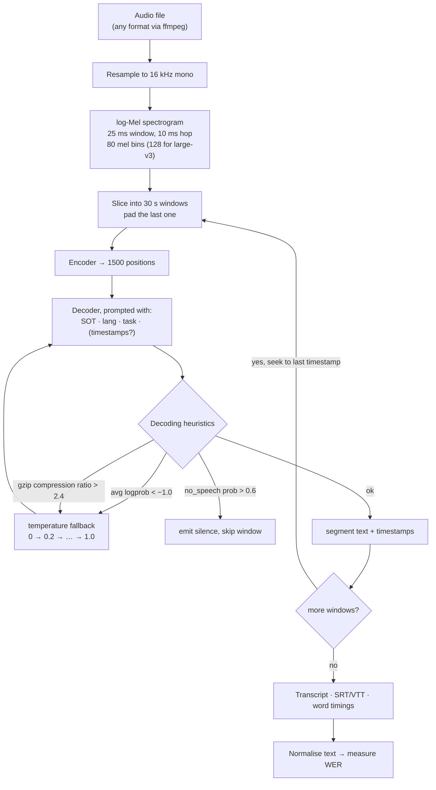

# Whisper Speech Lab

Production-grade speech recognition that runs on a laptop CPU for €0 — following the measure-don't-guess and
source-discipline rules in [`AGENTS.md`](../../../AGENTS.md). The lab ends with a **measured WER**, not a
transcript that "looked fine".

## When to use

- The learner needs transcripts, subtitles or timestamps and is about to pay per minute for an API.
- They cannot choose between `tiny`, `small` and `large` because nobody has told them what the axis is.
- A 90-minute recording produced a transcript that drifts, loops, or invents "Thanks for watching!" over
  silence — all documented Whisper long-form failure modes.
- Timestamps are needed for subtitles or for aligning to a video, and segment-level is too coarse.
- Audio is multilingual and language detection is picking the wrong one.
- **Don't use it for** speaker diarisation ("who spoke when" — Whisper does not do it; you need a separate
  diarisation model), for real-time streaming with strict sub-second latency (Whisper's unit of work is a
  30-second window), or for downstream *understanding* — once you have text, hand off to
  [prompt-optimizer](../prompt-optimizer/SKILL.md) or [rag-designer](../rag-designer/SKILL.md).

## First principles: a 30-second window and a task-conditioned decoder

Whisper (Radford et al., *Robust Speech Recognition via Large-Scale Weak Supervision*, arXiv:2212.04356,
2022-12-06) is an ordinary encoder–decoder Transformer trained on **680 000 hours** of weakly-supervised,
multilingual, multitask audio. Two design choices explain almost every behaviour you will observe:

**1. The input is a fixed 30-second window.** Audio is resampled to 16 kHz and turned into a log-Mel
spectrogram with a 25 ms window and a **10 ms hop**. Do the arithmetic once and the shapes stop being
mysterious:

$$30\text{ s} \times 16\,000\,\text{Hz} = 480\,000 \text{ samples}
\;\longrightarrow\; \frac{30\,000\text{ ms}}{10\text{ ms}} = 3\,000 \text{ frames}
\;\xrightarrow[\text{stride }2]{\text{conv}}\; 1\,500 \text{ encoder positions}$$

Shorter clips are **zero-padded to 30 s**; longer files are cut into consecutive windows. That padding is
why a 2-second clip costs nearly as much as a 30-second one, and why silence-heavy audio invites
hallucination — the model was trained to emit *something* for a window.

**2. The decoder is steered by special tokens, not by separate models.** One checkpoint does language ID,
transcription, translation-into-English and timestamping, because the prompt is a token sequence:
`<|startoftranscript|> <|en|> <|transcribe|> <|notimestamps|> …`. Swap `<|transcribe|>` for `<|translate|>`
and the same weights output English. Drop `<|notimestamps|>` and the decoder emits timestamp tokens,
quantised to **20 ms**, interleaved with the text.


*Caption: the retry heuristics on the right are the difference between a usable long-form transcript and a repetition loop.*

| Model | Params | English-only variant | Relative speed¹ | Typical use |
| --- | --- | --- | --- | --- |
| `tiny` | 39 M | `tiny.en` | ~10× | smoke tests, keyword spotting, throwaway drafts |
| `base` | 74 M | `base.en` | ~7× | quick drafts, clean studio audio |
| `small` | 244 M | `small.en` | ~4× | **the CPU sweet spot** for most work |
| `medium` | 769 M | `medium.en` | ~2× | accented/noisy audio, when you have a GPU |
| `large` (v2/v3) | 1 550 M | — | 1× | hardest audio, multilingual, GPU strongly advised |

¹ Speeds are the openai/whisper README's own rough figures on their hardware — **measure on yours**; they
are not a specification. Newer checkpoints (e.g. `large-v3`, which uses 128 Mel bins instead of 80, and the
distilled `turbo` line) appear regularly, so **verify the current model list on the repository page** rather
than trusting this table's completeness. English-only `.en` variants are usually more accurate than their
multilingual siblings *on English*, especially at the small end.

**WER is the metric, and normalisation is half of it.**

$$\text{WER} = \frac{S + D + I}{N}$$

with substitutions, deletions and insertions against $N$ reference words. Whisper's own evaluation uses an
extensive text normaliser (paper, Appendix C; shipped as `whisper.normalizers.EnglishTextNormalizer`)
precisely because raw comparison punishes casing and punctuation that no human cares about.

## Procedure

1. **State the requirement before choosing a model.** Acceptable WER, acceptable wall-clock per audio-hour,
   language(s), and whether you need word-level timings. Without the first two, "which model?" has no answer.
2. **Install locally (free, CPU-friendly).** `ffmpeg` is a hard dependency of `openai-whisper`:

   ```bash
   winget install Gyan.FFmpeg          # Windows; brew install ffmpeg / apt install ffmpeg elsewhere
   python -m venv .venv && .venv\Scripts\activate
   pip install -U openai-whisper faster-whisper jiwer
   ```
3. **Get a clip whose transcript you already know.** That is non-negotiable: WER needs a reference. Read a
   known sentence into your phone, or synthesise one offline (see the worked example).
4. **Run the CLI first** — it is the fastest path to a subtitle file:

   ```bash
   whisper sample.wav --model small --language en --task transcribe \
                      --output_format srt --output_dir out
   ```
   Use `--task translate` to get **English** output from non-English speech (that direction only).
5. **Switch to `faster-whisper` for anything real.** It reimplements Whisper on CTranslate2 with int8
   quantisation and is substantially faster and lighter at equal model size — treat the project's own
   speed-up claims as a benchmark to reproduce, not a guarantee:

   ```python
   from faster_whisper import WhisperModel
   model = WhisperModel("small", device="cpu", compute_type="int8")
   segments, info = model.transcribe("sample.wav", beam_size=5, vad_filter=True, word_timestamps=True)
   print(info.language, round(info.language_probability, 3), round(info.duration, 1))
   for s in segments:                       # NOTE: a generator — nothing runs until you iterate
       print(f"[{s.start:6.2f} → {s.end:6.2f}] {s.text}")
   ```
6. **Handle long audio deliberately.** Whisper already walks 30-second windows and seeks by the last
   timestamp, but two knobs decide whether it drifts: `vad_filter=True` (drop silence *before* decoding, the
   single best anti-hallucination move) and `condition_on_previous_text=False` (stop a repetition loop from
   feeding itself). The Hugging Face `pipeline("automatic-speech-recognition", …, chunk_length_s=30,
   return_timestamps=True)` is an alternative chunking implementation — same idea, different seams.
7. **Get word timestamps only when you need them** (`word_timestamps=True`). They are derived from
   cross-attention alignment, cost extra compute, and are *approximate* — good enough for karaoke subtitles,
   not for forensic timing.
8. **Pin the language when you know it.** Auto-detection reads only the first window, so a clip that opens
   with music or a foreign-language greeting can mislabel the whole file. `language="en"` removes an entire
   class of failure for free.
9. **Measure WER with and without normalisation** on your reference clip, then repeat for two model sizes.
   That 2×2 table *is* the model-selection decision.
10. **Record cost per audio-hour** (wall-clock ÷ audio duration = real-time factor) alongside WER, and pick
    the smallest model that clears your WER bar. Close with the **Learning Footer**.

## Output shape

```
Audio: <file> · <duration> · <language> · <clean|noisy|accented> · <mono 16k?>
Requirement: WER ≤ <..> · ≤ <..> min per audio-hour · timestamps <none|segment|word>

| model         | backend        | wall-clock | RTF (wall/audio) | WER raw | WER normalised |
|---------------|----------------|------------|------------------|---------|----------------|
| tiny(.en)     | faster-whisper | <..>       | <..>             | <..>    | <..>           |
| small(.en)    | faster-whisper | <..>       | <..>             | <..>    | <..>           |
| medium/large  | <..>           | <..>       | <..>             | <..>    | <..>           |

Normaliser: <EnglishTextNormalizer | lowercase+strip-punct>   raw−normalised gap: <..>  ← casing/punctuation only
Settings: language=<pinned|auto> · task=<transcribe|translate> · beam_size=<..> · vad_filter=<..>
          condition_on_previous_text=<..> · word_timestamps=<..>
Long-form checks: repetition loops <none|at mm:ss> · hallucination over silence <none|...>
                  drift at end of file <none|...> · language detected = <..> (p=<..>)
Outputs: <txt | srt | vtt | json with word timings>
Decision: ship <model+backend> — smallest that clears WER <..> at RTF <..>
Next: <prompt-optimizer for post-processing | rag-designer to index transcripts | eval-designer>
Learning Footer
```

## Worked example — make a reference clip offline, then measure WER honestly

Fully local and free. The trick is generating audio whose transcript you already know, so WER is computable
without downloading a corpus.

```python
# make_sample.py — offline TTS: Windows SAPI5 / macOS NSSpeechSynthesizer / espeak on Linux
import pyttsx3                     # pip install pyttsx3
REFERENCE = "the quick brown fox jumps over the lazy dog"
eng = pyttsx3.init()
eng.setProperty("rate", 150)
eng.save_to_file(REFERENCE, "sample.wav")
eng.runAndWait()
```

If TTS is unavailable, record one sentence on your phone and type the reference by hand — the lab works
identically. (Synthetic speech is *unrealistically* clean, so treat its WER as a floor, not an estimate.)

```python
# transcribe_and_score.py
import time, jiwer
from faster_whisper import WhisperModel

REFERENCE = "the quick brown fox jumps over the lazy dog"          # 9 words
for size in ["tiny.en", "small.en"]:
    model = WhisperModel(size, device="cpu", compute_type="int8")
    t0 = time.perf_counter()
    segments, info = model.transcribe("sample.wav", language="en", beam_size=5, vad_filter=True)
    hyp = " ".join(s.text for s in segments).strip()               # generator: consumed exactly once
    wall = time.perf_counter() - t0
    norm = jiwer.Compose([jiwer.ToLowerCase(), jiwer.RemovePunctuation(),
                          jiwer.RemoveMultipleSpaces(), jiwer.Strip()])
    print(f"{size:>10} | RTF {wall/info.duration:5.2f} | raw WER "
          f"{jiwer.wer(REFERENCE, hyp):.3f} | norm WER "
          f"{jiwer.wer(norm(REFERENCE), norm(hyp)):.3f} | {hyp!r}")
```

**Trace the arithmetic by hand before you trust the library.** Suppose Whisper returns
`"The quick brown fox jumped over the lazy dog."` against the 9-word reference
`the quick brown fox jumps over the lazy dog`:

| Comparison | Errors | WER |
| --- | --- | --- |
| Raw | `The`→`the`, `jumped`→`jumps`, `dog.`→`dog` = **3 substitutions** | $3/9 = 0.333$ |
| Normalised (lowercase, strip punctuation) | `jumped`→`jumps` = **1 substitution** | $1/9 = 0.111$ |

A factor-of-three difference produced entirely by casing and a full stop. `jiwer.wer` tokenises on
whitespace and does **not** lowercase or strip punctuation by default, so an unnormalised comparison is
measuring typography, not recognition — this is exactly why the Whisper paper ships its own normaliser. If
you want the paper's rules rather than the two-line version above, use
`from whisper.normalizers import EnglishTextNormalizer` and apply it to both strings.

Two implementation traps in that snippet, both of which have bitten people in production:

- `segments` is a **lazy generator**. Timing the `transcribe()` call alone measures almost nothing; the work
  happens while you iterate, which is why `t0` is read before the call and `wall` after the join.
- `info.duration` comes from the decoder's own audio probe, so `wall / info.duration` is a true real-time
  factor. RTF < 1 means faster than real time — the number that decides whether a batch job is viable.

Finally, reproduce the long-form failure mode on purpose: concatenate your clip with 30 seconds of digital
silence (`ffmpeg -f lavfi -t 30 -i anullsrc=r=16000:cl=mono silence.wav`) and transcribe with
`vad_filter=False`. Whisper will frequently invent text over the silence. Re-run with `vad_filter=True` and
`condition_on_previous_text=False` and watch it stop. That is the whole mitigation, demonstrated rather than
asserted.

## Tips

- **Always pin `language=` when you know it.** Detection sees only the first 30-second window, and a musical
  intro can mislabel an entire hour.
- Silence causes hallucination because every window must produce output — VAD filtering before decoding is
  the highest-leverage single setting.
- `condition_on_previous_text=True` (the default) is what makes repetition loops self-sustaining; turn it
  off for long or noisy files and accept slightly less coherent context.
- Report WER **with the normaliser named**. An unnormalised WER and a normalised one can differ by 3× on
  identical audio, so a bare "WER 0.33" is not a result.
- Prefer `.en` checkpoints for English at the small sizes, and `faster-whisper` + `compute_type="int8"` on
  CPU before reaching for a bigger model — quantised `small.en` often beats fp32 `base` on both axes.
- Word timestamps come from attention alignment and drift on overlapping speech or music; validate them
  against a few known cut points before building a subtitle pipeline on top.
- Whisper does **not** identify speakers. If you need "who said what", add a diarisation stage and align it
  to Whisper's segments — do not fake it with punctuation heuristics.
- Related: [llm-quantization-lab](../llm-quantization-lab/SKILL.md) for the int8/CTranslate2 trade-offs,
  [python-asyncio-lab](../python-asyncio-lab/SKILL.md) for batching many files,
  [eval-designer](../eval-designer/SKILL.md) to formalise the WER gate,
  [rag-designer](../rag-designer/SKILL.md) to make transcripts searchable,
  [ollama-local-llm-lab](../ollama-local-llm-lab/SKILL.md) for local post-processing of the raw text, and
  [data-cleaning-lab](../data-cleaning-lab/SKILL.md) for normalising transcripts at scale.
  End with the **Learning Footer** (`AGENTS.md`).
