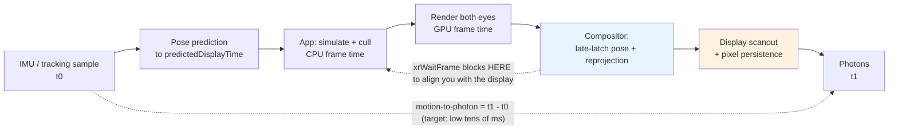

# XR Comfort & Performance Coach

XR comfort is not a polish task — it is a **latency and budget problem with a physiological failure mode**.
This skill derives the numbers from the ground up in the spirit of [`AGENTS.md`](../../../AGENTS.md), framed
against the **Khronos OpenXR specification** (1.0 in 2019, **OpenXR 1.1** in 2024,
`registry.khronos.org/OpenXR/`) so the advice survives a change of headset vendor.

## When to use

- Testers report nausea, eye strain or "swimming" and nobody can say which of the dozen possible causes it is.
- The app misses frame deadlines and you need to decide between resolution scale, foveation, draw-call
  reduction, or shader cost — with a budget, not a hunch.
- You are choosing a locomotion scheme and want the evidence-backed defaults rather than a preference poll.
- You need a shippable comfort-settings checklist for review or store submission.
- **Don't use it for** the OpenXR object lifecycle and frame loop itself — see
  [openxr-xr-basics-coach](../openxr-xr-basics-coach/SKILL.md) — for general engine profiling
  ([game-optimization-coach](../game-optimization-coach/SKILL.md)), or for shader authoring
  ([shader-coach](../shader-coach/SKILL.md)).

## First principles: the eye is a latency detector

On a flat screen, latency costs you responsiveness. In XR, your **head is a sensor and the world is supposed
to be nailed down**. If the rendered world lags the head, it *swims* — and the vestibular system, which
reports the true motion, disagrees with the eyes. **Sensory conflict theory** (Reason & Brand, 1975) is the
long-standing explanation for the resulting sickness; it is measured with the **Simulator Sickness
Questionnaire** (Kennedy, Lane, Berbaum & Lilienthal, 1993), still the standard instrument.

The pipeline you are budgeting is **motion-to-photon**:



*Fig. 1 — motion-to-photon. The compositor stage is the one people forget: OpenXR gives you
`XrFrameState::predictedDisplayTime` precisely so you render for **when the photons arrive**, not for now,
and the runtime then re-projects with a fresher pose just before scanout.*

### The frame budget is arithmetic, not opinion

$$ t_{\text{frame}} = \frac{1000\ \text{ms}}{f_{\text{Hz}}} $$

| Refresh rate | Budget per frame | What that budget must contain |
| --- | --- | --- |
| 72 Hz | **13.89 ms** | app CPU + GPU for **both eyes**, *and* headroom for the compositor |
| 80 Hz | **12.50 ms** | ditto |
| 90 Hz | **11.11 ms** | ditto |
| 120 Hz | **8.33 ms** | ditto — halve your per-eye cost versus 60 Hz flat-screen intuition |

Two consequences people underestimate: the budget covers **two eyes**, and the compositor needs its own
slice, so plan to consume noticeably less than the full number. Query and set the rate portably where the
runtime supports it — `XR_FB_display_refresh_rate` exposes
`xrEnumerateDisplayRefreshRatesFB` / `xrRequestDisplayRefreshRateFB`; confirm availability on the Khronos
extension registry before depending on it.

### Latency, in degrees of error

Residual latency shows up as angular error while the head turns:

$$ \varepsilon = \omega \cdot \Delta t $$

A moderate head turn is roughly $\omega = 100^\circ/\text{s}$. At $\Delta t = 20$ ms the world lags by
$100 \times 0.020 = 2^\circ$. At 45 ms it lags $4.5^\circ$. Convert to pixels with your device's pixels-per-degree
(PPD): at ~20 PPD, $2^\circ$ is about **40 pixels of visible swim** — far above a noticeable threshold, which
is why "sub-20 ms motion-to-photon" has been the industry rule of thumb since the earliest modern VR work
(Abrash, 2014). ⚠ PPD, FOV and per-device latency are hardware-specific: measure or read the vendor's
current developer documentation, don't reuse a number from a 2016 blog post.

### Reprojection saves rotation, not truth

| Technique | What it corrects | What it does **not** fix | Cost of relying on it |
| --- | --- | --- | --- |
| Asynchronous timewarp (ATW) | head **rotation**, re-warped with a late pose | positional parallax, animation, input | world stays stable, but objects stutter |
| Positional timewarp / depth reprojection | small **translation**, using a depth buffer | disocclusion (holes behind objects) | edge artefacts |
| Spacewarp / motion smoothing (e.g. `XR_FB_space_warp`, SteamVR motion smoothing) | synthesises an **extrapolated frame** | fast, non-rigid or transparent motion | ghosting/warping, halved app rate |
| Fixed foveated rendering (FFR) | nothing — it's a *saving*, reducing peripheral shading rate | central detail is untouched | peripheral blur if too aggressive |
| Eye-tracked foveated rendering (ETFR) | as FFR, but the high-detail region follows the gaze | needs eye tracking + low tracker latency | artefacts if gaze latency is high |

**Reprojection is a safety net, not a budget.** A frame that renders in 20 ms at 72 Hz is not "fine because
timewarp catches it": animation and positional parallax judder, and the user sees it. Foveation is the
honest lever — human acuity falls off steeply outside the fovea (≈1 arcmin at the centre, degrading rapidly
with eccentricity), so shading the periphery at a lower rate is nearly free perceptually. Vendor-reported
GPU savings vary widely with content and foveation level; **measure your own**, and see the current OpenXR
extension registry (`XR_FB_foveation`, `XR_META_foveation_eye_tracked`) and the Vulkan
`VK_KHR_fragment_shading_rate` / `VK_EXT_fragment_density_map` specifications for the mechanism.

### Comfort: control the camera, or rather, don't

Sickness rises with **vection** — the illusion of self-motion from optical flow that the inner ear does not
confirm. That single mechanism explains almost every locomotion guideline:

| Design choice | Comfort | Why (mechanism) |
| --- | --- | --- |
| Teleport / blink move | highest | no sustained optical flow at all |
| Snap turn (30–45°) | high | rotational vection is the worst kind; a snap has no flow to disagree with |
| Dash / short-burst move | good | flow exists but is too brief to build vection |
| Smooth locomotion + tunnelling vignette | acceptable | narrowing the FOV cuts peripheral flow, where vection is strongest |
| Smooth locomotion, full FOV | risky | strong sustained vection |
| **Acceleration / deceleration ramps** | worst | the vestibular system detects *acceleration*, so this maximises the conflict — prefer constant velocity |
| Camera taken from the user (cutscene, forced roll, screen shake) | worst | strongest conflict + loss of agency; never do it |
| Static rest frame (cockpit, nose reference, grounded horizon) | improves anything above | a stable reference the brain can trust |

Also fixed by geometry, not code: the **vergence–accommodation conflict**. Most headsets have a fixed focal
plane (commonly around 1–2 m — device-specific), so eyes converge on virtual depth while focusing at that
plane. Keep readable text and interactable UI at a comfortable distance (roughly 0.5–20 m; avoid anything
right in front of the face), and never render an object closer than the user can comfortably fuse.

## Procedure

1. **State the target first**: device, runtime, refresh rate, and therefore the millisecond budget from the
   table. Everything downstream is measured against that one number.
2. **Measure the current frame time before changing anything** — CPU time, GPU time, and *missed frames* —
   using the vendor's on-device profiler and the runtime's frame-timing stats. Verify the current tool name
   in your device's developer documentation; XR tooling is renamed often.
3. **Split the deficit**: CPU-bound (draw calls, physics, script) or GPU-bound (fill rate, shader cost,
   resolution)? Optimising the wrong side changes nothing. See
   [game-optimization-coach](../game-optimization-coach/SKILL.md) for the general method.
4. **Render for `predictedDisplayTime`, never `now()`.** In the OpenXR loop, use
   `XrFrameState::predictedDisplayTime` from `xrWaitFrame` for `xrLocateViews` and all animation. Using
   current time silently reintroduces exactly the latency the runtime exists to remove.
5. **Apply the cheap GPU levers in order**: single-pass stereo / multiview → fixed foveated rendering →
   dynamic resolution scale → MSAA instead of expensive post-AA → cut full-screen post-processing (it is
   paid twice, once per eye).
6. **Recompute the budget after each lever** and re-measure. Predict the effect first; if the measurement
   disagrees with the prediction, your bottleneck model is wrong.
7. **Design locomotion from the comfort table**, defaulting to the safest option and offering the others as
   opt-in. Never ship smooth turn as the only turn.
8. **Ship the comfort settings menu on by default**: teleport, snap turn with adjustable angle, tunnelling
   vignette strength, seated/standing with height calibration, dominant hand, subtitles/captions, and a
   "reset view" binding. Treat these as accessibility features — see
   [accessibility-audit](../accessibility-audit/SKILL.md).
9. **Test with real people, not just yourself.** Veteran developers adapt and stop feeling the problem.
   Recruit new users, run sessions of at least 10–15 minutes, and record with the SSQ or a simple 1–10
   discomfort scale before/after.
10. **Re-verify on device.** An editor/desktop preview is not evidence about a standalone headset. Close with
    the **Learning Footer**.

## Output shape

```
App: <name>   Device/runtime: <...>   OpenXR: <1.0|1.1>   Graphics: <Vulkan|D3D12|GL ES>
Target: <72|80|90|120> Hz  ->  frame budget = 1000/f = <..> ms   (both eyes + compositor headroom)
Measured: CPU <..> ms · GPU <..> ms · missed frames <..>%  -> bound by <CPU|GPU>   deficit <..> ms
Latency: motion-to-photon <measured/estimated ..> ms  ->  angular error at 100 deg/s = <..> deg (~<..> px at <PPD> PPD)
Reprojection in use: <ATW | spacewarp | none>  — relied on as a <safety net | budget (WRONG)>
Levers applied (in order, each re-measured):
  multiview <y/n> · FFR level <..> · resolution scale <..> · MSAA <..>x · post-FX cut <...>
  -> new GPU <..> ms   headroom vs budget = <..> ms (<..>%)
Locomotion: default <teleport|dash|snap turn|smooth+vignette>   acceleration ramps: <none>
Rest frame: <cockpit | horizon | none>   Camera ever taken from user: <no>
Comfort settings shipped ON by default: teleport <y> snap turn <y,angle> vignette <y> seated <y>
  height calibration <y> dominant hand <y> captions <y> reset view <y>
UI depth: text at <..> m · nearest interactable <..> m  (vergence-accommodation respected: <y>)
User testing: n=<..> users, <..> min sessions, discomfort <before -> after>, instrument = <SSQ|1-10>
Open risks / device-specific numbers to verify: <...>
Next: <openxr-xr-basics-coach | game-optimization-coach | shader-coach>
Learning Footer
```

## Worked example — a 72 Hz standalone app that is 1.3 ms over budget

Measured on device: **GPU 15.2 ms**, CPU 9.4 ms, 18 % of frames missed. Target 72 Hz.

**Step 1 — the budget.** Compute it rather than remembering it:

```python
for hz in (72, 80, 90, 120):
    print(f"{hz:>4} Hz -> {1000 / hz:6.2f} ms per frame")
#   72 Hz ->  13.89 ms
#   80 Hz ->  12.50 ms
#   90 Hz ->  11.11 ms
#  120 Hz ->   8.33 ms
```

GPU 15.2 ms against a 13.89 ms budget is **1.31 ms over** — and that is before leaving the compositor any
room, so the real deficit is worse. CPU at 9.4 ms is comfortably inside, so this is **GPU-bound**: cutting
draw calls or script cost would achieve nothing.

**Step 2 — pick a lever with a predictable model.** The app is fill-bound (large transparent surfaces, full
resolution). GPU cost for a fill-bound renderer scales roughly with pixel count, and pixel count scales with
the **square** of the resolution scale:

$$ t_{\text{GPU}}' \approx t_{\text{GPU}} \times s^2, \qquad s = 0.9 \;\Rightarrow\; s^2 = 0.81 $$

$$ 15.2\ \text{ms} \times 0.81 = 12.31\ \text{ms} $$

Against 13.89 ms that leaves **1.58 ms of headroom (≈11 %)** — enough for the compositor, and the 10 %
resolution drop is close to imperceptible with foveation masking the periphery. Layering fixed foveated
rendering on top saves more, but the amount is content- and device-dependent, so treat it as *measure, then
claim*, never as a fixed percentage.

**Step 3 — quantify what reprojection was hiding.** Before the fix, missed frames meant an effective render
rate near 36 Hz for 18 % of frames. Timewarp keeps the *world* stable under head rotation, but a moving
object animating at an effective 36 Hz visibly stutters. With $\omega = 100^\circ/\text{s}$ and a residual
rotational latency of one frame at 72 Hz:

$$ \varepsilon = 100^\circ/\text{s} \times 0.0139\ \text{s} = 1.39^\circ $$

— acceptable. Without reprojection, a 45 ms pipeline would give $4.5^\circ$, which reads as obvious swim.
That contrast is the argument for treating reprojection as insurance you hope never to claim.

**Step 4 — the OpenXR detail that makes the whole budget real.** Animate and locate views against the
*predicted* display time:

```c
XrFrameState fs = {.type = XR_TYPE_FRAME_STATE};
xrWaitFrame(session, NULL, &fs);          /* the runtime throttles you here — add no sleep of your own */
xrBeginFrame(session, NULL);

XrViewLocateInfo vli = {
    .type = XR_TYPE_VIEW_LOCATE_INFO,
    .viewConfigurationType = XR_VIEW_CONFIGURATION_TYPE_PRIMARY_STEREO,
    .displayTime = fs.predictedDisplayTime,     /* NOT now() — this is the late-latching contract */
    .space = appSpace,
};
xrLocateViews(session, &vli, &viewState, viewCapacity, &viewCount, views);

simulate(fs.predictedDisplayTime);   /* animate to the same instant the pose is predicted for */
render_eyes(views, viewCount);
/* ... xrEndFrame with displayTime = fs.predictedDisplayTime ... */
```

Mixing time bases here — poses predicted forward but animation stepped with wall-clock `now()` — produces
the classic "the world is stable but moving objects lag" complaint, which no amount of GPU optimisation
fixes.

**Step 5 — verify with users, not with the profiler.** Re-test with new users for 15 minutes. Frame budget
green *and* discomfort scores flat is the pass condition; either alone is not.

## Tips

- **Measure motion-to-photon end-to-end** rather than trusting the sum of your stage timings — the
  compositor, scanout and display persistence are all in the loop and none of them appear in your profiler.
- Never treat reprojection as budget. "Timewarp will fix it" fixes head rotation only, and users notice the
  rest.
- **Acceleration is the enemy**, not speed. Constant velocity with an instant start/stop is markedly more
  comfortable than a smooth ramp, which is the opposite of flat-screen game-feel intuition.
- Narrowing the FOV during motion (tunnelling vignette) targets peripheral vision precisely because that is
  where vection is generated — a small, dynamic vignette buys a lot of comfort for very little cost.
- Full-screen post-processing is paid **twice** (once per eye) and usually at full resolution; it is the
  first thing to cut in a GPU-bound XR app, and MSAA usually beats post-AA on both quality and cost.
- Ship comfort options **on by default** and make them changeable *in-headset, mid-session* — a user who
  must quit to a desktop menu to stop feeling ill has already stopped playing.
- You are not the test subject: developers habituate. Recruit fresh users and use a consistent instrument
  (SSQ or a simple 1–10 scale) so the comparison across builds means something.
- Version-volatile: refresh rates, per-device PPD/FOV, foveation extension names and levels, profiler tool
  names and vendor-quoted savings all change per SDK release — verify on the Khronos OpenXR registry and
  your device vendor's current developer documentation, and record the versions you tested with.
- Pair with [openxr-xr-basics-coach](../openxr-xr-basics-coach/SKILL.md) for the frame loop and reference
  spaces, [game-optimization-coach](../game-optimization-coach/SKILL.md) for CPU/GPU bottleneck method,
  [shader-coach](../shader-coach/SKILL.md) for per-eye shading cost,
  [game-loop-coach](../game-loop-coach/SKILL.md) for fixed-step simulation against a predicted display time,
  [accessibility-audit](../accessibility-audit/SKILL.md) for treating comfort settings as accessibility,
  [animation-coach](../animation-coach/SKILL.md) for motion that reads well at head-locked scale, and
  [mobile-release-coach](../mobile-release-coach/SKILL.md) for shipping to a standalone store.
  End with the **Learning Footer** (`AGENTS.md`).
