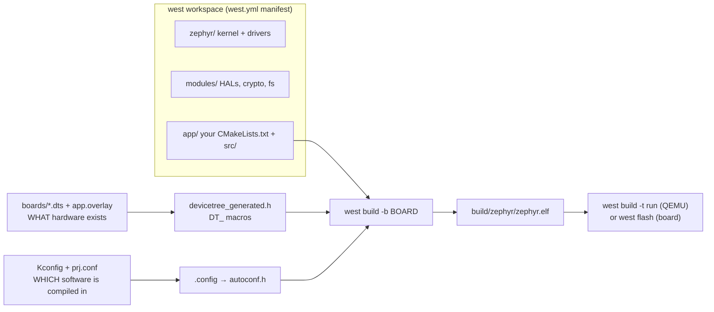

# Zephyr RTOS Lab

Zephyr taught the way it is actually built: **west workspace → devicetree → Kconfig → application → run**,
following the first-principles, run-it-yourself approach in [`AGENTS.md`](../../../AGENTS.md). Everything
below runs free on QEMU or `native_sim`, so no development board is required to finish the lab.

## When to use

- The learner is new to embedded RTOS work and needs the mental model *before* fighting a toolchain.
- A build fails with "unknown node label", "undefined CONFIG_", or an LED that will not blink — nearly
  always a devicetree/Kconfig confusion rather than a C bug.
- They must decide between a bare `while(1)` superloop, a Zephyr thread, and a workqueue item.
- Don't use it for Linux userspace device drivers, or for general C concurrency theory — see
  [linux-processes-lab](../linux-processes-lab/SKILL.md) and
  [concurrency-coach](../concurrency-coach/SKILL.md).

## First principles: hardware is data, software is config, code is neither

The Zephyr Project (Linux Foundation) separates three concerns that most bare-metal projects tangle
together. Confirm the current release and LTS on `docs.zephyrproject.org/latest/releases/index.html` —
**LTS v3.7** (July 2024) has a multi-year support window, while the 4.x line is the rolling stable series.



| Question | Answered by | Example | Failure symptom |
| --- | --- | --- | --- |
| Does this SoC have a UART at 0x40002000? | devicetree (`.dts`) | `&uart0 { status = "okay"; };` | `DT_NODELABEL` compile error |
| Which pin is `led0`? | devicetree `aliases` | `aliases { led0 = &green_led; };` | `GPIO_DT_SPEC_GET` fails to compile |
| Is the GPIO **driver** compiled in? | Kconfig (`prj.conf`) | `CONFIG_GPIO=y` | `device_is_ready()` returns false |
| How big is the main stack? | Kconfig | `CONFIG_MAIN_STACK_SIZE=2048` | stack-overflow fatal error |
| Which board am I building for? | `west build -b <board>` | `-b qemu_cortex_m3` | "board not found" |

**Trade-off to say out loud:** devicetree is resolved at *build* time into constants, so it costs nothing at
runtime but cannot be changed by code; Kconfig chooses which code exists at all. Neither is a runtime API —
that is the `device_get_binding`/`DEVICE_DT_GET` layer.

### Threads vs workqueues

| Mechanism | Cost | Use when | Never |
| --- | --- | --- | --- |
| ISR | lowest latency, no blocking | acknowledge hardware, post work | call `k_sleep`, take a mutex, do I/O |
| Workqueue item (`k_work`) | shares one thread + stack | deferrable, short, may block briefly | long-running work on the *system* workqueue |
| Dedicated thread (`K_THREAD_DEFINE`) | one stack each (RAM!) | long-lived loop with its own priority | spawning one per event |
| Timer (`k_timer`) | ISR context callback | periodic ticks | heavy work in the expiry function |

Zephyr priorities: **negative = cooperative** (never preempted involuntarily), **0..N = preemptible**, and
*lower number means higher priority*. This inversion trips up nearly every newcomer.

## Procedure

1. **Install the toolchain** (free, upstream). Follow the Getting Started Guide; the essentials are:
   ```bash
   sudo apt install --no-install-recommends git cmake ninja-build gperf ccache dfu-util \
     device-tree-compiler python3-venv python3-pip xz-utils file make gcc \
     gcc-multilib g++-multilib libsdl2-dev qemu-system-arm
   python3 -m venv ~/zephyrproject/.venv && source ~/zephyrproject/.venv/bin/activate
   pip install west
   ```
2. **Create the workspace** (this clones the kernel *and* every module in `west.yml`):
   ```bash
   west init ~/zephyrproject && cd ~/zephyrproject && west update
   west zephyr-export
   pip install -r zephyr/scripts/requirements.txt
   ```
3. **Install the Zephyr SDK** — `west sdk install` in recent releases, otherwise download the SDK bundle
   listed in the Getting Started Guide. Verify with `west sdk list` or `echo $ZEPHYR_SDK_INSTALL_DIR`.
4. **Prove the loop works before writing code**:
   ```bash
   cd ~/zephyrproject/zephyr
   west build -p always -b qemu_cortex_m3 samples/hello_world
   west build -t run          # prints "Hello World! qemu_cortex_m3"; exit QEMU with Ctrl-A x
   ```
5. **Read the generated artefacts** — this is the step that makes devicetree click:
   `build/zephyr/zephyr.dts` (the fully merged tree) and `build/zephyr/.config` (the resolved Kconfig).
   Never edit either by hand; edit `app.overlay` and `prj.conf`.
6. **Add an overlay** for hardware you want to change, e.g. `boards/qemu_cortex_m3.overlay`, and a
   `prj.conf` for drivers. Rebuild with `-p always` whenever you change either.
7. **Write the application** (worked example below), then inspect scheduling at runtime with
   `CONFIG_THREAD_ANALYZER=y` + `CONFIG_THREAD_ANALYZER_AUTO=y` to print stack high-water marks.
8. **Run the test harness** — Zephyr's own CI tool, free and local:
   `west twister -p native_sim -T tests/kernel/workq` (add `-c` to clean).
9. **Break it deliberately**: shrink `CONFIG_MAIN_STACK_SIZE` to 256 and read the fatal-error dump; then
   restore it. Close with the **Learning Footer**.

## Output shape

```
Goal: <what the firmware must do>
Board: <qemu_cortex_m3 | native_sim | nrf52840dk/nrf52840>   Zephyr: <git rev / release, verify on docs>
Hardware (devicetree): <nodes + aliases touched, overlay file>
Software (Kconfig): CONFIG_<...>=y   (why each one is needed)
Concurrency: <ISR | k_work | thread prio N | k_timer> — chosen because <latency/blocking/RAM reason>
Build:  west build -p always -b <board> <app>
Run:    west build -t run    | west flash    | west debug
Evidence: <serial output lines>   Stack use: <thread analyzer output>
Pitfall hit: <symptom> -> <devicetree | Kconfig | priority> root cause -> <fix>
Next: <mosquitto-mqtt-lab | linux-systemd-lab | openxr-xr-basics-coach>
Learning Footer
```

## Worked example — a producer thread and a deferred worker, running on QEMU

Application layout (`app/CMakeLists.txt`, `app/prj.conf`, `app/src/main.c`). This builds and runs on
`qemu_cortex_m3` with no board and no LED.

```cmake
# app/CMakeLists.txt
cmake_minimum_required(VERSION 3.20.0)
find_package(Zephyr REQUIRED HINTS $ENV{ZEPHYR_BASE})
project(threads_and_work)
target_sources(app PRIVATE src/main.c)
```

```ini
# app/prj.conf — WHICH software gets compiled in
CONFIG_LOG=y
CONFIG_LOG_MODE_IMMEDIATE=y
CONFIG_THREAD_ANALYZER=y
CONFIG_THREAD_ANALYZER_AUTO=y
CONFIG_THREAD_ANALYZER_RUN_UNLOCKED=y
CONFIG_MAIN_STACK_SIZE=2048
```

```c
/* app/src/main.c */
#include <zephyr/kernel.h>
#include <zephyr/logging/log.h>
LOG_MODULE_REGISTER(lab, LOG_LEVEL_INF);

#define PRODUCER_STACK 1024
#define PRODUCER_PRIO  5          /* preemptible; LOWER number == HIGHER priority */

static struct k_work_delayable report_work;
static atomic_t samples;

/* Runs on the system workqueue thread — allowed to block briefly, never in an ISR. */
static void report_fn(struct k_work *work)
{
        LOG_INF("samples so far: %ld", (long)atomic_get(&samples));
        k_work_schedule(&report_work, K_SECONDS(1));   /* re-arm */
}

/* A dedicated thread: long-lived loop with its own stack and priority. */
static void producer_fn(void *a, void *b, void *c)
{
        ARG_UNUSED(a); ARG_UNUSED(b); ARG_UNUSED(c);
        for (;;) {
                atomic_inc(&samples);
                k_msleep(100);      /* yields the CPU; a busy-wait here would starve lower prios */
        }
}
K_THREAD_DEFINE(producer_tid, PRODUCER_STACK, producer_fn, NULL, NULL, NULL,
                PRODUCER_PRIO, 0, 0);

int main(void)
{
        LOG_INF("board=%s  ticks/sec=%d", CONFIG_BOARD, CONFIG_SYS_CLOCK_TICKS_PER_SEC);
        k_work_init_delayable(&report_work, report_fn);
        k_work_schedule(&report_work, K_SECONDS(1));
        return 0;               /* main returns; producer + workqueue keep running */
}
```

```bash
west build -p always -b qemu_cortex_m3 app && west build -t run
# [00:00:00.000,000] <inf> lab: board=qemu_cortex_m3  ticks/sec=100
# [00:00:01.000,000] <inf> lab: samples so far: 10        <- ~10 per second, as designed
# thread_analyzer: producer  : STACK: unused 736 usage 288 / 1024 (28 %)
```

## Tips

- `west build` is **incremental and sticky**: after changing `prj.conf`, an overlay, or the board, add
  `-p always` or you will debug a stale binary.
- "Device not ready" almost always means the driver's `CONFIG_*` is off or the devicetree node is
  `status = "disabled"` — check `build/zephyr/zephyr.dts`, not the vendor `.dts` you edited.
- Priorities are inverted (lower = higher) and negative values are *cooperative*; a cooperative thread that
  never sleeps will hang the system.
- Every thread costs a whole stack in RAM. Prefer `k_work` on the system workqueue until you can prove you
  need isolation — but never put a long blocking call there, or you stall every other work item.
- `native_sim` (the successor to `native_posix`) builds your firmware as a host binary: fastest debug loop,
  real gdb/valgrind, no hardware timing fidelity.
- Log from an ISR only with `CONFIG_LOG_MODE_DEFERRED`; immediate mode does real I/O and will blow latency.
- Pair with [mosquitto-mqtt-lab](../mosquitto-mqtt-lab/SKILL.md) for the telemetry hop,
  [concurrency-coach](../concurrency-coach/SKILL.md) for the theory,
  [memory-management-coach](../memory-management-coach/SKILL.md) for stack sizing,
  [debugging-coach](../debugging-coach/SKILL.md) for the fault dumps, and
  [ros2-sim-nav-lab](../ros2-sim-nav-lab/SKILL.md) when the MCU talks to a robot.
  End with the **Learning Footer** (`AGENTS.md`).
