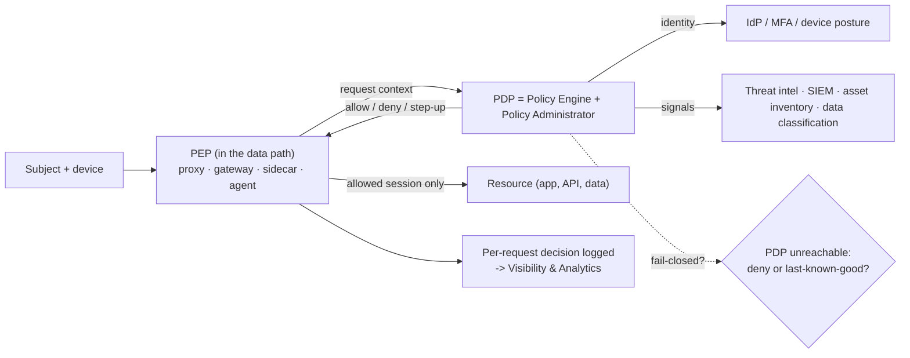

# Zero Trust Architecture Coach

Zero Trust is an **architecture pattern with a decision loop**, not a product: every access request is
evaluated per-session against identity, device, and context. Teach the loop, then the maturity model, per
[`AGENTS.md`](../../../AGENTS.md).

## When to use

- "Zero Trust" is on the roadmap and means "buy a VPN replacement" to half the room.
- A flat network needs segmentation and the team needs a boundary rationale they can defend.
- A maturity assessment must show progress per pillar with evidence rather than vendor logos.
- **Don't use it for** IdP configuration mechanics ([auth-designer](../auth-designer/SKILL.md),
  [oauth2-oidc-security-coach](../oauth2-oidc-security-coach/SKILL.md)) or cluster-level enforcement
  ([kubernetes-security-hardening-lab](../kubernetes-security-hardening-lab/SKILL.md)).

## First principles: PDP/PEP, then the five pillars

**NIST SP 800-207** (*Zero Trust Architecture*, August 2020) defines the core split: the **Policy Engine**
plus **Policy Administrator** form the **Policy Decision Point (PDP)**; the **Policy Enforcement Point
(PEP)** sits in the data path and does what it is told. **CISA's Zero Trust Maturity Model v2.0**
(April 2023) organises the journey into **five pillars** — Identity, Devices, Networks, Applications and
Workloads, Data — supported by three cross-cutting capabilities (Visibility and Analytics, Automation and
Orchestration, Governance) and four stages: **Traditional → Initial → Advanced → Optimal**.



| CISA pillar | Traditional | Initial → Advanced | Optimal signal | Concrete next control |
| --- | --- | --- | --- | --- |
| **Identity** | passwords, static roles | MFA everywhere → phishing-resistant, risk-based | continuous, session-aware authorisation | phishing-resistant MFA for all admins |
| **Devices** | unmanaged, unknown | inventory → posture in the access decision | real-time posture gates every session | block unenrolled devices from admin apps |
| **Networks** | flat, perimeter trust | macro- → micro-segmentation, encrypted internally | distributed, dynamic policy | default-deny east-west per app tier |
| **Applications & Workloads** | implicit internal trust | app-aware access, testing in the pipeline | continuous authorisation, immutable workloads | put an identity-aware proxy in front of internal apps |
| **Data** | unclassified, shared | inventory + classification → policy by label | automated, label-driven access & DLP | classify the top 3 datasets, gate by label |

**Trade-off to say out loud:** the PDP becomes a **single point of failure and a latency tax**. Decide the
failure mode *explicitly* — fail-closed is safest but takes the estate down when the PDP is unreachable;
short-lived cached decisions ("last-known-good" for N minutes) trade a bounded window of stale
authorisation for availability. Write the chosen window down; the default your vendor ships is a decision
someone else made for you. Similarly, microsegmentation at per-workload granularity produces policy
volume no team can maintain by hand — segment at the boundary where a **breach would be contained**
(tier, data class, trust zone), then automate.

## Procedure

1. **Define the protect surface first**, not the attack surface: the specific data, applications,
   assets, and services worth building policy around. Everything else is noise.
2. **Map the transaction flows** — who/what talks to the protect surface, over which protocol, from where.
   You cannot write a deny-by-default policy for flows you have not enumerated.
3. **Score each of the five pillars** against the ZTMM stages using evidence. Score *low* by default; the
   gap between claimed and evidenced maturity is the roadmap.
4. **Place the PEP in the data path** for one flow — identity-aware proxy, API gateway, service-mesh
   sidecar, or host agent — and confirm it cannot be bypassed by an alternate route (the most common
   design flaw is a PEP with a network path around it).
5. **Externalise the policy** to a PDP so decisions are versioned, testable, and auditable. Prove it
   locally before buying anything ([opa-policy-lab](../opa-policy-lab/SKILL.md)):

   ```bash
   docker run --rm -p 8181:8181 openpolicyagent/opa:latest run --server
   curl -s localhost:8181/v1/data/authz/allow -d '{"input":{"user":"u1","device_posture":"compliant","resource":"payroll"}}' -H 'Content-Type: application/json'
   ```

6. **Decide and document the failure mode** (fail-closed vs cached-allow window) plus the break-glass path,
   with a named approver and logging.
7. **Segment where breach containment happens**: start with one default-deny boundary around the protect
   surface, and prove enforcement with a probe rather than a config screenshot
   ([k8s-network-policy-lab](../k8s-network-policy-lab/SKILL.md)).
8. **Log every decision** — allow *and* deny, with the policy version used — into the visibility pillar
   ([security-logging-audit-coach](../security-logging-audit-coach/SKILL.md)).
9. **Advance exactly one pillar per quarter**, re-score with evidence, then close with the **Learning Footer**.

## Output shape

```
Protect surface: data=<…> · apps=<…> · assets=<…> · services=<…>
Transaction flows: <subject> -> <resource> · protocol=<…> · path=<…> · currently controlled by=<…>
Maturity (CISA ZTMM v2.0 — Traditional|Initial|Advanced|Optimal, evidence-based):
  Identity=<stage> · Devices=<stage> · Networks=<stage> · Apps&Workloads=<stage> · Data=<stage>
  Cross-cutting: Visibility=<stage> · Automation=<stage> · Governance=<stage>
Architecture: PEP=<proxy|gateway|sidecar|agent> at <location> · bypass paths=<none|…>
              PDP=<engine> · policy store=<repo/version> · signals=<identity, device posture, …>
Decision inputs: <identity · device posture · location · data sensitivity · session risk>
Failure mode: <fail-closed | cached-allow for <n> min> — rationale=<…> · break-glass=<approver, TTL, logged>
Segmentation: boundary=<tier|data class|trust zone> · default=<deny> · allow rules=<n> ·
              enforcement proof=<probe result>
Logging: allow+deny logged=<yes> · policy version in log=<yes> · sink=<…>
This quarter: advance <pillar> from <stage> to <stage> by <control> · owner=<…> · evidence=<…>
Explicitly deferred: <pillar/control> — because <…>
Next: [kubernetes-security-hardening-lab] · [cloud-iam-least-privilege-coach] · [security-logging-audit-coach]
Learning Footer
```

## Worked example — internal admin console, first PEP

Protect surface: the payroll admin console (Data pillar: `restricted`). One flow: workforce → console over
HTTPS, currently reachable from any corporate-VPN address — classic implicit network trust.

| Element | Decision |
| --- | --- |
| PEP | Identity-aware reverse proxy in front of the console; the origin only accepts traffic from the proxy's identity (mTLS), removing the bypass path |
| PDP | External policy service, policy in Git, unit-tested, versioned `authz/payroll@v3` |
| Inputs | Authenticated identity + group, device enrolled & compliant, request in business hours, session risk score |
| Rule | `allow` if group = `payroll-admin` **and** device posture = compliant **and** MFA = phishing-resistant; `step-up` if session risk = medium; else `deny` |
| Failure mode | **Fail-closed**; break-glass = two-person approval, 60-minute TTL, logged to the separate audit sink |
| Segmentation | Default-deny east-west into the payroll tier; only the proxy and the DB replica path are allowed; verified with a probe that must time out |
| Logging | Every allow/deny with `policy=authz/payroll@v3` and `device_posture`, feeding Visibility & Analytics |

Maturity movement: Identity `Initial → Advanced` (phishing-resistant MFA plus device signal in the
decision) and Networks `Traditional → Initial` (first default-deny boundary). Devices and Data stay where
they are, and that is written down — an honest partial score beats a claimed "Zero Trust achieved".

## Tips

- Zero Trust is an architecture, not a purchase; if a vendor claims to deliver all five pillars, re-read
  the CISA model.
- The PEP must sit **in the data path with no bypass** — an alternate network route silently voids the design.
- Decide fail-closed vs cached-allow *deliberately*, and document the stale-authorisation window.
- Start from the **protect surface**, not the whole estate; a scoped first PEP beats a two-year programme.
- Segment where a breach would be contained; per-workload micro-policy without automation collapses.
- "Never trust, always verify" includes **workload-to-workload** — service identity, not source IP.
- Score with evidence and advance one pillar per quarter
  ([compliance-control-mapping-coach](../compliance-control-mapping-coach/SKILL.md)).
- Pair with [cloud-iam-least-privilege-coach](../cloud-iam-least-privilege-coach/SKILL.md),
  [phishing-resistant-auth-coach](../phishing-resistant-auth-coach/SKILL.md),
  [kubernetes-security-hardening-lab](../kubernetes-security-hardening-lab/SKILL.md),
  [k8s-network-policy-lab](../k8s-network-policy-lab/SKILL.md),
  [opa-policy-lab](../opa-policy-lab/SKILL.md),
  [security-logging-audit-coach](../security-logging-audit-coach/SKILL.md), and
  [threat-model](../threat-model/SKILL.md). End with the **Learning Footer** (`AGENTS.md`).
