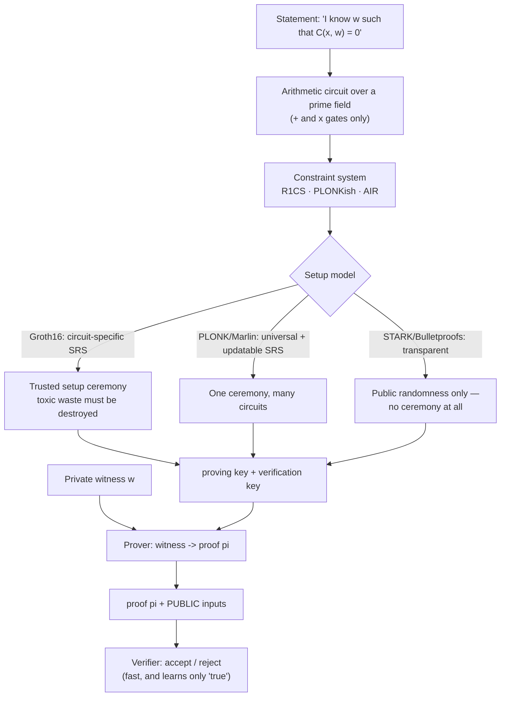

# ZK Proofs Coach

Zero-knowledge taught from the definitions outward: **statement → circuit → setup → prove → verify**,
following the first-principles, cite-the-primary-source discipline in [`AGENTS.md`](../../../AGENTS.md).
The lab runs free and locally with the open-source circom and snarkjs toolchain — no chain, no fees.

## When to use

- The learner can recite "prove without revealing" but cannot say what *soundness* costs or why a trusted
  setup exists.
- They must choose a proof system for a real constraint (on-chain verifier gas, prover time, no ceremony).
- They are writing circuits and getting under-constrained bugs — the most dangerous class in ZK.
- Don't use it for smart-contract security or general cryptography basics — see
  [solidity-security-coach](../solidity-security-coach/SKILL.md) and
  [cryptography-basics-coach](../cryptography-basics-coach/SKILL.md).

## First principles: three properties, and a simulator

Goldwasser, Micali and Rackoff introduced interactive proofs and zero knowledge (STOC 1985; SIAM J. Comput.
18(1), 1989). A proof system for a statement `x ∈ L` with witness `w` must satisfy:

- **Completeness** — an honest prover with a valid witness always convinces an honest verifier.
- **Soundness** — a cheating prover convinces the verifier with only negligible probability. *Computational*
  soundness (an "argument") assumes a bounded adversary; *statistical* soundness does not.
- **Zero-knowledge** — there exists a **simulator** that, without the witness, produces transcripts
  indistinguishable from real ones. That is the actual definition: anything the verifier learns, it could
  have generated alone. "The verifier didn't see the secret" is not zero knowledge.

**Fiat–Shamir** (CRYPTO 1986) removes interaction by replacing the verifier's random challenge with a hash
of the transcript — this is what makes proofs non-interactive and publishable, at the cost of a random
oracle assumption (and a notorious implementation pitfall: hash *every* public input, or the proof is
forgeable).



| | zk-SNARK (Groth16) | zk-SNARK (PLONK/Halo2) | zk-STARK | Bulletproofs |
| --- | --- | --- | --- | --- |
| Proof size | ~200 bytes (constant) | ~400 B–1 KB | ~40–200 KB | O(log n), ~1–2 KB |
| Verifier cost | constant, ~3 pairings | constant | poly-logarithmic | **linear** in circuit size |
| Setup | trusted, **per circuit** | trusted, **universal + updatable** | **transparent** | **transparent** |
| Hardness assumption | pairings / discrete log | pairings or DL | collision-resistant hashes only | discrete log |
| Post-quantum | **no** | no (pairing-based variants) | **plausibly yes** | no |
| Prover cost | fastest of these | fast | higher constants, quasi-linear | moderate |
| Typical use | on-chain verifier, tight gas | app-chains, reusable ceremony | rollups at scale, no-ceremony policy | confidential amounts |

**Trade-offs to say out loud:** Groth16's 200-byte proof is why it dominates on-chain verifiers — but its
setup is per-circuit, so *every circuit change needs a new ceremony*. PLONK trades a slightly larger proof
for a universal, updatable SRS (secure if **at least one** ceremony participant was honest). STARKs need no
ceremony and rest only on hash security, which is why they are the pick when "no trusted setup" or
post-quantum is a hard requirement — you pay in proof size and calldata.

## Procedure

1. **Write the statement precisely**, splitting *public inputs* (verifier sees) from *the witness* (stays
   secret). Ambiguity here is the source of most ZK design errors.
2. **Ask whether you need ZK at all.** A signature proves authorisation; a Merkle proof proves membership.
   Reach for ZK only when you must hide the witness *and* prove a non-trivial computation over it.
3. **Install the free toolchain**:
   ```bash
   git clone https://github.com/iden3/circom && cd circom && cargo build --release \
     && cargo install --path circom
   npm install -g snarkjs && circom --version && snarkjs --version
   ```
4. **Express the computation as an arithmetic circuit.** R1CS constraints are *quadratic*: one
   multiplication of two signals per constraint. Additions are free; comparisons, bit operations and hashes
   are expensive because they must be decomposed into field arithmetic.
5. **Run the setup** (worked example below). For learning, generate your own powers-of-tau; for production,
   use a public multi-party ceremony and record the transcript.
6. **Prove and verify**, then verify the *negative* case: change the public output and confirm rejection.
   A verifier you never saw reject is a verifier you have not tested.
7. **Count constraints** (`snarkjs r1cs info`) — it is the currency of ZK. Prover time and memory scale
   with it, and a naive hash inside a circuit can cost tens of thousands of constraints.
8. **Audit for under-constraint**: every output must be *forced* by constraints (`<==`), never merely
   *assigned* (`<--`). An under-constrained circuit accepts proofs of false statements while passing all
   your happy-path tests.
9. **Decide with the table**, writing down proof size, verifier cost, setup tolerance and PQ requirement.
   Close with the **Learning Footer**.

## Output shape

```
Statement: "I know <witness> such that <relation>"     Public: <inputs/outputs>   Secret: <witness>
Why ZK (not a signature / Merkle proof / TEE): <reason>
Circuit: <language> · constraints <n> · dominant cost <hash|range check|comparison>
System: <Groth16 | PLONK | STARK | Bulletproofs>   because <proof size / verifier / setup / PQ>
Setup: <per-circuit trusted | universal updatable | transparent>   ceremony: <participants / n-a>
Security: soundness <computational|statistical> · ZK <perfect|statistical|computational> · Fiat-Shamir <y/n>
Commands: circom ... | snarkjs groth16 setup ... | snarkjs groth16 prove ... | ... verify
Evidence: valid proof -> OK   tampered public input -> REJECTED   proof size <bytes>  verify <ms>
Risks checked: under-constrained signals · all public inputs hashed into the challenge · toxic waste
Next: <cryptography-basics-coach | solidity-security-coach | smart-contract-coach>
Learning Footer
```

## Worked example — prove you know `x` with `x³ + x + 5 = 35`, revealing nothing about `x`

`cubic.circom` — `x` is private; only the output `35` is public:

```circom
pragma circom 2.1.6;

template Cubic() {
    signal input  x;      // witness: private by default
    signal output out;    // public
    signal x2;

    x2  <== x * x;                 // R1CS is quadratic: ONE signal multiplication per constraint
    out <== x2 * x + x + 5;        // additions and constant scaling are free
}

component main = Cubic();
```

```bash
circom cubic.circom --r1cs --wasm --sym
snarkjs r1cs info cubic.r1cs                 # e.g. "# of Constraints: 2" — the currency of ZK

# --- setup (phase 1 is circuit-independent, phase 2 is circuit-specific for Groth16) ---
snarkjs powersoftau new bn128 12 pot12_0000.ptau -v
snarkjs powersoftau contribute pot12_0000.ptau pot12_0001.ptau --name="lab" -v
snarkjs powersoftau prepare phase2 pot12_0001.ptau pot12_final.ptau -v
snarkjs groth16 setup cubic.r1cs pot12_final.ptau cubic_0000.zkey
snarkjs zkey contribute cubic_0000.zkey cubic_final.zkey --name="lab p2" -v
snarkjs zkey export verificationkey cubic_final.zkey verification_key.json

# --- prove: x = 3, because 27 + 3 + 5 = 35 ---
echo '{"x": 3}' > input.json
node cubic_js/generate_witness.js cubic_js/cubic.wasm input.json witness.wtns
snarkjs groth16 prove cubic_final.zkey witness.wtns proof.json public.json
cat public.json          # ["35"]  <- the ONLY thing the verifier learns; x=3 never appears

snarkjs groth16 verify verification_key.json public.json proof.json
# [INFO]  snarkJS: OK!

# --- the test that matters: tamper with the public value ---
echo '["36"]' > public_bad.json
snarkjs groth16 verify verification_key.json public_bad.json proof.json
# [ERROR] snarkJS: Invalid proof     <- soundness, demonstrated rather than asserted
```

Then export an on-chain verifier and see the constant-size claim for yourself:

```bash
snarkjs zkey export solidityverifier cubic_final.zkey Verifier.sol
snarkjs zkey export soliditycalldata public.json proof.json
wc -c proof.json      # a Groth16 proof is 8 field elements — ~200 bytes on the wire
```

The verifier learns only that *some* `x` satisfies the cubic. `x = 3` is never transmitted, never in
`public.json`, and is not recoverable from the proof — that is the zero-knowledge property, made concrete.

## Tips

- **Under-constrained circuits are the #1 ZK vulnerability.** `<--` assigns a value; `<==` assigns *and*
  constrains. Every `<--` needs a matching `===`, or the prover can lie.
- Fiat–Shamir must absorb **every** public input into the challenge. Omitting one enables proof forgery —
  this has caused real production breaks.
- Field arithmetic is not integer arithmetic: values wrap modulo a large prime, so `a < b`, bit
  decomposition and "no overflow" all require explicit range checks that cost constraints.
- Trusted setup is safe if **at least one** participant destroyed their randomness; that is why ceremonies
  are large, public and transcript-logged. "We ran it ourselves" is not a ceremony.
- Groth16 setup is per circuit: any change to the circuit invalidates the keys. Plan for it, or choose a
  universal-SRS system.
- Succinct ≠ fast to prove. Prover time and RAM grow with constraint count — measure before promising a
  latency budget.
- ZK proves *computation*, not *truth about the world*: garbage inputs produce a valid proof of garbage.
  Oracle and data-authenticity design sits outside the circuit.
- Pairing-based SNARKs are **not** post-quantum; if that matters, use hash-based STARKs.
- Pair with [cryptography-basics-coach](../cryptography-basics-coach/SKILL.md) for the primitives,
  [smart-contract-coach](../smart-contract-coach/SKILL.md) and
  [solidity-security-coach](../solidity-security-coach/SKILL.md) for the on-chain verifier,
  [gas-optimization-coach](../gas-optimization-coach/SKILL.md) for verification cost, and
  [threat-model](../threat-model/SKILL.md) before you trust a ceremony.
  End with the **Learning Footer** (`AGENTS.md`).
