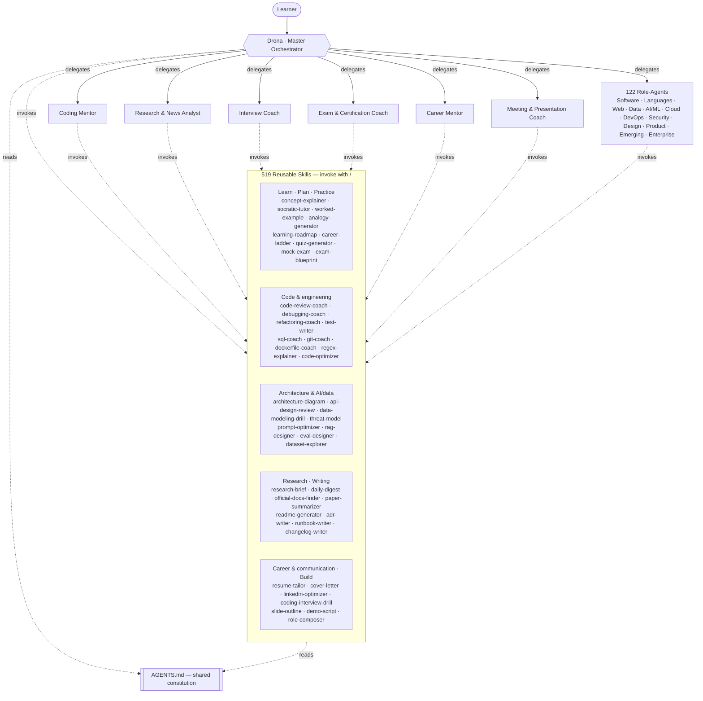

# LearningOS — powered by **Drona**

[](https://github.com/ArasaniRohithReddy/LearningOS/releases/latest)
[](LICENSE)
[](https://arasanirohithreddy.github.io/LearningOS/)
[](https://github.com/ArasaniRohithReddy/LearningOS/actions/workflows/validate.yml)
[](https://github.com/ArasaniRohithReddy/LearningOS)
&nbsp;·&nbsp; **129 agents · 519 skills · 122 roles**

> A modular, config-driven **GitHub Copilot Agent framework for learning, teaching, research, and
> technical career growth.** One master orchestrator (**Drona**, the guru), a set of specialist
> sub-agents, and reusable skills — all in the official GitHub Copilot format so they work in
> **VS Code**, **VS Code Insiders**, and the **GitHub Copilot CLI**.

**🌐 Live site:** <https://arasanirohithreddy.github.io/LearningOS/> &nbsp;·&nbsp;
**⬇ Download:** [latest release](https://github.com/ArasaniRohithReddy/LearningOS/releases/latest) &nbsp;·&nbsp;
**🤝 Contribute:** [open an issue](https://github.com/ArasaniRohithReddy/LearningOS/issues/new/choose) · [start a discussion](https://github.com/ArasaniRohithReddy/LearningOS/discussions) · [CONTRIBUTING.md](CONTRIBUTING.md)

LearningOS is **not** a single chatbot prompt. It is a small platform: agents compose reusable
skills, behavior is shared through a single constitution ([`AGENTS.md`](AGENTS.md)), and new
role-agents are built from tiny YAML config files instead of hand-written prompts.

---

## Why this exists

Most "learning agents" are one giant prompt that is hard to extend and inconsistent across tools.
LearningOS instead uses the same primitives GitHub Copilot itself uses:

- **Agents** (`.github/agents/*.agent.md`) — personas with their own tools and responsibilities.
- **Skills** (`.github/skills/<name>/SKILL.md`) — on-demand workflows, invocable with `/`.
- **Constitution** (`AGENTS.md`) — shared teaching behavior, auto-loaded everywhere.
- **Role configs** (`.github/roles/*.role.yml`) — compose new specialist agents from config.

Everything optimizes for **teaching**, not just answering. See the teaching principles and the
signature "Learning Footer" in [`AGENTS.md`](AGENTS.md).

## Architecture



## Repository layout

```
Learning Agents/
├── AGENTS.md                      # Shared teaching constitution (auto-loaded everywhere)
├── README.md                      # This file
├── LICENSE                        # MIT
├── CONTRIBUTING.md                # How to add roles / skills / agents / docs
├── CODE_OF_CONDUCT.md
├── docs/                          # The framework "brain" — how & why it works (12 guides)
│   ├── Architecture.md  Agents.md   Skills.md    Roles.md
│   ├── PluginSDK.md     MCP.md      Memory.md    News.md
│   ├── Standards.md     Security.md Testing.md   Roadmap.md
│   └── mcp.sample.json            # Copy servers into .vscode/mcp.json to enable MCP
├── .github/
│   ├── agents/                    # 129 custom agents (personas)
│   │   ├── drona.agent.md         # ⭐ Master orchestrator
│   │   ├── coding-mentor · research-analyst · interview-coach
│   │   ├── exam-coach · career-mentor · meeting-prep       # 6 core mentors
│   │   └── + 122 role-agents (python/rust/scala-developer, data-engineer, quantum-computing-engineer, …)
│   ├── skills/                    # 519 reusable workflows (slash commands), across 27 groups
│   │   ├── Learn: concept-explainer socratic-tutor misconception-buster analogy-generator worked-example glossary-builder mind-map note-generator teach-back knowledge-graph cheat-sheet
│   │   ├── Plan/Assess: learning-roadmap onboarding-plan career-ladder progress-tracker spaced-repetition-scheduler project-mentor practice-generator quiz-generator flashcards mock-exam skill-assessment gap-analysis rubric-grader exam-blueprint
│   │   ├── Code: code-review-coach debugging-coach refactoring-coach test-writer pair-programmer regex-explainer sql-coach git-coach dockerfile-coach code-optimizer algorithm-visualizer complexity-analyzer code-walkthrough system-design-drill
│   │   ├── Architecture/AI-data: architecture-diagram api-design-review data-modeling-drill threat-model tech-comparison estimation-coach prompt-optimizer rag-designer eval-designer dataset-explorer
│   │   ├── Research/Writing: research-brief daily-digest feed-curator official-docs-finder engineering-blog-finder github-repo-finder paper-summarizer literature-review technical-writing-coach readme-generator adr-writer runbook-writer documentation-planner changelog-writer
│   │   └── Career/Build: resume-tailor cover-letter linkedin-optimizer salary-negotiation star-story-builder portfolio-reviewer coding-interview-drill whiteboard-explainer slide-outline demo-script case-study role-composer
│   └── roles/                     # 122 config-driven role definitions — add your own!
│       ├── _TEMPLATE.role.yml
│       ├── Software · Languages (Py/Java/C#/Go/Rust/C++/TS/Kotlin/Scala/PHP/Swift/Elixir/R/Dart/Haskell/Clojure) · Web
│       ├── AI/ML · MLOps · Deep Learning · LLMOps · CV · NLP
│       ├── Data & BI · Streaming · Big Data · Snowflake · Tableau · Looker · Governance
│       ├── Cloud (Azure/AWS/GCP) · Platform · Network · Terraform · Serverless
│       ├── DevOps · SRE · Observability · FinOps · Linux/Windows admin · Chaos · Perf
│       ├── Security (App/Cloud/SOC/DevSecOps/IAM/GRC/Privacy) · QA/SDET · Architecture
│       ├── Emerging (AR/VR · Quantum · Edge · Graphics · Bioinformatics · Quant · GIS · HPC)
│       └── Design · Docs · DevRel · Product · EM · TPM · BA · Scrum · Business/Support · Enterprise (SF/ServiceNow/SAP/D365)
├── marketplace/                   # Generated pack index (registry.json + CATALOG.md)
├── scripts/build-registry.mjs     # Scans agents/skills/roles → rebuilds the marketplace index
```

## Documentation

The [`docs/`](docs/) folder is the framework's brain — how and why it works:

| Doc | Topic |
|---|---|
| [Architecture](docs/Architecture.md) | The five primitives, request flow, design principles |
| [Agents](docs/Agents.md) | Persona roster + how the "100+ agents" vision is served |
| [Skills](docs/Skills.md) | Skill catalog, authoring, and progressive loading |
| [Roles](docs/Roles.md) | The config-driven role system + full 122-role catalog |
| [PluginSDK](docs/PluginSDK.md) | Packaging & distribution model |
| [Install](docs/Install.md) | Install across every host (Copilot CLI, VS Code/Insiders, Desktop, Claude, Cursor, Gemini) + one-command `install.ps1` |
| [Extension](docs/Extension.md) | Drona as an installable **`.vsix`** (`@drona` chat participant) — no Marketplace account needed |
| [CodeExecution](docs/CodeExecution.md) | Run code in 90+ languages with **no local install** (self-hosted Piston / onlinecompiler.io key) — setup + where to get a key |
| [Customize](docs/Customize.md) | Add / edit / disable your own skills & agents; scaffolders + `validate.mjs` |
| [Marketplace](docs/Marketplace.md) | Enterprise plugin marketplace: pack model + generated registry |
| [LocalPractice](docs/LocalPractice.md) | Practice every domain locally & free (no subscriptions) — the tool catalog |
| [Floci — local cloud](docs/Floci.md) | Practice **AWS, Azure, GCP & Oracle (OCI)** locally & free with floci emulators — install, per-cloud endpoints, and the honest "AI-ready"/MCP story |
| [MCP](docs/MCP.md) | Live docs/data via MCP + **LearningOS's own MCP server** ([`mcp/`](mcp/README.md)) for any client (Claude/VS Code/Cursor) + [sample config](docs/mcp.sample.json) |
| [Memory](docs/Memory.md) | Learner profile, spaced repetition, RAG |
| [News](docs/News.md) | News / RSS / research framework |
| [Standards](docs/Standards.md) | Coding & teaching standards |
| [Security](docs/Security.md) | Security & Responsible AI guardrails |
| [Testing](docs/Testing.md) | Structural + behavioral evaluation |
| [Roadmap](docs/Roadmap.md) | Vision → status and what's next |

## Install & use

LearningOS is discovered automatically when this folder is your workspace/repo root. Nothing to build.

### VS Code / VS Code Insiders (Agent Mode)

1. Open this folder in VS Code or VS Code Insiders (Copilot Chat + Agent Mode enabled).
2. In the Chat view, open the **agent picker** and choose **Drona** (or any specialist).
3. Ask naturally — e.g. *"Teach me how Kubernetes scheduling works and quiz me."*
4. Invoke a skill directly by typing `/` and picking one, e.g. `/learning-roadmap`, `/quiz-generator`.

> Skill discovery locations are already enabled in `.vscode/settings.json` via
> `chat.agentSkillsLocations` (`.github/skills` is included). Skills under `.github/skills/` and
> agents under `.github/agents/` are picked up with no extra setup.

### GitHub Copilot CLI

1. Install the CLI and sign in (`copilot`), then `cd` into this folder.
2. `AGENTS.md` is loaded automatically as shared guidance.
3. Custom agents in `.github/agents/` and skills in `.github/skills/` are available in the session.
4. Ask Drona to teach, plan, quiz, or research — the same behavior as in VS Code.

### Use it in another project

Copy `AGENTS.md` and the `.github/agents/`, `.github/skills/`, and `.github/roles/` folders (and
optionally `docs/`) into any repository. That repo instantly gains the full LearningOS toolkit.

## Quick start prompts

- `@Drona teach me the CAP theorem from first principles, then give me 5 quiz questions.`
- `/learning-roadmap 90-day plan to become an Azure AI Engineer, ~1 hour/day`
- `/research-brief latest changes in the Model Context Protocol (MCP) spec, official sources only`
- `@Interview Coach run a 30-minute system design mock for a URL shortener and score me`
- `/code-review-coach review this function and teach me what to improve`
- `/flashcards 20 spaced-repetition cards on Kubernetes networking`

## Practice cloud & tech locally (no subscription needed)

LearningOS includes **256 hands-on labs** (`*-lab` skills) so you learn by doing — per language
(Python, JS, TS, Go, Rust, Java, C#), framework (React), data (pandas, SQL, Spark, Kafka, PyTorch),
and tooling (Git, Docker/Kubernetes).

For **AWS / Azure / GCP**, you can do the cloud labs **entirely offline** against the free,
open-source **[Floci](https://github.com/floci-io/floci)** local emulators — `docker compose up`, no
cloud account, token, or paid tier. The dedicated skills walk you through setup:

- `/floci-aws-local-lab` — AWS locally via [Floci](https://github.com/floci-io/floci) (`http://localhost:4566`)
- `/floci-azure-local-lab` — Azure locally via [Floci AZ](https://github.com/floci-io/floci-az) (`http://localhost:4577`)
- `/floci-gcp-local-lab` — GCP locally via [floci-gcp](https://github.com/floci-io/floci-gcp) (`http://localhost:4588`)

Point your existing SDK / CLI / Terraform at the local endpoint and run the `aws-*-lab`, `azure-*-lab`,
and `gcp-*-lab` exercises for free. (Floci is an emulator for learning/dev/testing — verify behavior
against the official cloud docs before production.)

**And it's not just cloud** — you can practice **databases** (Postgres, MySQL, MongoDB, Redis, SQLite),
**messaging** (Redpanda/Kafka, RabbitMQ, NATS, MQTT), **Kubernetes** (minikube, kind, k3d),
**observability** (Prometheus + Grafana, Jaeger), **auth** (Keycloak), and even **LLMs & RAG** (Ollama +
Chroma/Qdrant/pgvector — *no API key or cost*) entirely on your laptop. The full, verified catalog with
the matching labs is in **[docs/LocalPractice.md](docs/LocalPractice.md)**.

## Extend it — build a new role-agent from config

Instead of writing a new prompt, describe the role in YAML and let LearningOS build the agent:

1. Copy `.github/roles/_TEMPLATE.role.yml` to `.github/roles/my-role.role.yml` and fill it in.
2. Run the `role-composer` skill: `/role-composer .github/roles/my-role.role.yml`.
3. A ready-to-use `.github/agents/<my-role>.agent.md` is generated in the correct format.

**122 ready-made role configs** ship across every domain (Software, Programming Languages, Web &
Frameworks, AI/ML, Data/BI, Cloud & Platform, DevOps/SRE, Security, QA & Testing, Design/Docs,
Architecture, Product & Management, Emerging & Specialized Tech, Business/Support, Enterprise
Platforms) — see the full catalog in
[docs/Roles.md](docs/Roles.md). Two good starting points:
[`data-engineer.role.yml`](.github/roles/data-engineer.role.yml) and
[`azure-ai-engineer.role.yml`](.github/roles/azure-ai-engineer.role.yml).

## Roadmap / where to take it next

The core is intentionally small and high-quality, and designed to grow. **Phases 1–3 are done** —
orchestrator, shared constitution, **519 skills**, **129 agents** (Drona + 6 mentors + 122 role-agents),
config-driven roles + composer, and learner templates. **Phase 4 is in progress** — the roster is
**well past the 100+ agent** milestone and a first-cut **Enterprise Plugin Marketplace** now ships
(generated [registry](marketplace/registry.json) + [catalog](marketplace/CATALOG.md))
(see [docs/Roadmap.md](docs/Roadmap.md)):

- **Breadth toward 100+ agents / 500+ skills** — added in reviewed, high-quality batches across every
  domain (each is one role config or one skill folder; no stubs). *129 agents / 519 skills and counting.*
- **Live MCP integrations** (when available in your client): GitHub, Fetch/Web, Playwright, Microsoft
  Learn, RSS/arXiv, Memory, SQLite — to pull live docs, feeds, and papers into lessons.
- **Learning analytics & evaluation**: progress / gaps / streaks over the learner profile, and a
  golden-prompt evaluation harness.

## License

[MIT](LICENSE). Built to be cloned, extended, and shared.
