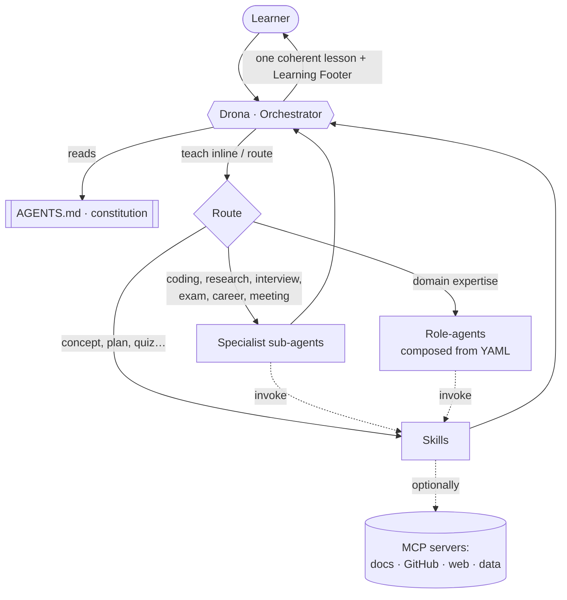

# LearningOS — Architecture

> The design behind LearningOS: a modular, config-driven **GitHub Copilot Agent framework** for
> learning, teaching, research, and technical career growth, orchestrated by **Drona**.

This document explains *how the pieces fit together* and *why*. For behavior rules, see the shared
constitution in [`AGENTS.md`](../AGENTS.md).

## Design principles

LearningOS follows the enterprise principles set out in the original vision — each capability is
replaceable without touching the rest:

| Principle | How LearningOS realizes it |
|---|---|
| **Modular** | Every persona is a separate `.agent.md`; every workflow a separate skill. |
| **Extensible** | New roles are added as YAML config (no code) via `role-composer`. |
| **Config-driven** | Role-agents are *composed* from `.github/roles/*.role.yml`. |
| **Source-aware** | Source-priority + citations enforced in `AGENTS.md` and `research-brief`. |
| **MCP-ready** | Live docs/feeds/data via MCP servers — see [MCP.md](./MCP.md). |
| **Memory-enabled** | Learner profile + spaced-repetition state — see [Memory.md](./Memory.md). |
| **Teaching-first** | The Learning Footer + Socratic method are mandatory everywhere. |
| **Portable** | Pure Copilot primitives → runs in VS Code, Insiders, and Copilot CLI. |

## The five primitives

LearningOS is built only from primitives GitHub Copilot already understands, so nothing is bespoke:

1. **Constitution** — [`AGENTS.md`](../AGENTS.md): always-on teaching behavior, source discipline,
   coding standards, and the signature Learning Footer. Auto-loaded in every tool (incl. CLI).
2. **Orchestrator** — [`drona.agent.md`](../.github/agents/drona.agent.md): the master entry point
   that understands intent, teaches directly, or delegates.
3. **Specialist sub-agents** — focused personas with their own tools (see [Agents.md](./Agents.md)).
4. **Skills** — reusable, on-demand workflows invocable with `/` (see [Skills.md](./Skills.md)).
5. **Roles** — YAML configs that compose *new* specialist agents (see [Roles.md](./Roles.md)).

## How a request flows

Drona always **reconciles specialist output into one voice** — the learner never sees raw hand-offs.

## Mapping the vision to Copilot primitives

The original blueprint called for "100+ agents, 500+ skills." LearningOS delivers that **breadth
through composition**, not 100 hand-written files:

| Vision element | LearningOS implementation |
|---|---|
| Master Orchestrator | `Drona` agent |
| 6 core mentor personas | `.github/agents/*.agent.md` |
| Long tail of specialist agents | `.github/roles/*.role.yml` → `role-composer` |
| Reusable skills | `.github/skills/*/SKILL.md` |
| Plugin SDK | Copilot's agent/skill packaging — see [PluginSDK.md](./PluginSDK.md) |
| MCP integration | [MCP.md](./MCP.md) + `docs/mcp.sample.json` |
| Memory / Knowledge / RAG | [Memory.md](./Memory.md) |
| News / RSS / Research | [News.md](./News.md) |
| Coding & Teaching Standards | [Standards.md](./Standards.md) |
| Security & Responsible AI | [Security.md](./Security.md) |
| Testing / Evaluation | [Testing.md](./Testing.md) |

## Extensibility model

- **Add a domain expert** → write one `*.role.yml`, run `/role-composer` (see [Roles.md](./Roles.md)).
- **Add a workflow** → add a skill folder (see [Skills.md](./Skills.md)).
- **Add a distinct persona** → add a `*.agent.md` (see [Agents.md](./Agents.md)).
- **Add live data** → enable an MCP server (see [MCP.md](./MCP.md)).

Nothing above requires changing Drona or the constitution — that is the whole point.

## Portability

Because LearningOS uses only standard files (`AGENTS.md`, `.github/agents`, `.github/skills`), the
entire toolkit is portable: copy those folders into any repo and it works in VS Code, VS Code
Insiders, and the GitHub Copilot CLI. See the [README](../README.md) for install steps.
