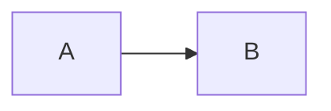

<!-- LearningOS — Lesson Notes (template)
     Produced by the /note-generator skill. Copy to  notes/<topic>.md . Keep notes atomic and skimmable. -->

# <Topic>

> **Summary (2–3 sentences):** <the core idea in plain language>

## Key points
- <atomic point — one idea>
- <...>

## Worked example
```<language or pseudocode>
<concrete example>
```
<what to notice about it>

## Diagram


## Why it works & trade-offs
- <the "why", and when to use vs. alternatives>

## Pitfalls / misconceptions
- <common mistake> → <the correct understanding>

## Self-test (→ flashcards)
1. <question> — <answer>
2. <question> — <answer>

## See also
- [<related concept>](./<related>.md)  <!-- feeds /knowledge-graph -->

## Sources
- <title> — <official / blog / paper> — <YYYY-MM-DD> — <link>
